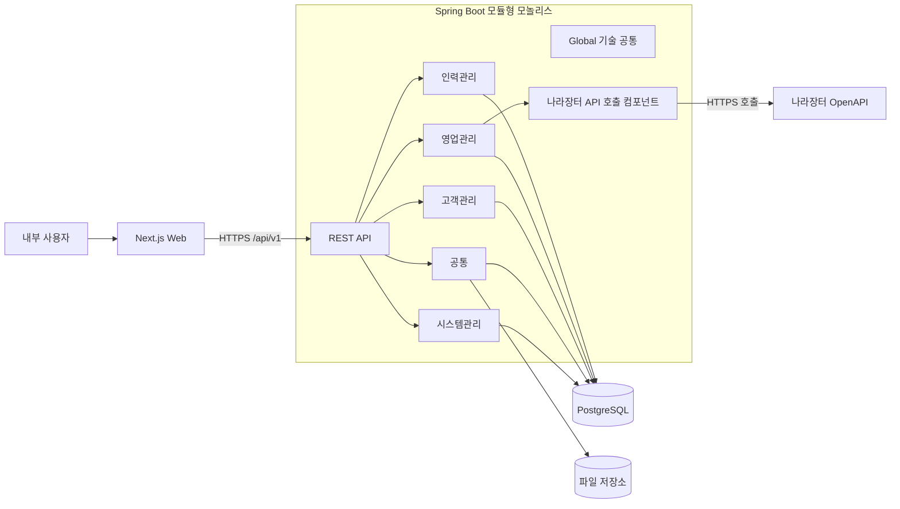

# BMS 애플리케이션 아키텍처

## 1. 문서 개요

### 1.1 목적

본 문서는 BMS(Business Management System)의 1차 설계 범위에 적용할 애플리케이션 구조와 공통 구현 원칙을 정의한다.

화면, API, 데이터, 보안 및 테스트 상세설계는 본 문서의 아키텍처 원칙을 기준으로 작성한다. 본 문서는 설계 초안이며, 미결정 항목은 상세설계 과정에서 검토한 후 결정 기록으로 관리한다.

### 1.2 문서 상태

| 항목 | 내용 |
| --- | --- |
| 상태 | 초안 |
| 작성일 | 2026-07-16 |
| 적용 단계 | 1차 설계 |
| 설계 범위 | 시스템관리, 공통, 고객관리, 영업관리, 인력관리 |

### 1.3 관련 산출물

- 요구사항 정의서
- 업무기능분해도 및 상세 업무기능분해도
- 업무 프로세스 정의서
- 메뉴구조도 및 화면목록
- 데이터 아키텍처와 논리·물리 데이터 모델
- 후속 작성할 화면설계서, API 명세서, CRUD Matrix 및 테스트케이스

---

## 2. 설계 범위

### 2.1 대상 업무영역

| 업무영역 | BFD | 주요 기능 | 화면 범위 |
| --- | --- | --- | --- |
| 시스템관리 | BFD-01 | 사용자, 역할, 메뉴, 공통코드, 조직, 시스템 환경설정, 로그, 공지사항 | SYS-001~SYS-008 |
| 공통 | BFD-02 | 인증, 대시보드, 알림, 첨부파일, 메모 | COM-001~COM-005 중 분석에서 정의한 화면과 업무 화면 내 공통 기능 |
| 고객관리 | BFD-03 | 고객사, 고객담당자, 영업활동 | CUS-001~CUS-003 |
| 영업관리 | BFD-04 | 사업공고, 영업기회, 사업성 분석, 제안, 수주 | SAL-001~SAL-005 |
| 인력관리 | BFD-07 | 직원, 기술경력, 단가, 인력투입, 투입률, 협력업체, 외주인력 | RES-001, RES-003~RES-007 |

설계 범위는 위 5개 업무영역의 분석 완료 기능 전체를 의미한다. 실제 개발 순서는 메뉴구조도와 화면목록의 `1차`, `후속` 구분을 유지한다. 후속 기능도 구조적 확장 지점을 확보하되 1차 개발을 불필요하게 복잡하게 만들지 않는다.

### 2.2 구현단계 적용 원칙

| 구현단계 | 설계 원칙 |
| --- | --- |
| 1차 | 화면, API, 데이터 및 테스트 상세설계를 우선 완료하고 개발 대상으로 확정한다. |
| 후속 | 도메인 경계와 데이터 확장 방향을 정의하되 상세 화면과 API는 착수 시점에 구체화한다. |

현재 분석 기준의 주요 1차 화면은 다음과 같다.

- 공통: 로그인, 일반 사용자 대시보드
- 시스템관리: 사용자, 역할, 메뉴, 공통코드, 조직 관리
- 고객관리: 고객사, 고객담당자, 영업활동 관리
- 영업관리: 사업공고, 수주 관리
- 인력관리: 직원, 기술경력, 단가, 인력투입, 투입률, 협력업체, 외주인력 관리

### 2.3 제외 업무영역

다음 업무영역은 이번 애플리케이션 상세설계 범위에서 제외한다.

- 계약관리
- 독립 프로젝트관리
- 예산·원가관리
- 매출·수금관리
- 유지관리

제외 영역의 엔터티를 선행 구현하거나 화면·API를 설계하지 않는다. 다만 대상 영역과의 연결이 필요한 경우 다음 경계 원칙을 적용한다.

| 연계 지점 | 처리 원칙 |
| --- | --- |
| 수주 결과 → 계약 | 영업관리에서는 수주 결과와 전환 가능 상태까지만 관리한다. 계약 생성 기능은 후속 계약관리 설계에서 연결한다. |
| 인력투입 → 프로젝트 기준정보 | 인력관리에서는 프로젝트 식별자와 최소 조회정보를 외부 참조로 취급한다. 프로젝트 생성·변경 업무는 구현하지 않는다. |
| 인력·영업 → 예산·원가·매출 | 현재 영역은 원천 데이터와 참조 식별자만 제공하고 금액 집계 및 회계성 업무 규칙을 포함하지 않는다. |

---

## 3. 아키텍처 목표와 원칙

### 3.1 목표

- 내부 업무시스템에 적합한 단순하고 일관된 구조를 제공한다.
- 업무영역 간 결합을 낮추고 후속 영역을 단계적으로 추가할 수 있게 한다.
- 화면 노출 권한과 서버의 실제 데이터 처리 권한을 함께 통제한다.
- 공통 기능을 재사용하되 업무영역의 데이터 소유권을 침해하지 않는다.
- 분석 기능 ID부터 화면, API, 데이터 및 테스트까지 추적 가능하게 한다.

### 3.2 기본 원칙

- 배포 단위는 하나로 유지하는 모듈형 모놀리스 구조를 사용한다.
- 패키지는 BFD ID가 아닌 업무영역과 역할을 기준으로 구성한다.
- 업무 데이터는 소유 업무영역만 변경한다.
- 다른 업무영역의 데이터가 필요하면 공개된 애플리케이션 서비스 또는 조회 인터페이스를 사용한다.
- 공통 모듈은 인증, 업무대상, 파일, 알림, 메모 등 명확한 공통 책임만 가진다.
- 기술 편의성만을 이유로 모든 기능을 `common` 또는 `util`에 배치하지 않는다.
- 상태 변경, 논리삭제와 이력 보존 정책은 데이터 성격에 따라 구분한다.
- 외부 API 호출은 Spring Boot 내부의 전용 클라이언트로 분리하고, 파일 저장소는 교체 가능한 인터페이스로 구성한다.

---

## 4. 전체 시스템 구조

### 4.1 논리 구성



### 4.2 기술 기준

| 구분 | 현재 기준 | 설계 방향 |
| --- | --- | --- |
| 백엔드 | Java 17, Spring Boot 4.1.0, Spring MVC, Spring Data JPA | REST API와 업무 트랜잭션 제공 |
| 프론트엔드 | Next.js 16.2.9, React 19.2.4, TypeScript 5 | App Router 기반 업무 화면 제공 |
| 데이터베이스 | PostgreSQL 16 | 업무 데이터와 메타정보의 단일 원본 |
| 로컬 인프라 | Docker Compose | PostgreSQL 개발환경 제공 |
| 통신 | JSON 기반 HTTP API | `/api/v1` 버전 경로 사용 |

현재 버전은 저장소 설정을 기록한 것이며, 의존성 변경은 별도 검토와 테스트를 거쳐 반영한다.

### 4.3 배포 구조

초기에는 프론트엔드, 백엔드, PostgreSQL을 각각 하나의 실행 단위로 운영한다. 웹 브라우저에는 하나의 서비스 도메인을 제공하고 리버스 프록시에서 화면 요청과 `/api` 요청을 분기하는 구성을 기본안으로 한다.

- 웹 요청: Next.js
- API 요청: Spring Boot
- 데이터 저장: PostgreSQL
- 파일 저장: 개발환경 로컬 저장소, 운영환경 교체 가능한 파일 저장소
- 외부 API 호출: Spring Boot WAS 내부의 나라장터 API 클라이언트

---

## 5. 백엔드 아키텍처

### 5.1 패키지 구조

```text
com.bms.backend
├── global
│   ├── config
│   ├── error
│   ├── security
│   ├── web
│   └── persistence
├── system
├── common
├── customer
├── sales
├── employee
└── external
    └── g2b
```

`system`, `common`, `customer`, `sales`, `employee` 업무 패키지는 다음 내부 구조를 기본으로 한다.

```text
{business-area}
├── api             # REST Controller, 요청·응답 DTO
├── application     # 유스케이스, 트랜잭션 경계
├── domain          # 엔터티, 값 객체, 업무 규칙, 저장소 인터페이스
└── infrastructure  # JPA 저장소, 외부 API 클라이언트 구현
```

단순 조회 기능까지 형식적인 계층을 강제하지는 않지만, API 계층이 JPA 저장소를 직접 호출하거나 영속 엔터티를 응답으로 반환하지 않는다.

### 5.2 모듈 책임

| 모듈 | 책임 |
| --- | --- |
| `global` | 프레임워크 설정, 공통 오류, 보안 기반, 웹 및 영속성 기술 지원 |
| `system` | 사용자, 역할, 메뉴권한, 조직, 코드, 설정, 로그, 공지사항 |
| `common` | 인증 유스케이스, 대시보드 조합, 업무대상, 알림, 첨부파일, 메모 |
| `customer` | 고객사, 고객담당자, 영업활동 |
| `sales` | 사업공고 수집·검토, 영업기회, 사업성 분석, 제안, 수주 |
| `employee` | 직원·외주인력 공통정보, 기술, 단가, 투입 및 투입률 |
| `external` | Spring Boot WAS에서 호출하는 나라장터 등 외부 API별 클라이언트와 응답 변환 |

### 5.3 모듈 간 호출

- API Controller는 자신의 업무영역 애플리케이션 서비스만 호출한다.
- 다른 업무영역의 내부 저장소나 JPA 엔터티를 직접 참조하지 않는다.
- 동기 처리가 필요한 조회·검증은 상대 영역의 공개 인터페이스를 호출한다.
- 공통 모듈은 업무대상ID와 유형을 관리하고 업무대상 접근권한 판정 인터페이스를 제공하며, 각 업무영역은 자신이 소유한 업무대상 유형의 존재·상태·접근권한 판정기를 구현한다.
- 첨부파일·메모 유스케이스는 구체적인 업무영역 저장소를 직접 조회하지 않고 등록된 업무대상 접근권한 판정기를 호출한다.
- 알림처럼 원 업무 트랜잭션과 분리 가능한 후속 처리는 애플리케이션 이벤트를 사용할 수 있다.
- 이벤트 사용 여부는 유실 허용 여부와 트랜잭션 일관성을 검토해 유스케이스별로 결정한다.

### 5.4 트랜잭션

- 트랜잭션 경계는 애플리케이션 서비스의 유스케이스 단위로 설정한다.
- 조회는 읽기 전용 트랜잭션을 기본으로 한다.
- 외부 API 호출과 장시간 파일 처리를 데이터베이스 트랜잭션 안에서 수행하지 않는다.
- 기준정보의 동시 수정 충돌은 낙관적 잠금 적용 여부를 상세 데이터 설계에서 결정한다.
- 업무대상 적용 엔터티를 생성할 때 업무대상과 구체적인 업무 엔터티를 하나의 데이터베이스 트랜잭션에서 함께 생성한다.
- 계약문서 등록은 업무대상, PDF 첨부파일 메타정보와 계약문서의 데이터베이스 변경을 하나의 트랜잭션 경계에서 처리하되 파일 바이너리 저장 실패와 트랜잭션 실패에 대한 보상 처리를 적용한다.
- 다수 엔터티 변경이 하나의 업무 결과를 구성하면 동일 트랜잭션에서 처리한다.

---

## 6. 프론트엔드 아키텍처

### 6.1 디렉터리 구조

```text
frontend
├── app
│   ├── (auth)
│   │   └── login
│   ├── (main)
│   │   ├── dashboard
│   │   ├── system
│   │   ├── customer
│   │   ├── sales
│   │   └── employee
│   └── layout.tsx
├── features
│   ├── auth
│   ├── system
│   ├── common
│   ├── customer
│   ├── sales
│   └── employee
├── shared
│   ├── api
│   ├── components
│   ├── hooks
│   ├── types
│   └── utils
└── public
```

### 6.2 구성 원칙

- `app`은 라우팅, 레이아웃과 페이지 조합을 담당한다.
- 업무 규칙과 화면별 상태는 `features/{business-area}`에서 관리한다.
- 버튼, 입력항목, 테이블, 모달 등 업무 의미가 없는 UI만 `shared/components`에 둔다.
- 첨부파일, 메모, 알림처럼 업무 의미를 가진 공통 기능은 `features/common`에 둔다.
- 서버 API의 요청·응답 타입과 화면 폼 타입을 필요에 따라 분리한다.
- 메뉴는 서버가 제공하는 사용 가능 메뉴를 기준으로 구성하고 URL 직접 접근도 서버 권한검사로 차단한다.

### 6.3 렌더링과 데이터 조회

- 로그인 이후의 업무 화면은 사용자별 데이터가 많으므로 동적 렌더링을 기본으로 한다.
- 서버 컴포넌트와 클라이언트 컴포넌트는 화면별 상호작용 필요성에 따라 구분한다.
- 조회 캐시를 적용할 때 사용자 권한이 다른 응답이 공유되지 않도록 한다.
- 등록·수정 후 관련 목록과 상세 데이터의 무효화 기준을 화면설계에서 정의한다.

---

## 7. 인증과 권한

### 7.1 인증 방식

내부 업무시스템의 초기 구조는 Spring Security 기반 서버 세션 방식을 기본안으로 한다.

- 인증 성공 시 서버가 세션을 생성하고 브라우저에는 세션 쿠키만 전달한다.
- 쿠키는 `HttpOnly`, `Secure`, `SameSite` 정책을 적용한다.
- 상태 변경 요청은 CSRF 방어를 적용한다.
- 로그아웃 시 서버 세션을 무효화하고 접속로그에 로그아웃 일시를 기록한다.
- 세션 유휴시간은 15분으로 설정하고 무활동 상태가 지속되면 자동 로그아웃한다.
- 초기 단일 백엔드에서는 메모리 또는 기본 세션 저장소를 사용할 수 있으며 다중 인스턴스 전환 시 공유 세션 저장소를 검토한다.

### 7.2 계정 정책

- 사람 사용자 계정은 내부 직원과만 연결한다.
- 외주인력 계정은 생성하지 않는다.
- 비활성 상태의 계정은 로그인할 수 없다.
- 비밀번호는 복호화할 수 없는 단방향 해시로 저장한다.
- 로그인은 5회까지 연속 실패를 허용하고 5회를 초과하는 6번째 실패에서 계정을 비활성화한다.
- 비활성 계정은 관리자가 활성화하며 이때 로그인 실패건수를 초기화한다.
- 계정 비활성화 시 해당 사용자의 기존 로그인 세션은 즉시 무효화한다.
- 인증 실패 메시지는 사용자ID 존재 여부를 노출하지 않는다.

### 7.3 권한 모델

권한은 사용자–역할–메뉴 관계를 기반으로 하는 RBAC를 사용한다.

```text
사용자 N : M 역할
역할 N : M 메뉴
메뉴 → 화면 경로 및 접근 단위
API → 요구 메뉴 또는 업무 권한
```

- 메뉴 미노출만으로 접근을 통제하지 않는다.
- 서버 API는 인증 사용자와 요구 권한을 매 요청마다 검사한다.
- 역할은 접근할 수 있는 화면을 정의하며 사용자의 화면 권한은 부여된 역할별 권한 화면의 합집합으로 계산한다.
- 로그인 성공 시 역할과 권한 화면을 세션 스냅샷으로 저장한다.
- 역할 또는 화면 권한이 변경되어도 현재 세션은 기존 권한을 유지하며 다음 로그인부터 변경된 권한을 적용한다.
- 고객, 영업, 인력 데이터의 행 단위 접근범위가 필요하면 조직·담당자·역할 기준을 별도 권한 규칙으로 정의한다.
- 첨부파일과 메모 권한은 업무대상ID로 조회한 업무대상 유형의 권한을 따른다. 업무대상 유형별 판정기는 대상 엔터티의 존재·논리삭제 상태와 행 단위 접근범위를 함께 확인한다.

---

## 8. API 설계 원칙

### 8.1 기본 규칙

- 기본 경로는 `/api/v1`을 사용한다.
- URL은 업무 자원을 나타내는 복수형 명사를 사용한다.
- 조회는 `GET`, 등록은 `POST`, 전체 교체는 `PUT`, 부분 변경은 `PATCH`, 삭제는 `DELETE`를 기본으로 한다.
- 상태코드가 있는 엔터티의 비활성·종료·취소는 상태변경 API 또는 `PATCH`로 표현한다.
- 요청 DTO에 Bean Validation을 적용하고 업무 규칙 검증과 구분한다.
- 날짜·시간은 ISO 8601 형식을 사용하고 서버 저장 기준 시간대는 상세설계에서 통일한다.
- 첨부파일·메모 API는 업무구분과 업무ID 조합 대신 `taskTargetId`만 입력받으며, 업무대상 유형은 클라이언트 입력을 신뢰하지 않고 서버가 업무대상에서 조회한다.
- 업무대상 적용 엔터티의 상세 응답은 공통 기능 호출에 사용할 `taskTargetId`를 제공한다.

### 8.2 응답과 오류

- 성공 응답은 단일 자원, 목록 또는 처리 결과를 명확한 DTO로 반환한다.
- 목록 API는 검색조건, 정렬과 페이지 정보를 일관된 형식으로 제공한다.
- 오류 응답은 HTTP 상태, 애플리케이션 오류코드, 사용자 메시지, 요청 추적ID와 필드 오류를 포함한다.
- 내부 예외 메시지, SQL, 인증정보와 개인정보는 응답에 포함하지 않는다.
- 동일 오류코드는 동일 의미로 사용하며 오류코드 목록을 API 공통설계에서 관리한다.

### 8.3 추적성

각 API 명세는 다음 식별자를 기록한다.

- 요구사항 ID
- BFD 기능 ID
- 화면 ID 또는 공통 호출 주체
- 사용 엔터티·테이블
- 요구 권한
- 테스트케이스 ID

---

## 9. 데이터와 영속성

### 9.1 기본 원칙

- PostgreSQL을 업무 데이터의 원본으로 사용한다.
- 논리 모델과 물리 모델은 데이터 아키텍처의 CSV 원본을 따른다.
- JPA 엔터티가 물리 스키마를 임의로 생성하거나 변경하지 않게 한다.
- 로컬 초기 개발을 제외한 환경에서는 `ddl-auto=validate`를 기본으로 하고 스키마 변경은 마이그레이션 도구로 관리한다.
- 운영 비밀번호와 인증정보를 설정 파일 또는 Git에 저장하지 않는다.

### 9.2 데이터 상태 정책

| 데이터 유형 | 처리 원칙 |
| --- | --- |
| 사용자·역할·메뉴·조직·공통코드 | 참조 이력을 보존하기 위해 물리삭제하지 않고 상태 변경 또는 논리삭제한다. |
| 고객·영업·인력 기준정보 | 업무 참조 여부를 확인하고 사용상태 또는 논리삭제를 적용한다. |
| 업무대상 | 등록·수정·논리삭제가 가능한 일반 업무 데이터로 관리하고 적용 엔터티·첨부파일·메모가 참조 중이면 물리삭제하지 않는다. |
| 공지사항·메모 | 분석에서 정의한 권한과 논리삭제 정책을 적용한다. |
| 접속로그·시스템로그·외부연계로그 | 정정 대상이 아닌 이력으로 관리하고 보존기간에 따른 별도 삭제 정책을 적용한다. |
| 첨부파일 | 메타정보와 저장 파일의 상태를 함께 관리하고 참조 중인 파일 삭제를 차단한다. |

### 9.3 감사정보

- 업무 테이블은 등록자·등록일시·수정자·수정일시를 기본 감사정보로 사용한다.
- 인증 사용자가 없는 시스템 처리의 등록 주체 표현을 별도로 정의한다.
- 개인정보와 민감정보 변경은 값 자체를 로그에 남기지 않고 변경 행위와 대상만 기록한다.
- 이력 테이블의 불변 여부와 보존기간은 로그 상세설계에서 확정한다.

---

## 10. 공통 기능 설계 원칙

### 10.1 대시보드

- 일반 사용자 대시보드는 접근 가능한 메뉴와 구현된 업무영역의 요약정보로 시작한다.
- 업무영역별 요약 조회는 해당 영역이 제공하고 공통 대시보드는 결과를 조합한다.
- 경영진·영업·PM·시스템관리자 대시보드는 후속 지표 정의 후 확장한다.

### 10.2 알림

- 알림은 수신 사용자만 조회하고 읽음 처리할 수 있다.
- 알림 발생 주체는 자신의 트랜잭션에서 알림 저장소를 직접 수정하지 않고 공통 알림 인터페이스를 사용한다.
- 실시간 전송은 초기 필수사항으로 두지 않으며 조회 기반으로 시작한다.

### 10.3 업무대상

- 공통 모듈은 업무대상ID, 업무대상유형코드와 논리삭제 상태를 관리하며 구체적인 업무 엔터티의 상세정보를 소유하지 않는다.
- 최초 적용 대상은 계약, 프로젝트, 영업기회, 계약문서, 사업공고, 제안과 인력이다.
- 현재 상세설계 범위에서 제외된 계약·프로젝트·계약문서는 해당 업무 모듈 도입 시 업무대상 생성과 권한 판정기를 함께 구현하며 업무 엔터티 없이 업무대상만 선행 생성하지 않는다.
- 업무대상 적용 엔터티 생성 유스케이스는 공통 업무대상 생성 인터페이스로 업무대상ID를 발급받고 같은 트랜잭션에서 자신의 엔터티에 저장한다.
- 공통 모듈은 생성·조회·논리삭제를 담당하는 `TaskTargetService`, 유형별 대상 존재와 접근권한을 판정하는 `TaskTargetAccessPolicy`, 유형에 맞는 판정기를 선택하는 `TaskTargetAccessPolicyRegistry` 경계를 제공한다.
- 업무대상ID로 조회한 업무대상유형코드와 실제 업무영역 판정기 유형이 일치하지 않으면 요청을 거부한다.
- 업무대상 레코드는 수정할 수 있지만 업무대상ID와 업무대상유형코드는 생성 후 변경하지 않는다.
- 서로 다른 구체 엔터티가 같은 업무대상ID를 사용하거나 하나의 업무대상이 여러 유형에 연결되지 않도록 생성·변경 유스케이스에서 검증한다.
- 논리삭제된 업무대상은 기존 이력 조회 정책에 따라 조회할 수 있으나 신규 첨부파일·메모 등록 대상에는 사용할 수 없다.
- 업무대상 접근권한 판정 인터페이스는 최소한 대상 존재 확인, 조회 가능 여부와 변경 가능 여부를 제공한다.

### 10.4 첨부파일

- 파일 바이너리와 파일 메타정보를 분리한다.
- 첨부파일은 하나의 업무대상ID를 필수 참조하며 동일한 파일을 여러 업무대상에서 공유하지 않는다.
- 업무대상 존재와 논리삭제 상태는 공통 모듈에서 확인하고 대상별 접근권한은 업무대상 유형에 대응하는 업무영역 판정기에 위임한다.
- 파일 크기, 확장자, 실제 형식, 경로 정규화와 악성 파일 대응 정책을 적용한다.
- 저장 파일명과 경로는 서버가 생성한다.
- 저장소 접근은 인터페이스로 추상화하여 로컬 파일시스템과 운영 저장소를 교체할 수 있게 한다.
- 계약문서 PDF는 계약이 아닌 계약문서의 업무대상에 소속하며 계약문서와 첨부파일의 업무대상ID 일치를 등록 트랜잭션에서 검증한다.

### 10.5 메모

- 메모는 하나의 업무대상ID를 필수 참조한다.
- 조회·등록은 대상 업무 권한을 따르고 수정·삭제는 작성자 또는 관리권한을 추가로 확인한다.
- 업무대상 존재와 논리삭제 상태는 공통 모듈에서 확인하고 대상별 접근권한은 업무대상 유형에 대응하는 업무영역 판정기에 위임한다.

### 10.6 공통코드

- 코드그룹과 공통코드는 시스템관리 모듈이 소유한다.
- 다른 업무영역은 공통코드를 조회만 하고 코드 변경은 시스템관리 유스케이스를 사용한다.
- 논리삭제된 코드는 신규 입력에서 선택할 수 없지만 기존 데이터 조회에서는 명칭을 확인할 수 있어야 한다.
- 캐시를 적용할 경우 코드 변경 시 무효화 기준을 함께 정의한다.

---

## 11. 외부시스템 연계

### 11.1 나라장터 연계

- Spring Boot WAS가 `external.g2b`의 전용 API 클라이언트를 통해 나라장터 OpenAPI를 직접 호출한다.
- 나라장터 응답은 `external.g2b`에서 외부 응답 모델로 수신한다.
- 외부 응답 필드 원형을 보존하고 내부 영업 엔터티로 변환하는 책임을 분리한다.
- 네트워크 타임아웃, 재시도와 호출 건수는 외부시스템 연계설정을 사용한다.
- 호출 조건, 결과코드, 응답건수와 오류를 외부연계 호출로그에 기록한다.
- 서비스키 자체는 데이터베이스에 저장하지 않고 환경변수 또는 보안 저장소 참조명을 사용한다.
- 재시도는 중복 수집이 발생하지 않도록 외부 식별자와 수집 이력을 기준으로 멱등성을 확보한다.

### 11.2 장애 처리

- 외부시스템 장애가 내부 사용자 트랜잭션을 장시간 점유하지 않게 한다.
- 일시 오류와 영구 오류를 구분하고 재처리 가능 상태를 기록한다.
- 원본 수신과 내부 변환이 분리된 경우 부분 실패 상태를 추적할 수 있게 한다.
- 인증정보, 개인정보와 민감한 요청값은 로그에서 마스킹한다.

---

## 12. 로그와 관측성

- 모든 요청에 추적ID를 부여하고 API 오류 응답과 서버 로그에 함께 기록한다.
- 애플리케이션 로그는 구조화된 형식을 기본으로 한다.
- 접속로그, 업무 감사이력, 시스템 진단로그와 외부연계 호출로그의 목적을 구분한다.
- 비밀번호, 세션ID, 인증 헤더, 서비스키와 개인정보는 로그에 기록하지 않는다.
- 운영환경 로그 레벨과 보존기간은 운영 설계에서 확정한다.
- 헬스체크는 애플리케이션과 데이터베이스 연결 상태를 구분해 제공한다.

---

## 13. 테스트 전략

| 테스트 수준 | 대상 |
| --- | --- |
| 단위 테스트 | 도메인 규칙, 상태변경, 권한 판단, 값 검증 |
| 애플리케이션 테스트 | 유스케이스, 트랜잭션, 모듈 간 공개 인터페이스 |
| API 통합 테스트 | 인증·권한, 요청 검증, 오류 형식, 데이터베이스 연계 |
| 저장소 테스트 | JPA 매핑, 제약조건, 조회조건과 페이징 |
| 프론트엔드 테스트 | 주요 컴포넌트, 폼 검증, 권한별 표시 |
| E2E 테스트 | 로그인과 시스템관리·고객·영업·인력 핵심 시나리오 |

우선 검증 시나리오는 다음과 같다.

- 로그인 성공·실패, 로그인 실패 초과 비활성 및 관리자 비활성·활성화
- 역할 부여·회수 및 메뉴·API 접근 차단
- 계층형 메뉴와 조직의 순환 참조 방지
- 논리삭제된 공통코드의 신규 입력 차단과 기존 데이터 조회
- 고객사–담당자–영업활동 연결
- 사업공고 중복수집 방지와 영업 전환
- 내부 직원과 외주인력 구분 및 외주인력 계정 생성 차단
- 인력투입과 월별 투입률 유효성
- 업무대상 생성과 구체 엔터티 생성의 트랜잭션 원자성
- 업무대상 유형과 구체 엔터티 불일치 및 서로 다른 유형의 업무대상ID 중복 사용 차단
- 업무대상별 첨부파일·메모 접근권한과 논리삭제 대상의 신규 등록 차단
- 계약문서와 PDF 첨부파일의 업무대상ID 일치 및 파일 중복 소속 차단

---

## 14. 상세설계 산출물과 진행 순서

본 문서 승인 후 다음 순서로 상세설계를 진행한다.

1. 인증·권한 상세설계와 사용자 상태 모델
2. 시스템관리·공통 논리 및 물리 데이터 모델 보완
3. 공통 API 규칙과 오류코드 정의
4. 시스템관리·공통 화면설계 및 API 명세
5. 고객관리 화면설계, API 명세와 데이터 설계
6. 영업관리 화면설계, 외부연계 명세와 데이터 설계
7. 인력관리 화면설계, API 명세와 데이터 설계
8. CRUD Matrix 및 요구사항–BFD–화면–API–테이블 추적성 검증
9. 테스트케이스 작성

---

## 15. 미결정 사항

다음 항목은 상세설계 착수 전에 확정하거나 결정 기록으로 관리한다.

| ID | 항목 | 기본안 | 결정 시점 |
| --- | --- | --- | --- |
| AA-DEC-001 | 세션 저장소 | 초기 단일 인스턴스는 기본 세션, 확장 시 공유 저장소 검토 | 인증 상세설계 |
| AA-DEC-002 | 비밀번호 정책 | 단방향 해시와 실패 비활성 적용, 복잡도·초기 비밀번호·변경주기는 별도 확정 | 인증 상세설계 |
| AA-DEC-004 | 운영 파일 저장소 | 저장소 인터페이스 적용, 제품과 보존정책은 후속 결정 | 첨부파일 상세설계 |
| AA-DEC-005 | 프로젝트 참조 공급원 | 인력관리에는 최소 조회계약만 정의 | 인력관리 상세설계 전 |
| AA-DEC-006 | 데이터베이스 마이그레이션 도구 | 도입 후 `ddl-auto=validate` 적용 | 물리 데이터 설계 전 |
| AA-DEC-007 | 서버 기준 시간대 | 저장·표시 원칙과 외부연계 시간 변환 기준 확정 | API 공통설계 |

---

## 16. 변경 이력

| 버전 | 일자 | 변경 내용 |
| --- | --- | --- |
| 0.2 | 2026-07-21 | 공통 업무대상 물리화에 따른 모듈 책임, 트랜잭션, 권한, API 및 첨부파일·메모 구조 변경 |
| 0.1 | 2026-07-16 | 시스템관리, 공통, 고객관리, 영업관리, 인력관리 범위의 애플리케이션 아키텍처 초안 작성 |
