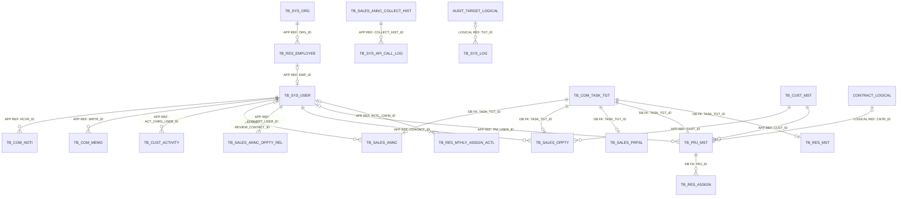
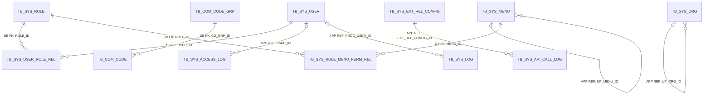
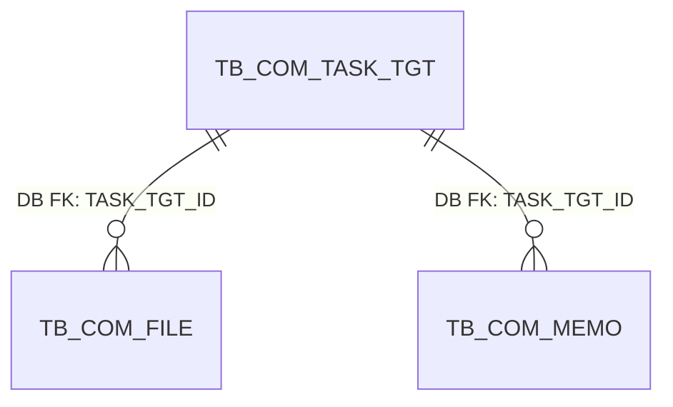
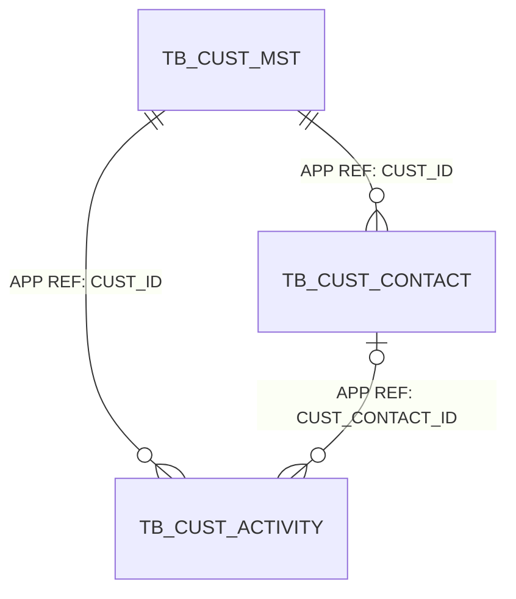
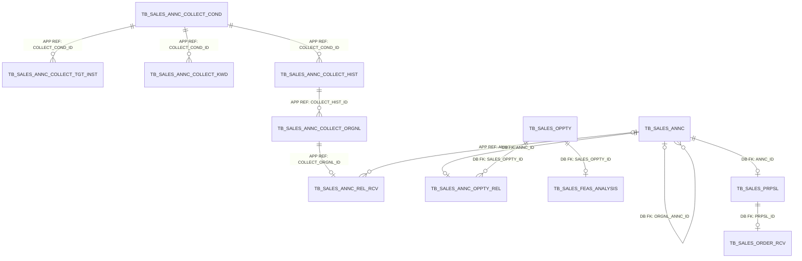
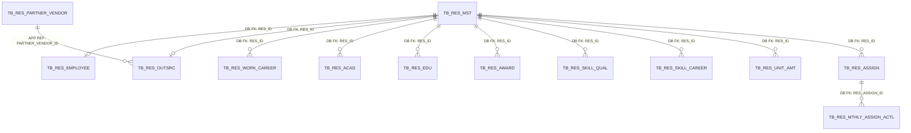
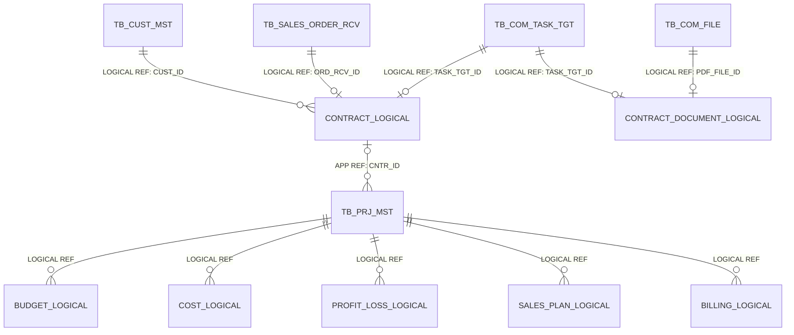

<!-- 이 파일은 python scripts/generate_erd.py --overview 명령으로 생성합니다. 직접 수정하지 마십시오. -->
# BMS 전체 ERD

## 1. 문서 개요

현재 물리 모델이 확정된 모든 업무영역의 PostgreSQL 테이블과 관계를 통합하여 표현한다. 상세 컬럼은 영역별 ERD에서 확인하며, 아직 물리화되지 않은 업무영역은 논리 확장 경계로 구분한다.

- 물리화 범위: 6개 업무영역, 47개 테이블, 671개 컬럼
- 구현 메타데이터: 202개 제약조건, 104개 인덱스
- 표기: `DB FK`는 데이터베이스 집행, `APP REF`는 애플리케이션 집행, `LOGICAL REF`는 상대 영역 물리화 전 논리 관계
- 카디널리티: `||` 필수 1, `o|` 선택 1, `o{` 0개 이상

## 2. 물리 모델 범위

| 업무영역 | 테이블 | 컬럼 | 제약조건 | 인덱스 | 상세 ERD |
| --- | ---: | ---: | ---: | ---: | --- |
| 시스템 관리 | 14 | 148 | 46 | 25 | [01.system-management-erd.md](01.system-management-erd.md) |
| 공통 업무영역 | 4 | 40 | 14 | 7 | [02.common-management-erd.md](02.common-management-erd.md) |
| 고객관리 | 3 | 40 | 10 | 9 | [03.customer-management-erd.md](03.customer-management-erd.md) |
| 영업관리 | 12 | 270 | 59 | 37 | [04.sales-management-erd.md](04.sales-management-erd.md) |
| 프로젝트관리 | 1 | 17 | 8 | 5 | [06.project-management-erd.md](06.project-management-erd.md) |
| 인력관리 | 13 | 156 | 65 | 21 | [07.resource-management-erd.md](07.resource-management-erd.md) |

## 3. 업무영역 간 관계



영역 간 참조 중 로그 보존, 감사 속성, 선택적 사용자 참조와 미물리화 선행 참조는 애플리케이션에서 집행한다.

## 4. 업무영역별 관계

### 4.1 시스템 관리



영역 내부 FK 관계가 없는 테이블: `TB_SYS_CONFIG`, `TB_SYS_NOTICE`

### 4.2 공통 업무영역



영역 내부 FK 관계가 없는 테이블: `TB_COM_NOTI`

### 4.3 고객관리



### 4.4 영업관리



### 4.5 프로젝트관리

```mermaid
erDiagram
```

영역 내부 FK 관계가 없는 테이블: `TB_PRJ_MST`

### 4.6 인력관리



## 5. 미물리화 업무영역의 논리 확장 경계

계약·예산원가·매출수금 영역은 논리 엔터티가 정의되어 있으나 물리 테이블·컬럼·제약조건은 아직 확정되지 않았다. 다음 관계는 현재 논리 모델의 연결 방향이며 물리화 시 실제 테이블명과 FK 집행 방식을 확정한다.



### 5.1 논리 엔터티 목록

| 업무영역 | 논리 엔터티 |
| --- | --- |
| contract | 계약, 계약기관, 계약업체, 계약변경이력, 계약문서 |
| cost | 예산, 예산항목, 예산상세, 예산변경이력, 인건비, 외주비, 경비, 원가, 손익, 공통경비배부 |
| revenue | 매출계획, 매출, 청구, 수금, 미수금, 세금계산서 |

## 6. 전체 물리 테이블 목록

| 업무영역 | 물리 테이블 | 논리 엔터티 | 유형 |
| --- | --- | --- | --- |
| 시스템 관리 | `TB_SYS_USER` | 사용자 | MASTER |
| 시스템 관리 | `TB_SYS_ROLE` | 역할 | MASTER |
| 시스템 관리 | `TB_SYS_USER_ROLE_REL` | 사용자역할 | RELATION |
| 시스템 관리 | `TB_SYS_MENU` | 메뉴 | MASTER |
| 시스템 관리 | `TB_SYS_ROLE_MENU_PERM_REL` | 역할메뉴권한 | RELATION |
| 시스템 관리 | `TB_SYS_ORG` | 조직 | MASTER |
| 시스템 관리 | `TB_COM_CODE_GRP` | 코드그룹 | MASTER |
| 시스템 관리 | `TB_COM_CODE` | 공통코드 | MASTER |
| 시스템 관리 | `TB_SYS_CONFIG` | 시스템설정 | MASTER |
| 시스템 관리 | `TB_SYS_EXT_REL_CONFIG` | 외부시스템연계설정 | MASTER |
| 시스템 관리 | `TB_SYS_API_CALL_LOG` | API호출로그 | LOG |
| 시스템 관리 | `TB_SYS_ACCESS_LOG` | 접속로그 | LOG |
| 시스템 관리 | `TB_SYS_LOG` | 시스템로그 | LOG |
| 시스템 관리 | `TB_SYS_NOTICE` | 공지사항 | BUSINESS |
| 공통 업무영역 | `TB_COM_NOTI` | 알림 | BUSINESS |
| 공통 업무영역 | `TB_COM_TASK_TGT` | 업무대상 | BUSINESS |
| 공통 업무영역 | `TB_COM_FILE` | 첨부파일 | BUSINESS |
| 공통 업무영역 | `TB_COM_MEMO` | 메모 | BUSINESS |
| 고객관리 | `TB_CUST_MST` | 고객사 | MASTER |
| 고객관리 | `TB_CUST_CONTACT` | 고객담당자 | MASTER |
| 고객관리 | `TB_CUST_ACTIVITY` | 영업활동 | BUSINESS |
| 영업관리 | `TB_SALES_ANNC` | 사업공고 | BUSINESS |
| 영업관리 | `TB_SALES_ANNC_COLLECT_COND` | 사업공고수집조건 | MASTER |
| 영업관리 | `TB_SALES_ANNC_COLLECT_TGT_INST` | 사업공고수집대상기관 | RELATION |
| 영업관리 | `TB_SALES_ANNC_COLLECT_KWD` | 사업공고수집키워드 | RELATION |
| 영업관리 | `TB_SALES_ANNC_COLLECT_HIST` | 사업공고수집이력 | HISTORY |
| 영업관리 | `TB_SALES_ANNC_COLLECT_ORGNL` | 사업공고수집원문 | HISTORY |
| 영업관리 | `TB_SALES_ANNC_REL_RCV` | 사업공고연계수신 | HISTORY |
| 영업관리 | `TB_SALES_ANNC_OPPTY_REL` | 사업공고영업기회연계 | RELATION |
| 영업관리 | `TB_SALES_OPPTY` | 영업기회 | BUSINESS |
| 영업관리 | `TB_SALES_FEAS_ANALYSIS` | 사업성분석 | BUSINESS |
| 영업관리 | `TB_SALES_PRPSL` | 제안 | BUSINESS |
| 영업관리 | `TB_SALES_ORDER_RCV` | 수주 | BUSINESS |
| 프로젝트관리 | `TB_PRJ_MST` | 프로젝트 | MASTER |
| 인력관리 | `TB_RES_MST` | 인력 | MASTER |
| 인력관리 | `TB_RES_EMPLOYEE` | 직원 | MASTER |
| 인력관리 | `TB_RES_OUTSRC` | 외주인력 | MASTER |
| 인력관리 | `TB_RES_PARTNER_VENDOR` | 협력업체 | MASTER |
| 인력관리 | `TB_RES_WORK_CAREER` | 인력근무경력 | HISTORY |
| 인력관리 | `TB_RES_ACAD` | 인력학력 | HISTORY |
| 인력관리 | `TB_RES_EDU` | 인력교육 | HISTORY |
| 인력관리 | `TB_RES_AWARD` | 인력상훈 | HISTORY |
| 인력관리 | `TB_RES_SKILL_QUAL` | 인력기술자격 | HISTORY |
| 인력관리 | `TB_RES_SKILL_CAREER` | 인력기술경력 | HISTORY |
| 인력관리 | `TB_RES_UNIT_AMT` | 인력단가 | HISTORY |
| 인력관리 | `TB_RES_ASSIGN` | 인력투입 | BUSINESS |
| 인력관리 | `TB_RES_MTHLY_ASSIGN_ACTL` | 인력월별투입실적 | BUSINESS |

## 7. 재생성

```powershell
# 전체 통합 ERD만 생성
python scripts/generate_erd.py --overview

# 전체 통합 ERD와 지원 영역별 상세 ERD 생성
python scripts/generate_erd.py --all
```

생성 후 전체 데이터 카탈로그를 검증한다.

```powershell
python scripts/validate_data_catalog.py
```
