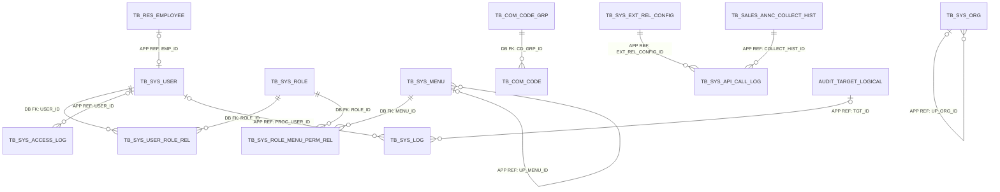
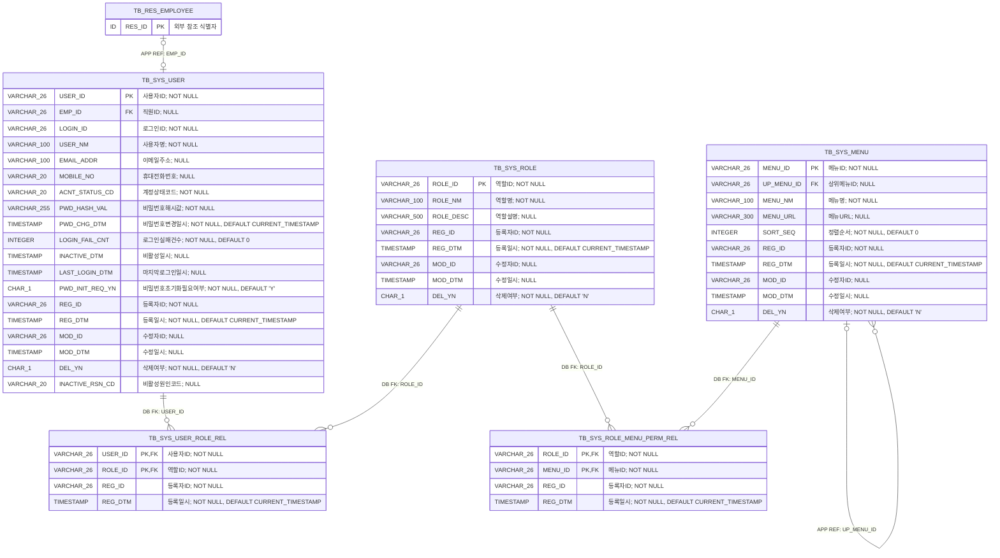
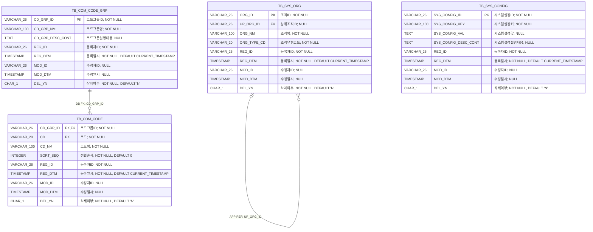
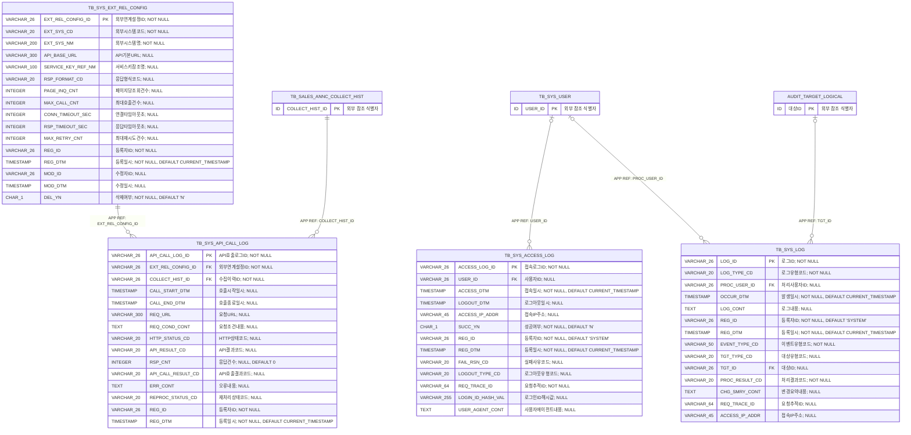
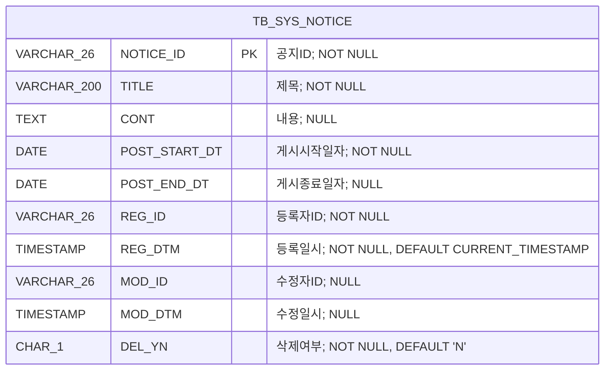

<!-- 이 파일은 scripts/generate_system_erd.py로 생성합니다. 직접 수정하지 마십시오. -->
# 시스템 관리 상세 ERD

## 1. 문서 개요

시스템 관리 영역의 PostgreSQL 물리 모델을 계정·권한, 조직·코드·설정, 외부연계·로그 및 공지사항 관점으로 표현한다. 원본은 데이터 카탈로그 CSV이며 이 문서는 구현과 리뷰를 위한 파생 산출물이다.

- 기준 DBMS: PostgreSQL
- 범위: 시스템 관리 14개 테이블
- 표기: `PK`는 기본키, `FK`는 논리 참조 컬럼, `DB FK`는 DB 제약 집행, `APP REF`는 애플리케이션 집행
- 타입 표기: Mermaid 호환을 위해 `VARCHAR(26)`은 `VARCHAR_26`, `CHAR(1)`은 `CHAR_1`처럼 괄호를 밑줄로 표시
- 카디널리티: `||` 필수 1, `o|` 선택 1, `o{` 0개 이상

### 1.1 원본 카탈로그

- 테이블: `03.physical-model/tables/table-system.csv`
- 컬럼: `03.physical-model/columns/column-system.csv`
- 제약조건: `03.physical-model/constraints/constraint-system.csv`
- 인덱스: `03.physical-model/indexes/index-system.csv`
- 타입 매핑: `01.standard/db-type-mapping.csv`

### 1.2 업무기능 추적성

| 기능 ID | 업무기능 | 주요 테이블 |
| --- | --- | --- |
| BFD-01-01 | 사용자관리 | TB_SYS_USER, TB_SYS_ACCESS_LOG, TB_SYS_LOG |
| BFD-01-02 | 역할관리 | TB_SYS_ROLE, TB_SYS_USER_ROLE_REL, TB_SYS_ROLE_MENU_PERM_REL |
| BFD-01-03 | 메뉴관리 | TB_SYS_MENU, TB_SYS_ROLE_MENU_PERM_REL |
| BFD-01-04 | 공통코드관리 | TB_COM_CODE_GRP, TB_COM_CODE |
| BFD-01-05 | 조직관리 | TB_SYS_ORG |
| BFD-01-06 | 시스템환경설정 | TB_SYS_CONFIG, TB_SYS_EXT_REL_CONFIG |
| BFD-01-07 | 로그관리 | TB_SYS_ACCESS_LOG, TB_SYS_LOG, TB_SYS_API_CALL_LOG |
| BFD-01-08 | 공지사항관리 | TB_SYS_NOTICE |

## 2. 전체 관계 개요



> `TB_RES_EMPLOYEE`와 `TB_SALES_ANNC_COLLECT_HIST`는 다른 업무영역의 테이블이며, `AUDIT_TARGET_LOGICAL`은 `(TGT_TYPE_CD, TGT_ID)`로 식별하는 다형 감사대상이다.

## 3. 영역별 상세 ERD

### 3.1 계정·권한·메뉴

사용자 인증과 역할 기반 메뉴 접근 제어 구조이다.



테이블 대응:
- `TB_SYS_USER`: 사용자
- `TB_SYS_ROLE`: 역할
- `TB_SYS_USER_ROLE_REL`: 사용자역할
- `TB_SYS_MENU`: 메뉴
- `TB_SYS_ROLE_MENU_PERM_REL`: 역할메뉴권한

### 3.2 조직·공통코드·환경설정

계층형 조직, 공통코드 및 시스템 운영 설정 구조이다.



테이블 대응:
- `TB_SYS_ORG`: 조직
- `TB_COM_CODE_GRP`: 코드그룹
- `TB_COM_CODE`: 공통코드
- `TB_SYS_CONFIG`: 시스템설정

### 3.3 외부연계·로그

외부 API 호출 정책과 호출·접속·감사 로그 구조이다.



테이블 대응:
- `TB_SYS_EXT_REL_CONFIG`: 외부시스템연계설정
- `TB_SYS_API_CALL_LOG`: API호출로그
- `TB_SYS_ACCESS_LOG`: 접속로그
- `TB_SYS_LOG`: 시스템로그

### 3.4 공지사항

게시 기간과 논리삭제를 적용하는 시스템 공지 구조이다.



테이블 대응:
- `TB_SYS_NOTICE`: 공지사항

## 4. 관계 구현 명세

| 관계명 | 자식 컬럼 | 부모 | 집행 | 생성 | 삭제/수정 | 설명 |
| --- | --- | --- | --- | --- | --- | --- |
| FK_TB_SYS_USER_ROLE_REL_01 | TB_SYS_USER_ROLE_REL.USER_ID | TB_SYS_USER.USER_ID | DATABASE | Y | RESTRICT/RESTRICT | 사용자역할의 사용자 참조 무결성 |
| FK_TB_SYS_USER_ROLE_REL_02 | TB_SYS_USER_ROLE_REL.ROLE_ID | TB_SYS_ROLE.ROLE_ID | DATABASE | Y | RESTRICT/RESTRICT | 사용자역할의 역할 참조 무결성 |
| FK_TB_SYS_USER_01 | TB_SYS_USER.EMP_ID | TB_RES_EMPLOYEE.RES_ID | APPLICATION | N | RESTRICT/RESTRICT | 사용자의 내부 직원 애플리케이션 참조 |
| FK_TB_SYS_MENU_01 | TB_SYS_MENU.UP_MENU_ID | TB_SYS_MENU.MENU_ID | APPLICATION | N | RESTRICT/RESTRICT | 상위메뉴 자기참조 |
| FK_TB_SYS_ROLE_MENU_PERM_REL_1 | TB_SYS_ROLE_MENU_PERM_REL.ROLE_ID | TB_SYS_ROLE.ROLE_ID | DATABASE | Y | RESTRICT/RESTRICT | 역할메뉴권한의 역할 참조 무결성 |
| FK_TB_SYS_ROLE_MENU_PERM_REL_2 | TB_SYS_ROLE_MENU_PERM_REL.MENU_ID | TB_SYS_MENU.MENU_ID | DATABASE | Y | RESTRICT/RESTRICT | 역할메뉴권한의 메뉴 참조 무결성 |
| FK_TB_SYS_ORG_01 | TB_SYS_ORG.UP_ORG_ID | TB_SYS_ORG.ORG_ID | APPLICATION | N | RESTRICT/RESTRICT | 상위조직 자기참조 |
| FK_TB_COM_CODE_01 | TB_COM_CODE.CD_GRP_ID | TB_COM_CODE_GRP.CD_GRP_ID | DATABASE | Y | RESTRICT/RESTRICT | 공통코드의 코드그룹 참조 무결성 |
| FK_TB_SYS_API_CALL_LOG_01 | TB_SYS_API_CALL_LOG.EXT_REL_CONFIG_ID | TB_SYS_EXT_REL_CONFIG.EXT_REL_CONFIG_ID | APPLICATION | N | RESTRICT/RESTRICT | 로그 보존기간을 고려한 외부시스템연계설정 애플리케이션 참조 |
| FK_TB_SYS_API_CALL_LOG_02 | TB_SYS_API_CALL_LOG.COLLECT_HIST_ID | TB_SALES_ANNC_COLLECT_HIST.COLLECT_HIST_ID | APPLICATION | N | RESTRICT/RESTRICT | 영업관리 사업공고수집이력 애플리케이션 참조 |
| FK_TB_SYS_ACCESS_LOG_01 | TB_SYS_ACCESS_LOG.USER_ID | TB_SYS_USER.USER_ID | APPLICATION | N | RESTRICT/RESTRICT | 접속로그의 사용자 애플리케이션 참조 |
| FK_TB_SYS_LOG_01 | TB_SYS_LOG.PROC_USER_ID | TB_SYS_USER.USER_ID | APPLICATION | N | RESTRICT/RESTRICT | 시스템로그 처리사용자의 애플리케이션 참조 |
| FK_TB_SYS_LOG_02 | TB_SYS_LOG.TGT_ID | 감사대상(논리).대상ID | APPLICATION | N | RESTRICT/RESTRICT | 대상유형코드와 대상ID로 식별하는 일반 감사대상 애플리케이션 참조 |

## 5. 업무 무결성 규칙

| 제약조건 | 테이블 | 대상 컬럼 | 검사식 | 설명 |
| --- | --- | --- | --- | --- |
| CK_TB_SYS_USER_02 | TB_SYS_USER | PWD_INIT_REQ_YN | `PWD_INIT_REQ_YN IN ('Y','N')` | 비밀번호초기화필요여부 허용값 검사 |
| CK_TB_SYS_USER_03 | TB_SYS_USER | DEL_YN | `DEL_YN IN ('Y','N')` | 삭제여부 허용값 검사 |
| CK_TB_SYS_USER_04 | TB_SYS_USER | ACNT_STATUS_CD\|INACTIVE_RSN_CD\|INACTIVE_DTM | `(ACNT_STATUS_CD = 'ACTIVE' AND INACTIVE_RSN_CD IS NULL AND INACTIVE_DTM IS NULL) OR (ACNT_STATUS_CD = 'INACTIVE' AND INACTIVE_RSN_CD IS NOT NULL AND INACTIVE_DTM IS NOT NULL)` | 계정상태와 비활성 원인 및 일시 일관성 검사 |
| CK_TB_SYS_ROLE_02 | TB_SYS_ROLE | DEL_YN | `DEL_YN IN ('Y','N')` | 삭제여부 허용값 검사 |
| CK_TB_SYS_MENU_02 | TB_SYS_MENU | DEL_YN | `DEL_YN IN ('Y','N')` | 삭제여부 허용값 검사 |
| CK_TB_SYS_ORG_02 | TB_SYS_ORG | DEL_YN | `DEL_YN IN ('Y','N')` | 삭제여부 허용값 검사 |
| CK_TB_COM_CODE_GRP_02 | TB_COM_CODE_GRP | DEL_YN | `DEL_YN IN ('Y','N')` | 삭제여부 허용값 검사 |
| CK_TB_COM_CODE_02 | TB_COM_CODE | DEL_YN | `DEL_YN IN ('Y','N')` | 삭제여부 허용값 검사 |
| CK_TB_SYS_CONFIG_02 | TB_SYS_CONFIG | DEL_YN | `DEL_YN IN ('Y','N')` | 삭제여부 허용값 검사 |
| CK_TB_SYS_EXT_REL_CONFIG_01 | TB_SYS_EXT_REL_CONFIG | DEL_YN | `DEL_YN IN ('Y','N')` | 삭제여부 허용값 검사 |
| CK_TB_SYS_EXT_REL_CONFIG_02 | TB_SYS_EXT_REL_CONFIG | PAGE_INQ_CNT\|MAX_CALL_CNT\|CONN_TIMEOUT_SEC\|RSP_TIMEOUT_SEC\|MAX_RETRY_CNT | `(PAGE_INQ_CNT IS NULL OR PAGE_INQ_CNT > 0) AND (MAX_CALL_CNT IS NULL OR MAX_CALL_CNT > 0) AND (CONN_TIMEOUT_SEC IS NULL OR CONN_TIMEOUT_SEC > 0) AND (RSP_TIMEOUT_SEC IS NULL OR RSP_TIMEOUT_SEC > 0) AND (MAX_RETRY_CNT IS NULL OR MAX_RETRY_CNT >= 0)` | 외부연계 호출정책 수치 범위 검사 |
| CK_TB_SYS_API_CALL_LOG_01 | TB_SYS_API_CALL_LOG | RSP_CNT | `RSP_CNT IS NULL OR RSP_CNT >= 0` | 응답건수 음수 방지 |
| CK_TB_SYS_API_CALL_LOG_02 | TB_SYS_API_CALL_LOG | CALL_START_DTM\|CALL_END_DTM | `CALL_END_DTM IS NULL OR CALL_START_DTM IS NULL OR CALL_END_DTM >= CALL_START_DTM` | API 호출 시작과 종료 일시 순서 검사 |
| CK_TB_SYS_ACCESS_LOG_01 | TB_SYS_ACCESS_LOG | SUCC_YN | `SUCC_YN IN ('Y','N')` | 성공여부 허용값 검사 |
| CK_TB_SYS_ACCESS_LOG_02 | TB_SYS_ACCESS_LOG | SUCC_YN\|FAIL_RSN_CD | `(SUCC_YN = 'Y' AND FAIL_RSN_CD IS NULL) OR (SUCC_YN = 'N' AND FAIL_RSN_CD IS NOT NULL)` | 로그인 성공여부와 실패사유 일관성 검사 |
| CK_TB_SYS_ACCESS_LOG_03 | TB_SYS_ACCESS_LOG | SUCC_YN\|LOGOUT_DTM\|LOGOUT_TYPE_CD | `(LOGOUT_DTM IS NULL AND LOGOUT_TYPE_CD IS NULL) OR (SUCC_YN = 'Y' AND LOGOUT_DTM IS NOT NULL AND LOGOUT_TYPE_CD IS NOT NULL)` | 로그아웃일시와 로그아웃유형 일관성 검사 |
| CK_TB_SYS_LOG_01 | TB_SYS_LOG | PROC_RESULT_CD | `PROC_RESULT_CD IN ('SUCCESS','FAILURE')` | 처리결과코드 허용값 검사 |
| CK_TB_SYS_LOG_02 | TB_SYS_LOG | TGT_TYPE_CD\|TGT_ID | `(TGT_TYPE_CD IS NULL AND TGT_ID IS NULL) OR (TGT_TYPE_CD IS NOT NULL AND TGT_ID IS NOT NULL)` | 대상유형과 대상ID 일관성 검사 |
| CK_TB_SYS_NOTICE_01 | TB_SYS_NOTICE | DEL_YN | `DEL_YN IN ('Y','N')` | 삭제여부 허용값 검사 |

## 6. 조회 및 고유성 인덱스

| 인덱스 | 테이블 | 컬럼 | 고유 | 조건 | 목적 |
| --- | --- | --- | --- | --- | --- |
| UX_TB_SYS_USER_01 | TB_SYS_USER | LOGIN_ID | Y | - | 삭제 여부와 관계없는 로그인ID 전체 고유성 보장 |
| UX_TB_SYS_USER_02 | TB_SYS_USER | EMP_ID | Y | EMP_ID IS NOT NULL AND DEL_YN = 'N' | 내부 직원과 활성 사용자 계정의 선택적 1대1 관계 보장 |
| UX_TB_SYS_ROLE_01 | TB_SYS_ROLE | ROLE_NM | Y | DEL_YN = 'N' | 활성 역할명 고유성 보장 |
| IX_TB_SYS_USER_ROLE_REL_01 | TB_SYS_USER_ROLE_REL | ROLE_ID | N | - | 역할별 사용자 역방향 조회 |
| IX_TB_SYS_MENU_01 | TB_SYS_MENU | UP_MENU_ID\|SORT_SEQ | N | DEL_YN = 'N' | 상위메뉴별 하위메뉴 정렬 조회 |
| IX_TB_SYS_ROLE_MENU_PERM_REL_1 | TB_SYS_ROLE_MENU_PERM_REL | MENU_ID | N | - | 메뉴별 역할권한 역방향 조회 |
| IX_TB_SYS_ORG_01 | TB_SYS_ORG | UP_ORG_ID | N | DEL_YN = 'N' | 상위조직별 하위조직 조회 |
| IX_TB_COM_CODE_01 | TB_COM_CODE | CD_GRP_ID\|SORT_SEQ | N | DEL_YN = 'N' | 코드그룹별 삭제되지 않은 코드 정렬 조회 |
| UX_TB_SYS_CONFIG_01 | TB_SYS_CONFIG | SYS_CONFIG_KEY | Y | DEL_YN = 'N' | 활성 시스템설정키 고유성 보장 |
| UX_TB_SYS_EXT_REL_CONFIG_01 | TB_SYS_EXT_REL_CONFIG | EXT_SYS_CD | Y | DEL_YN = 'N' | 삭제되지 않은 외부시스템별 연계설정 고유성 보장 |
| IX_TB_SYS_API_CALL_LOG_01 | TB_SYS_API_CALL_LOG | EXT_REL_CONFIG_ID\|CALL_START_DTM | N | - | 외부시스템별 API 호출이력 조회 |
| IX_TB_SYS_API_CALL_LOG_02 | TB_SYS_API_CALL_LOG | COLLECT_HIST_ID\|CALL_START_DTM | N | - | 수집 실행별 API 호출이력 조회 |
| IX_TB_SYS_API_CALL_LOG_03 | TB_SYS_API_CALL_LOG | CALL_START_DTM | N | - | 호출시작일시 기준 기간 조회 및 보관정책 처리 |
| IX_TB_SYS_API_CALL_LOG_04 | TB_SYS_API_CALL_LOG | API_CALL_RESULT_CD\|CALL_START_DTM | N | - | 호출결과별 API 호출이력 조회 |
| IX_TB_SYS_API_CALL_LOG_05 | TB_SYS_API_CALL_LOG | REPROC_STATUS_CD\|CALL_START_DTM | N | - | 재처리상태별 API 호출이력 조회 |
| IX_TB_SYS_ACCESS_LOG_01 | TB_SYS_ACCESS_LOG | USER_ID\|ACCESS_DTM | N | - | 사용자별 접속이력 조회 |
| IX_TB_SYS_ACCESS_LOG_02 | TB_SYS_ACCESS_LOG | ACCESS_DTM | N | - | 접속일시 기준 기간 조회 및 보관정책 처리 |
| IX_TB_SYS_ACCESS_LOG_03 | TB_SYS_ACCESS_LOG | REQ_TRACE_ID | N | - | 로그인 요청추적ID 기준 접속이력 조회 |
| IX_TB_SYS_LOG_01 | TB_SYS_LOG | LOG_TYPE_CD\|OCCUR_DTM | N | - | 로그유형별 발생이력 조회 |
| IX_TB_SYS_LOG_02 | TB_SYS_LOG | PROC_USER_ID\|OCCUR_DTM | N | - | 처리사용자별 시스템로그 조회 |
| IX_TB_SYS_LOG_03 | TB_SYS_LOG | OCCUR_DTM | N | - | 발생일시 기준 기간 조회 및 보관정책 처리 |
| IX_TB_SYS_LOG_04 | TB_SYS_LOG | EVENT_TYPE_CD\|OCCUR_DTM | N | - | 이벤트유형별 발생이력 조회 |
| IX_TB_SYS_LOG_05 | TB_SYS_LOG | TGT_TYPE_CD\|TGT_ID\|OCCUR_DTM | N | - | 업무 대상별 시스템로그 조회 |
| IX_TB_SYS_LOG_06 | TB_SYS_LOG | REQ_TRACE_ID | N | - | 요청추적ID 기준 시스템로그 조회 |
| IX_TB_SYS_NOTICE_01 | TB_SYS_NOTICE | POST_START_DT\|POST_END_DT | N | DEL_YN = 'N' | 게시기간에 해당하는 공지사항 조회 |

## 7. 구현 주의사항

- 내부 단일 식별자는 애플리케이션에서 생성한 26자리 Monotonic ULID를 사용한다.
- 모든 일시는 UTC로 저장하고 화면에서 `Asia/Seoul`로 변환한다.
- 논리삭제된 부모 참조, 계층 순환, 외주인력 계정 생성 금지 및 다형 감사대상 정합성은 애플리케이션에서 검증한다.
- 로그 테이블은 명시된 로그아웃일시 갱신 외에는 불변으로 취급하며 인증정보·민감값은 저장 전에 마스킹한다.
- 역할이나 메뉴를 논리삭제하면 기존 관계 이력은 보존하되 다음 로그인부터 권한 계산에서 제외한다.
- 공통코드 값은 운영 사용 후 변경하거나 재사용하지 않는다.

## 8. 재생성

```powershell
python scripts/generate_system_erd.py
```

생성 후 전체 데이터 카탈로그 검증을 수행한다.

```powershell
python scripts/validate_data_catalog.py --review-area system --report tmp/data-catalog-validation-system.csv
```
