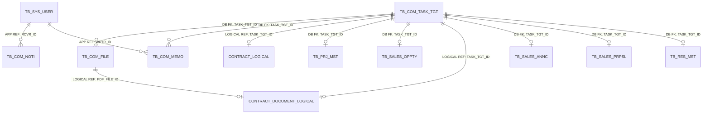
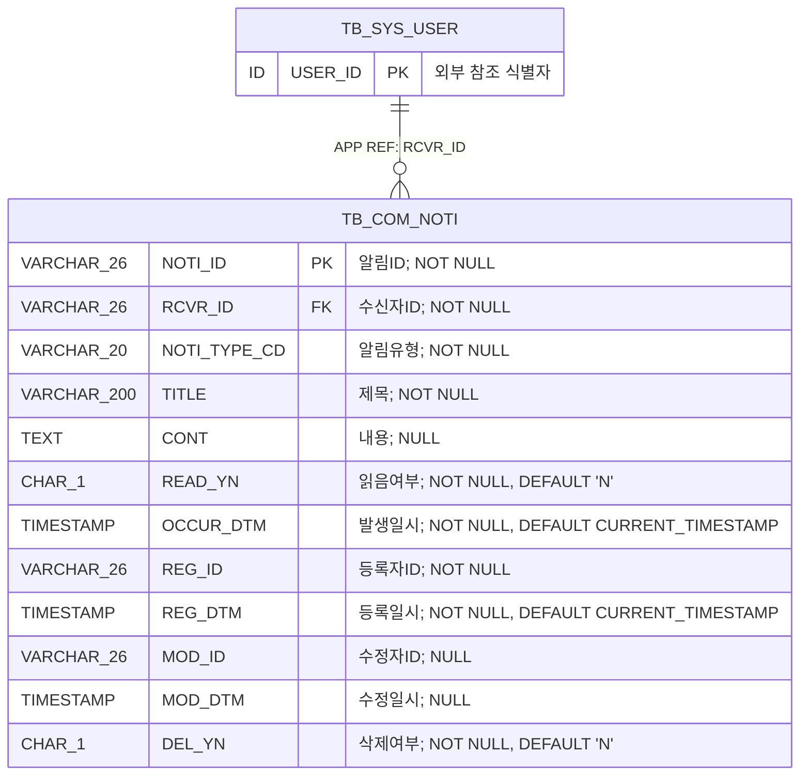
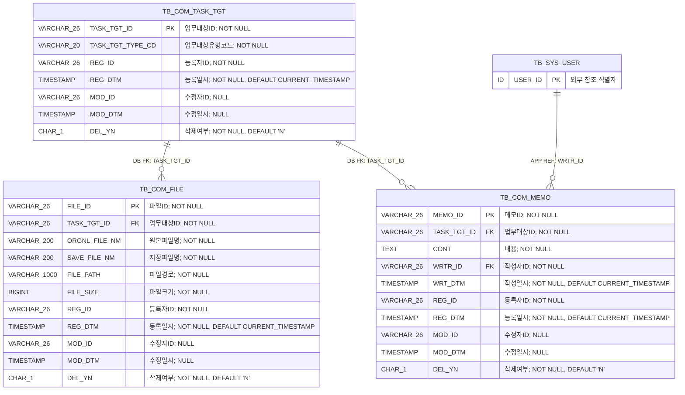

<!-- 이 파일은 python scripts/generate_erd.py --area common 명령으로 생성합니다. 직접 수정하지 마십시오. -->
# 공통 업무영역 상세 ERD

## 1. 문서 개요

여러 업무영역에서 재사용하는 알림, 업무대상, 첨부파일 및 메모의 PostgreSQL 물리 모델을 표현한다. 원본은 데이터 카탈로그 CSV이며 이 문서는 구현과 리뷰를 위한 파생 산출물이다.

- 기준 DBMS: PostgreSQL
- 범위: 공통 업무영역 4개 테이블
- 표기: `PK`는 기본키, `FK`는 논리 참조 컬럼, `DB FK`는 DB 제약 집행, `APP REF`는 애플리케이션 집행, `LOGICAL REF`는 상대 영역 물리화 전 논리 관계
- 타입 표기: Mermaid 호환을 위해 `VARCHAR(26)`은 `VARCHAR_26`, `CHAR(1)`은 `CHAR_1`처럼 괄호를 밑줄로 표시
- 카디널리티: `||` 필수 1, `o|` 선택 1, `o{` 0개 이상

### 1.1 원본 카탈로그

- 테이블: `03.physical-model/tables/table-common.csv`
- 컬럼: `03.physical-model/columns/column-common.csv`
- 제약조건: `03.physical-model/constraints/constraint-common.csv`
- 인덱스: `03.physical-model/indexes/index-common.csv`
- 타입 매핑: `01.standard/db-type-mapping.csv`

### 1.2 업무기능 추적성

| 기능 ID | 업무기능 | 주요 테이블 |
| --- | --- | --- |
| BFD-02-01 | 대시보드 | 업무영역별 원천 데이터의 파생 조회 |
| BFD-02-02 | 알림관리 | TB_COM_NOTI |
| BFD-02-03 | 첨부파일관리 | TB_COM_TASK_TGT, TB_COM_FILE |
| BFD-02-04 | 메모관리 | TB_COM_TASK_TGT, TB_COM_MEMO |
| BFD-02-05 | 인증관리 | TB_SYS_USER, TB_SYS_ACCESS_LOG |

## 2. 전체 관계 개요



> 계약·계약문서는 아직 물리 모델이 확정되지 않아 `*_LOGICAL`로 표시했다. 프로젝트·영업기회·사업공고·제안·인력의 물리 테이블은 `TASK_TGT_ID`를 필수·고유 참조한다. 업무대상 유형과 실제 연결 엔터티의 일치는 애플리케이션 트랜잭션에서 검증한다.

## 3. 영역별 상세 ERD

### 3.1 알림

사용자별 업무 이벤트 알림과 읽음 상태를 관리하는 구조이다.



테이블 대응:
- `TB_COM_NOTI`: 알림

### 3.2 업무대상·첨부파일·메모

공통 업무대상을 중심으로 파일과 메모를 연결하는 범용 구조이다.



테이블 대응:
- `TB_COM_TASK_TGT`: 업무대상
- `TB_COM_FILE`: 첨부파일
- `TB_COM_MEMO`: 메모

## 4. 관계 구현 명세

| 관계명 | 자식 컬럼 | 부모 | 집행 | 생성 | 삭제/수정 | 설명 |
| --- | --- | --- | --- | --- | --- | --- |
| FK_TB_COM_NOTI_01 | TB_COM_NOTI.RCVR_ID | TB_SYS_USER.USER_ID | APPLICATION | N | RESTRICT/RESTRICT | 알림 수신자의 시스템관리 사용자 애플리케이션 참조 |
| FK_TB_COM_FILE_01 | TB_COM_FILE.TASK_TGT_ID | TB_COM_TASK_TGT.TASK_TGT_ID | DATABASE | Y | RESTRICT/RESTRICT | 첨부파일의 업무대상 참조 무결성 |
| FK_TB_COM_MEMO_01 | TB_COM_MEMO.TASK_TGT_ID | TB_COM_TASK_TGT.TASK_TGT_ID | DATABASE | Y | RESTRICT/RESTRICT | 메모의 업무대상 참조 무결성 |
| FK_TB_COM_MEMO_02 | TB_COM_MEMO.WRTR_ID | TB_SYS_USER.USER_ID | APPLICATION | N | RESTRICT/RESTRICT | 메모 작성자의 시스템관리 사용자 애플리케이션 참조 |

## 5. 업무 무결성 규칙

| 제약조건 | 테이블 | 대상 컬럼 | 검사식 | 설명 |
| --- | --- | --- | --- | --- |
| CK_TB_COM_NOTI_01 | TB_COM_NOTI | READ_YN | `READ_YN IN ('Y','N')` | 읽음여부 허용값 검사 |
| CK_TB_COM_NOTI_02 | TB_COM_NOTI | DEL_YN | `DEL_YN IN ('Y','N')` | 삭제여부 허용값 검사 |
| CK_TB_COM_TASK_TGT_01 | TB_COM_TASK_TGT | DEL_YN | `DEL_YN IN ('Y','N')` | 삭제여부 허용값 검사 |
| CK_TB_COM_FILE_01 | TB_COM_FILE | FILE_SIZE | `FILE_SIZE >= 0` | 파일크기 음수 방지 |
| CK_TB_COM_FILE_02 | TB_COM_FILE | DEL_YN | `DEL_YN IN ('Y','N')` | 삭제여부 허용값 검사 |
| CK_TB_COM_MEMO_01 | TB_COM_MEMO | DEL_YN | `DEL_YN IN ('Y','N')` | 삭제여부 허용값 검사 |

## 6. 조회 및 고유성 인덱스

| 인덱스 | 테이블 | 컬럼 | 고유 | 조건 | 목적 |
| --- | --- | --- | --- | --- | --- |
| IX_TB_COM_NOTI_01 | TB_COM_NOTI | RCVR_ID\|READ_YN\|OCCUR_DTM | N | DEL_YN = 'N' | 수신자별 읽음 상태와 발생일시 기준 알림 조회 |
| IX_TB_COM_NOTI_02 | TB_COM_NOTI | OCCUR_DTM | N | - | 발생일시 기준 알림 보관정책 처리 |
| IX_TB_COM_TASK_TGT_01 | TB_COM_TASK_TGT | TASK_TGT_TYPE_CD\|REG_DTM | N | DEL_YN = 'N' | 유형별 활성 업무대상 등록순 조회 |
| IX_TB_COM_FILE_01 | TB_COM_FILE | TASK_TGT_ID\|REG_DTM | N | DEL_YN = 'N' | 업무대상별 첨부파일 등록순 조회 |
| UX_TB_COM_FILE_01 | TB_COM_FILE | FILE_PATH\|SAVE_FILE_NM | Y | - | 파일 저장 위치 전체 고유성 보장 |
| IX_TB_COM_MEMO_01 | TB_COM_MEMO | TASK_TGT_ID\|WRT_DTM | N | DEL_YN = 'N' | 업무대상별 메모 작성순 조회 |
| IX_TB_COM_MEMO_02 | TB_COM_MEMO | WRTR_ID\|WRT_DTM | N | DEL_YN = 'N' | 작성자별 메모 조회 및 관리 |

## 7. 구현 주의사항

- 업무대상은 허용된 구체 엔터티 하나와만 연결하고 유형코드와 실제 엔터티의 일치를 애플리케이션에서 검증한다.
- 논리삭제된 업무대상에는 새 첨부파일과 메모를 등록하지 않으며 기존 데이터는 보존 정책에 따라 조회한다.
- 첨부파일은 하나의 업무대상에만 소속하며 등록 후 업무대상ID를 변경하지 않는다.
- 파일경로와 저장파일명은 시스템이 생성하고 크기·확장자·실제 형식 및 정규화된 저장경로를 검증한다.
- 계약문서의 PDF 첨부파일과 계약문서는 동일한 업무대상ID를 사용해야 한다.
- 알림은 수신자 본인만 조회·읽음 처리하고 메모 수정·삭제는 작성자 또는 관리권한 보유자만 수행한다.

## 8. 재생성

```powershell
python scripts/generate_erd.py --area common
```

생성 후 전체 데이터 카탈로그 검증을 수행한다.

```powershell
python scripts/validate_data_catalog.py --review-area common --report tmp/data-catalog-validation-common.csv
```
