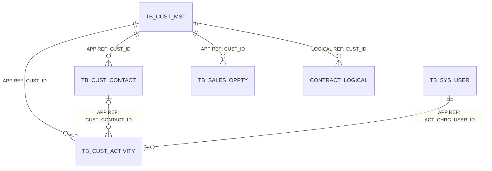
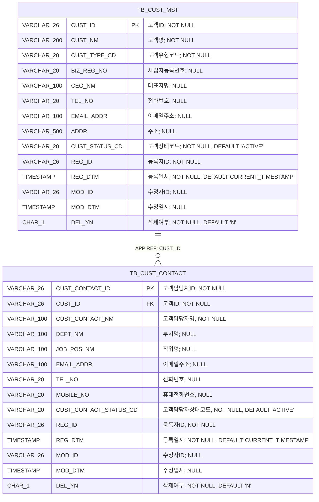
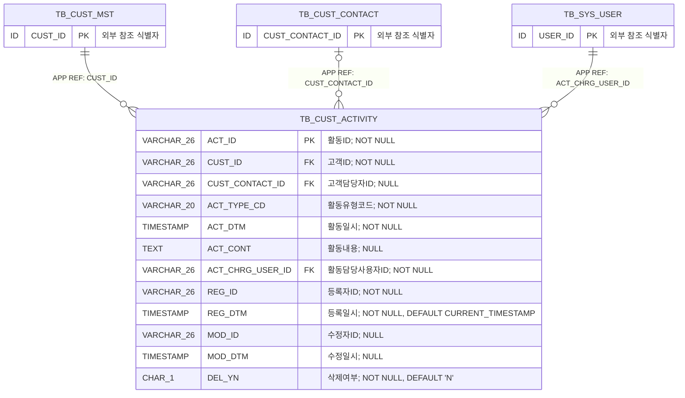

<!-- 이 파일은 python scripts/generate_erd.py --area customer 명령으로 생성합니다. 직접 수정하지 마십시오. -->
# 고객관리 상세 ERD

## 1. 문서 개요

고객사, 고객담당자 및 고객 대상 영업활동의 PostgreSQL 물리 모델을 표현한다. 원본은 데이터 카탈로그 CSV이며 이 문서는 구현과 리뷰를 위한 파생 산출물이다.

- 기준 DBMS: PostgreSQL
- 범위: 고객관리 3개 테이블
- 표기: `PK`는 기본키, `FK`는 논리 참조 컬럼, `DB FK`는 DB 제약 집행, `APP REF`는 애플리케이션 집행, `LOGICAL REF`는 상대 영역 물리화 전 논리 관계
- 타입 표기: Mermaid 호환을 위해 `VARCHAR(26)`은 `VARCHAR_26`, `CHAR(1)`은 `CHAR_1`처럼 괄호를 밑줄로 표시
- 카디널리티: `||` 필수 1, `o|` 선택 1, `o{` 0개 이상

### 1.1 원본 카탈로그

- 테이블: `03.physical-model/tables/table-customer.csv`
- 컬럼: `03.physical-model/columns/column-customer.csv`
- 제약조건: `03.physical-model/constraints/constraint-customer.csv`
- 인덱스: `03.physical-model/indexes/index-customer.csv`
- 타입 매핑: `01.standard/db-type-mapping.csv`

### 1.2 업무기능 추적성

| 기능 ID | 업무기능 | 주요 테이블 |
| --- | --- | --- |
| BFD-03-01 | 고객사관리 | TB_CUST_MST |
| BFD-03-02 | 고객담당자관리 | TB_CUST_CONTACT |
| BFD-03-03 | 영업활동관리 | TB_CUST_ACTIVITY |

## 2. 전체 관계 개요



> `TB_SYS_USER`는 시스템관리, `TB_SALES_OPPTY`는 영업관리 영역의 물리 테이블이다. 계약은 아직 물리 모델이 확정되지 않아 `CONTRACT_LOGICAL`로 표시했다.

## 3. 영역별 상세 ERD

### 3.1 고객사·고객담당자

고객사 기준정보와 소속 담당자의 상태 및 연락정보를 관리하는 구조이다.



테이블 대응:
- `TB_CUST_MST`: 고객사
- `TB_CUST_CONTACT`: 고객담당자

### 3.2 영업활동

고객사, 선택 고객담당자 및 BMS 담당사용자를 연결하여 고객 접촉 이력을 관리하는 구조이다.



테이블 대응:
- `TB_CUST_ACTIVITY`: 영업활동

## 4. 관계 구현 명세

| 관계명 | 자식 컬럼 | 부모 | 집행 | 생성 | 삭제/수정 | 설명 |
| --- | --- | --- | --- | --- | --- | --- |
| FK_TB_CUST_CONTACT_01 | TB_CUST_CONTACT.CUST_ID | TB_CUST_MST.CUST_ID | APPLICATION | N | RESTRICT/RESTRICT | 고객담당자의 고객사 애플리케이션 참조 |
| FK_TB_CUST_ACTIVITY_01 | TB_CUST_ACTIVITY.CUST_ID | TB_CUST_MST.CUST_ID | APPLICATION | N | RESTRICT/RESTRICT | 영업활동의 고객사 애플리케이션 참조 |
| FK_TB_CUST_ACTIVITY_02 | TB_CUST_ACTIVITY.CUST_CONTACT_ID | TB_CUST_CONTACT.CUST_CONTACT_ID | APPLICATION | N | RESTRICT/RESTRICT | 영업활동 고객사와 동일 고객사에 소속된 고객담당자 애플리케이션 참조 |
| FK_TB_CUST_ACTIVITY_03 | TB_CUST_ACTIVITY.ACT_CHRG_USER_ID | TB_SYS_USER.USER_ID | APPLICATION | N | RESTRICT/RESTRICT | 영업활동 담당자의 시스템관리 사용자 애플리케이션 참조 |

## 5. 업무 무결성 규칙

| 제약조건 | 테이블 | 대상 컬럼 | 검사식 | 설명 |
| --- | --- | --- | --- | --- |
| CK_TB_CUST_MST_01 | TB_CUST_MST | DEL_YN | `DEL_YN IN ('Y','N')` | 삭제여부 허용값 검사 |
| CK_TB_CUST_CONTACT_01 | TB_CUST_CONTACT | DEL_YN | `DEL_YN IN ('Y','N')` | 삭제여부 허용값 검사 |
| CK_TB_CUST_ACTIVITY_01 | TB_CUST_ACTIVITY | DEL_YN | `DEL_YN IN ('Y','N')` | 삭제여부 허용값 검사 |

## 6. 조회 및 고유성 인덱스

| 인덱스 | 테이블 | 컬럼 | 고유 | 조건 | 목적 |
| --- | --- | --- | --- | --- | --- |
| UX_TB_CUST_MST_01 | TB_CUST_MST | BIZ_REG_NO | Y | BIZ_REG_NO IS NOT NULL | 삭제 여부와 관계없는 사업자등록번호 고유성 보장 |
| IX_TB_CUST_MST_01 | TB_CUST_MST | CUST_STATUS_CD\|CUST_NM | N | DEL_YN = 'N' | 고객상태별 고객사 명칭 조회 |
| IX_TB_CUST_MST_02 | TB_CUST_MST | CUST_NM | N | DEL_YN = 'N' | 고객사 명칭 검색 |
| IX_TB_CUST_CONTACT_01 | TB_CUST_CONTACT | CUST_ID\|CUST_CONTACT_STATUS_CD\|CUST_CONTACT_NM | N | DEL_YN = 'N' | 고객사별 상태 및 담당자명 조회 |
| IX_TB_CUST_CONTACT_02 | TB_CUST_CONTACT | EMAIL_ADDR | N | DEL_YN = 'N' AND EMAIL_ADDR IS NOT NULL | 이메일주소 기준 고객담당자 조회 |
| IX_TB_CUST_ACTIVITY_01 | TB_CUST_ACTIVITY | CUST_ID\|ACT_DTM | N | DEL_YN = 'N' | 고객사별 영업활동 일시순 조회 |
| IX_TB_CUST_ACTIVITY_02 | TB_CUST_ACTIVITY | CUST_CONTACT_ID\|ACT_DTM | N | DEL_YN = 'N' AND CUST_CONTACT_ID IS NOT NULL | 고객담당자별 영업활동 조회 |
| IX_TB_CUST_ACTIVITY_03 | TB_CUST_ACTIVITY | ACT_CHRG_USER_ID\|ACT_DTM | N | DEL_YN = 'N' | 담당사용자별 영업활동 조회 |
| IX_TB_CUST_ACTIVITY_04 | TB_CUST_ACTIVITY | ACT_TYPE_CD\|ACT_DTM | N | DEL_YN = 'N' AND ACT_TYPE_CD IS NOT NULL | 활동유형별 영업활동 조회 |

## 7. 구현 주의사항

- 고객사와 고객담당자는 `ACTIVE`를 기본 상태로 등록하며 비활성 상태와 논리삭제를 구분한다.
- 사업자등록번호는 값이 있을 때 삭제 여부와 관계없이 재사용할 수 없다.
- 영업활동에 고객담당자를 지정하면 해당 담당자가 활동 고객사에 소속되어 있는지 애플리케이션에서 검증한다.
- 영업활동 등록 시 고객사, 활동유형, 활동일시 및 활동담당사용자를 필수로 입력한다.
- 비활성 고객사와 담당자는 신규 업무 선택에서 제외하지만 기존 활동과 후속 업무 이력에서는 조회할 수 있다.
- 대표자명·연락처·이메일·주소 등 개인정보는 권한과 마스킹 정책을 적용한다.
- 활동일시는 UTC로 저장하고 화면에서 `Asia/Seoul`로 변환한다.

## 8. 재생성

```powershell
python scripts/generate_erd.py --area customer
```

생성 후 전체 데이터 카탈로그 검증을 수행한다.

```powershell
python scripts/validate_data_catalog.py --review-area customer --report tmp/data-catalog-validation-customer.csv
```
