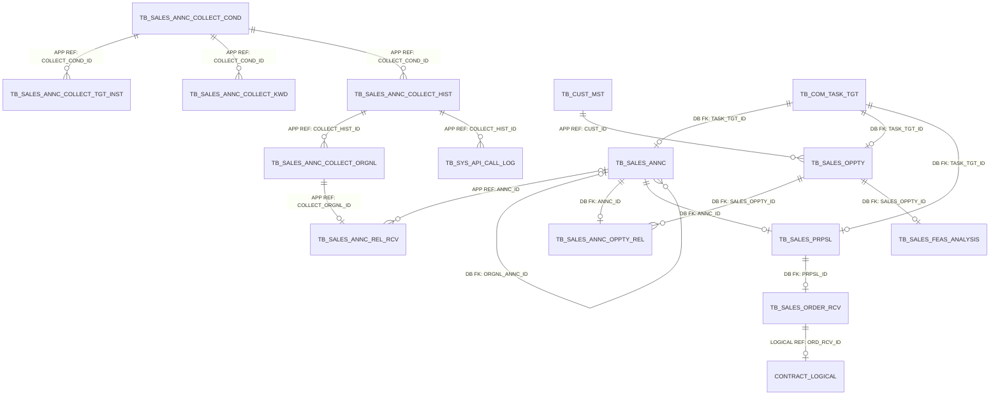
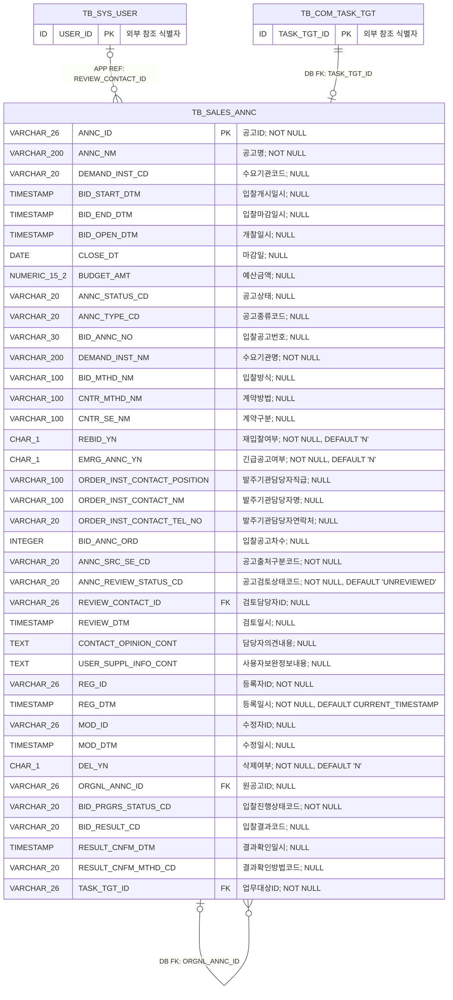
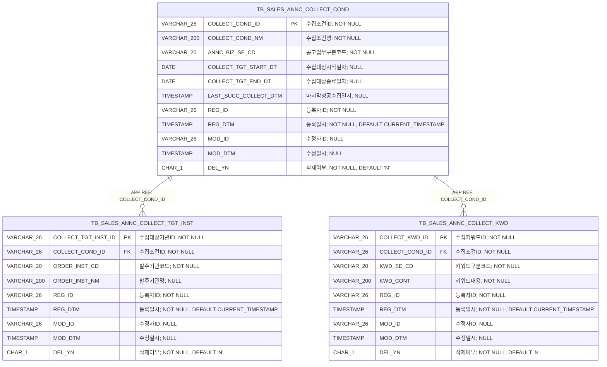
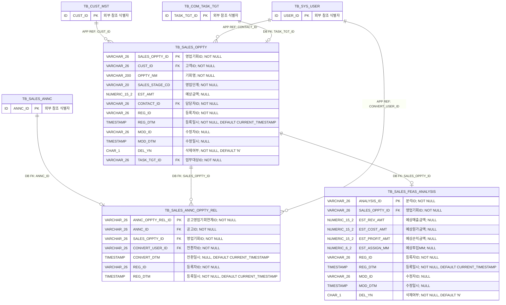
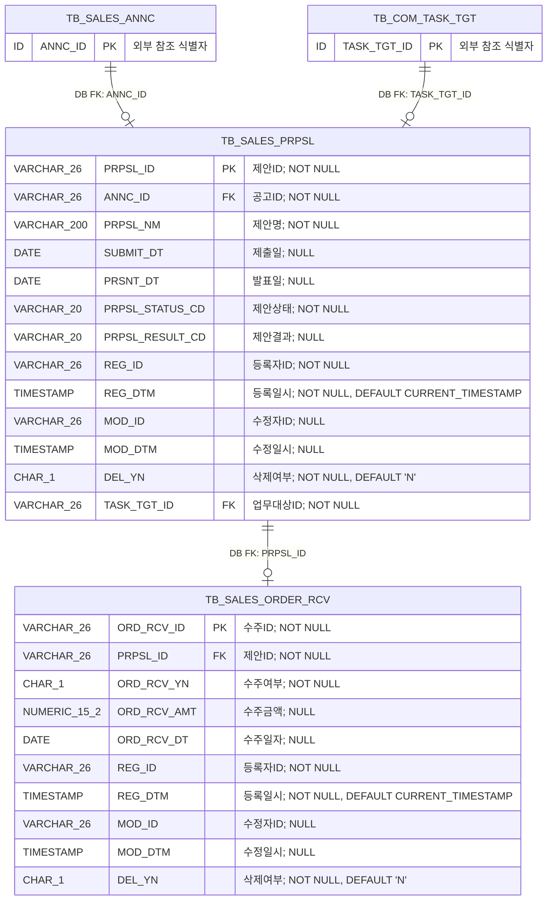

<!-- 이 파일은 python scripts/generate_erd.py --area sales 명령으로 생성합니다. 직접 수정하지 마십시오. -->
# 영업관리 상세 ERD

## 1. 문서 개요

사업공고 수집·검토부터 영업기회, 사업성분석, 제안 및 수주까지의 PostgreSQL 물리 모델을 표현한다. 원본은 데이터 카탈로그 CSV이며 이 문서는 구현과 리뷰를 위한 파생 산출물이다.

- 기준 DBMS: PostgreSQL
- 범위: 영업관리 12개 테이블
- 표기: `PK`는 기본키, `FK`는 논리 참조 컬럼, `DB FK`는 DB 제약 집행, `APP REF`는 애플리케이션 집행, `LOGICAL REF`는 상대 영역 물리화 전 논리 관계
- 타입 표기: Mermaid 호환을 위해 `VARCHAR(26)`은 `VARCHAR_26`, `CHAR(1)`은 `CHAR_1`처럼 괄호를 밑줄로 표시
- 카디널리티: `||` 필수 1, `o|` 선택 1, `o{` 0개 이상

### 1.1 원본 카탈로그

- 테이블: `03.physical-model/tables/table-sales.csv`
- 컬럼: `03.physical-model/columns/column-sales.csv`
- 제약조건: `03.physical-model/constraints/constraint-sales.csv`
- 인덱스: `03.physical-model/indexes/index-sales.csv`
- 타입 매핑: `01.standard/db-type-mapping.csv`

### 1.2 업무기능 추적성

| 기능 ID | 업무기능 | 주요 테이블 |
| --- | --- | --- |
| BFD-04-01 | 사업공고관리 | TB_SALES_ANNC, TB_SALES_ANNC_COLLECT_*, TB_SALES_ANNC_REL_RCV, TB_SALES_ANNC_OPPTY_REL |
| BFD-04-02 | 영업기회관리 | TB_SALES_OPPTY, TB_SALES_ANNC_OPPTY_REL |
| BFD-04-03 | 사업성분석 | TB_SALES_FEAS_ANALYSIS |
| BFD-04-04 | 제안관리 | TB_SALES_PRPSL |
| BFD-04-05 | 수주관리 | TB_SALES_ORDER_RCV |

## 2. 전체 관계 개요



> `TB_CUST_MST`는 고객관리, `TB_COM_TASK_TGT`는 공통, `TB_SYS_API_CALL_LOG`는 시스템관리 영역의 물리 테이블이다. 계약은 아직 물리 모델이 확정되지 않아 `CONTRACT_LOGICAL`로 표시했다.

## 3. 영역별 상세 ERD

### 3.1 사업공고

수동·자동수집 사업공고와 최초·재공고 관계 및 검토·입찰결과를 관리하는 구조이다.



테이블 대응:
- `TB_SALES_ANNC`: 사업공고

### 3.2 수집조건

수집조건별 발주기관과 포함·제외 키워드를 관리하는 구조이다.



테이블 대응:
- `TB_SALES_ANNC_COLLECT_COND`: 사업공고수집조건
- `TB_SALES_ANNC_COLLECT_TGT_INST`: 사업공고수집대상기관
- `TB_SALES_ANNC_COLLECT_KWD`: 사업공고수집키워드

### 3.3 수집처리이력

수집 실행, 불변 원문, 조달청 원본 응답 필드 및 사업공고 반영 결과를 단계별로 보존하는 구조이다.

```mermaid
erDiagram
    TB_SALES_ANNC_COLLECT_HIST {
        VARCHAR_26 COLLECT_HIST_ID PK "수집이력ID; NOT NULL"
        VARCHAR_26 COLLECT_COND_ID FK "수집조건ID; NOT NULL"
        VARCHAR_20 COLLECT_EXEC_TYPE_CD "수집실행유형코드; NOT NULL"
        TIMESTAMP COLLECT_START_DTM "수집시작일시; NOT NULL"
        TIMESTAMP COLLECT_END_DTM "수집종료일시; NULL"
        TIMESTAMP INQ_START_DTM "조회시작일시; NULL"
        TIMESTAMP INQ_END_DTM "조회종료일시; NULL"
        INTEGER RSP_CNT "응답건수; NOT NULL, DEFAULT 0"
        INTEGER NEW_CNT "신규건수; NOT NULL, DEFAULT 0"
        INTEGER CHG_CNT "변경건수; NOT NULL, DEFAULT 0"
        INTEGER DUP_CNT "중복건수; NOT NULL, DEFAULT 0"
        INTEGER ERR_CNT "오류건수; NOT NULL, DEFAULT 0"
        VARCHAR_20 COLLECT_PROC_STATUS_CD "수집처리상태코드; NOT NULL"
        TEXT ERR_CONT "오류내용; NULL"
        VARCHAR_20 REPROC_STATUS_CD "재처리상태코드; NULL"
        VARCHAR_26 REG_ID "등록자ID; NOT NULL"
        TIMESTAMP REG_DTM "등록일시; NOT NULL, DEFAULT CURRENT_TIMESTAMP"
    }
    TB_SALES_ANNC_COLLECT_ORGNL {
        VARCHAR_26 COLLECT_ORGNL_ID PK "수집원문ID; NOT NULL"
        VARCHAR_26 COLLECT_HIST_ID FK "수집이력ID; NOT NULL"
        VARCHAR_30 BID_ANNC_NO "입찰공고번호; NOT NULL"
        INTEGER BID_ANNC_ORD "입찰공고차수; NOT NULL"
        TEXT ORGNL_RSP_CONT "원문응답내용; NOT NULL"
        VARCHAR_255 ORGNL_HASH_VAL "원문해시값; NOT NULL"
        TIMESTAMP COLLECT_DTM "수집일시; NOT NULL, DEFAULT CURRENT_TIMESTAMP"
        VARCHAR_26 REG_ID "등록자ID; NOT NULL"
        TIMESTAMP REG_DTM "등록일시; NOT NULL, DEFAULT CURRENT_TIMESTAMP"
    }
    TB_SALES_ANNC_REL_RCV {
        VARCHAR_26 REL_RCV_ID PK "연계수신ID; NOT NULL"
        VARCHAR_26 COLLECT_ORGNL_ID FK "수집원문ID; NOT NULL"
        VARCHAR_26 ANNC_ID FK "공고ID; NULL"
        VARCHAR_20 REL_PROC_SE_CD "연계처리구분코드; NOT NULL"
        VARCHAR_20 REL_PROC_STATUS_CD "연계처리상태코드; NOT NULL"
        TIMESTAMP BIZ_ANNC_REFLECT_DTM "사업공고반영일시; NULL"
        INTEGER REPROC_CNT "재처리횟수; NOT NULL, DEFAULT 0"
        TEXT ERR_CONT "오류내용; NULL"
        VARCHAR_26 REG_ID "등록자ID; NOT NULL"
        TIMESTAMP REG_DTM "등록일시; NOT NULL, DEFAULT CURRENT_TIMESTAMP"
        VARCHAR_26 MOD_ID "수정자ID; NULL"
        TIMESTAMP MOD_DTM "수정일시; NULL"
        TEXT resultCode "결과코드; NULL"
        TEXT resultMsg "결과메세지; NULL"
        TEXT numOfRows "한 페이지 결과 수; NULL"
        TEXT pageNo "페이지 번호; NULL"
        TEXT totalCount "전체 결과 수; NULL"
        TEXT bidNtceNo "입찰공고번호; NULL"
        TEXT bidNtceOrd "입찰공고차수; NULL"
        TEXT reNtceYn "재공고여부; NULL"
        TEXT rgstTyNm "등록유형명; NULL"
        TEXT ntceKindNm "공고종류명; NULL"
        TEXT intrbidYn "국제입찰여부; NULL"
        TEXT bidNtceDt "입찰공고일시; NULL"
        TEXT refNo "참조번호; NULL"
        TEXT bidNtceNm "입찰공고명; NULL"
        TEXT ntceInsttCd "공고기관코드; NULL"
        TEXT ntceInsttNm "공고기관명; NULL"
        TEXT dminsttCd "수요기관코드; NULL"
        TEXT dminsttNm "수요기관명; NULL"
        TEXT bidMethdNm "입찰방식명; NULL"
        TEXT cntrctCnclsMthdNm "계약체결방법명; NULL"
        TEXT ntceInsttOfclNm "공고기관담당자명; NULL"
        TEXT ntceInsttOfclTelNo "공고기관담당자전화번호; NULL"
        TEXT ntceInsttOfclEmailAdrs "공고기관담당자이메일주소; NULL"
        TEXT exctvNm "집행관명; NULL"
        TEXT bidQlfctRgstDt "입찰참가자격등록마감일시; NULL"
        TEXT cmmnSpldmdAgrmntRcptdocMethd "공동수급협정서접수방식; NULL"
        TEXT cmmnSpldmdAgrmntClseDt "공동수급협정마감일시; NULL"
        TEXT cmmnSpldmdCorpRgnLmtYn "공동수급업체지역제한여부; NULL"
        TEXT bidBeginDt "입찰개시일시; NULL"
        TEXT bidClseDt "입찰마감일시; NULL"
        TEXT opengDt "개찰일시; NULL"
        TEXT ntceSpecDocUrl1 "공고규격서URL1; NULL"
        TEXT ntceSpecDocUrl2 "공고규격서URL2; NULL"
        TEXT ntceSpecDocUrl3 "공고규격서URL3; NULL"
        TEXT ntceSpecDocUrl4 "공고규격서URL4; NULL"
        TEXT ntceSpecDocUrl5 "공고규격서URL5; NULL"
        TEXT ntceSpecDocUrl6 "공고규격서URL6; NULL"
        TEXT ntceSpecDocUrl7 "공고규격서URL7; NULL"
        TEXT ntceSpecDocUrl8 "공고규격서URL8; NULL"
        TEXT ntceSpecDocUrl9 "공고규격서URL9; NULL"
        TEXT ntceSpecDocUrl10 "공고규격서URL10; NULL"
        TEXT ntceSpecFileNm1 "공고규격파일명1; NULL"
        TEXT ntceSpecFileNm2 "공고규격파일명2; NULL"
        TEXT ntceSpecFileNm3 "공고규격파일명3; NULL"
        TEXT ntceSpecFileNm4 "공고규격파일명4; NULL"
        TEXT ntceSpecFileNm5 "공고규격파일명5; NULL"
        TEXT ntceSpecFileNm6 "공고규격파일명6; NULL"
        TEXT ntceSpecFileNm7 "공고규격파일명7; NULL"
        TEXT ntceSpecFileNm8 "공고규격파일명8; NULL"
        TEXT ntceSpecFileNm9 "공고규격파일명9; NULL"
        TEXT ntceSpecFileNm10 "공고규격파일명10; NULL"
        TEXT rbidPermsnYn "재입찰허용여부; NULL"
        TEXT pqApplDocRcptMthdNm "PQ신청서접수방법명; NULL"
        TEXT pqApplDocRcptDt "PQ신청서접수일시; NULL"
        TEXT tpEvalApplMthdNm "TP심사신청방법명; NULL"
        TEXT tpEvalApplClseDt "TP심사신청마감일시; NULL"
        TEXT jntcontrctDutyRgnNm1 "공동도급의무지역명1; NULL"
        TEXT jntcontrctDutyRgnNm2 "공동도급의무지역명2; NULL"
        TEXT jntcontrctDutyRgnNm3 "공동도급의무지역명3; NULL"
        TEXT rgnDutyJntcontrctRt "지역의무공동도급비율; NULL"
        TEXT dtlsBidYn "내역입찰여부; NULL"
        TEXT bidPrtcptLmtYn "입찰참가제한여부; NULL"
        TEXT prearngPrceDcsnMthdNm "예정가격결정방법명; NULL"
        TEXT totPrdprcNum "총예가건수; NULL"
        TEXT drwtPrdprcNum "추첨예가건수; NULL"
        TEXT asignBdgtAmt "배정예산금액; NULL"
        TEXT presmptPrce "추정가격; NULL"
        TEXT opengPlce "개찰장소; NULL"
        TEXT dcmtgOprtnDt "설명회실시일시; NULL"
        TEXT dcmtgOprtnPlce "설명회실시장소; NULL"
        TEXT bidNtceDtlUrl "입찰공고상세URL; NULL"
        TEXT bidNtceUrl "입찰공고URL; NULL"
        TEXT bidPrtcptFeePaymntYn "입찰참가수수료납부여부; NULL"
        TEXT bidPrtcptFee "입찰참가수수료; NULL"
        TEXT bidGrntymnyPaymntYn "입찰보증금납부여부; NULL"
        TEXT crdtrNm "채권자명; NULL"
        TEXT ppswGnrlSrvceYn "조달청일반용역여부; NULL"
        TEXT srvceDivNm "용역구분명; NULL"
        TEXT prdctClsfcLmtYn "물품분류제한여부; NULL"
        TEXT mnfctYn "제조여부; NULL"
        TEXT purchsObjPrdctList "구매대상물품목록; NULL"
        TEXT untyNtceNo "통합공고번호; NULL"
        TEXT cmmnSpldmdMethdCd "공동수급방식코드; NULL"
        TEXT cmmnSpldmdMethdNm "공동수급구성방식명; NULL"
        TEXT stdNtceDocUrl "표준공고서URL; NULL"
        TEXT brffcBidprcPermsnYn "지사투찰허용여부; NULL"
        TEXT dsgntCmptYn "지명경쟁여부; NULL"
        TEXT arsltCmptYn "실적경쟁여부; NULL"
        TEXT pqEvalYn "PQ심사여부; NULL"
        TEXT tpEvalYn "TP심사여부; NULL"
        TEXT ntceDscrptYn "공고설명여부; NULL"
        TEXT rsrvtnPrceReMkngMthdNm "예비가격재작성방법명; NULL"
        TEXT arsltApplDocRcptMthdNm "실적신청서접수방법명; NULL"
        TEXT arsltReqstdocRcptDt "실적신청서접수일시; NULL"
        TEXT orderPlanUntyNo "발주계획통합번호; NULL"
        TEXT sucsfbidLwltRate "낙찰하한율; NULL"
        TEXT rgstDt "공고등록일시; NULL"
        TEXT bfSpecRgstNo "사전규격등록번호; NULL"
        TEXT infoBizYn "정보화사업여부; NULL"
        TEXT sucsfbidMthdCd "낙찰방법코드; NULL"
        TEXT sucsfbidMthdNm "낙찰방법명; NULL"
        TEXT chgDt "변경일시; NULL"
        TEXT dminsttOfclEmailAdrs "수요기관담당자이메일주소; NULL"
        TEXT indstrytyLmtYn "업종제한여부; NULL"
        TEXT chgNtceRsn "변경공고사유; NULL"
        TEXT rbidOpengDt "재입찰개찰일시; NULL"
        TEXT VAT "부가가치세; NULL"
        TEXT indutyVAT "주공종부가가치세; NULL"
        TEXT pubPrcrmntLrgclsfcNm "공공조달대분류명; NULL"
        TEXT pubPrcrmntMidclsfcNm "공공조달중분류명; NULL"
        TEXT pubPrcrmntClsfcNo "공공조달분류번호; NULL"
        TEXT pubPrcrmntClsfcNm "공공조달분류명; NULL"
    }
    TB_SALES_ANNC {
        ID ANNC_ID PK "외부 참조 식별자"
    }
    TB_SALES_ANNC_COLLECT_COND {
        ID COLLECT_COND_ID PK "외부 참조 식별자"
    }
    TB_SALES_ANNC_COLLECT_COND ||--o{ TB_SALES_ANNC_COLLECT_HIST : "APP REF: COLLECT_COND_ID"
    TB_SALES_ANNC_COLLECT_HIST ||--o{ TB_SALES_ANNC_COLLECT_ORGNL : "APP REF: COLLECT_HIST_ID"
    TB_SALES_ANNC_COLLECT_ORGNL ||--o| TB_SALES_ANNC_REL_RCV : "APP REF: COLLECT_ORGNL_ID"
    TB_SALES_ANNC o|--o{ TB_SALES_ANNC_REL_RCV : "APP REF: ANNC_ID"
```



테이블 대응:
- `TB_SALES_ANNC_COLLECT_HIST`: 사업공고수집이력
- `TB_SALES_ANNC_COLLECT_ORGNL`: 사업공고수집원문
- `TB_SALES_ANNC_REL_RCV`: 사업공고연계수신

### 3.4 영업기회·사업성

사업공고 전환 관계, 고객별 영업기회 및 영업기회별 사업성분석을 관리하는 구조이다.



테이블 대응:
- `TB_SALES_ANNC_OPPTY_REL`: 사업공고영업기회연계
- `TB_SALES_OPPTY`: 영업기회
- `TB_SALES_FEAS_ANALYSIS`: 사업성분석

### 3.5 제안·수주

사업공고별 단일 제안과 제안별 단일 수주 결과를 관리하는 구조이다.



테이블 대응:
- `TB_SALES_PRPSL`: 제안
- `TB_SALES_ORDER_RCV`: 수주

## 4. 관계 구현 명세

| 관계명 | 자식 컬럼 | 부모 | 집행 | 생성 | 삭제/수정 | 설명 |
| --- | --- | --- | --- | --- | --- | --- |
| FK_TB_SALES_ANNC_01 | TB_SALES_ANNC.ORGNL_ANNC_ID | TB_SALES_ANNC.ANNC_ID | DATABASE | Y | RESTRICT/RESTRICT | 재공고의 원공고 참조 무결성 |
| FK_TB_SALES_ANNC_02 | TB_SALES_ANNC.REVIEW_CONTACT_ID | TB_SYS_USER.USER_ID | APPLICATION | N | RESTRICT/RESTRICT | 사업공고 검토 담당 사용자 애플리케이션 참조 |
| FK_TB_SALES_ANNC_03 | TB_SALES_ANNC.TASK_TGT_ID | TB_COM_TASK_TGT.TASK_TGT_ID | DATABASE | Y | RESTRICT/RESTRICT | 사업공고의 업무대상 참조 무결성 |
| FK_TB_SALES_ANNC_COLLECT_TGT_INST_01 | TB_SALES_ANNC_COLLECT_TGT_INST.COLLECT_COND_ID | TB_SALES_ANNC_COLLECT_COND.COLLECT_COND_ID | APPLICATION | N | RESTRICT/RESTRICT | 수집대상기관의 수집조건 애플리케이션 참조 |
| FK_TB_SALES_ANNC_COLLECT_KWD_01 | TB_SALES_ANNC_COLLECT_KWD.COLLECT_COND_ID | TB_SALES_ANNC_COLLECT_COND.COLLECT_COND_ID | APPLICATION | N | RESTRICT/RESTRICT | 수집키워드의 수집조건 애플리케이션 참조 |
| FK_TB_SALES_ANNC_COLLECT_HIST_01 | TB_SALES_ANNC_COLLECT_HIST.COLLECT_COND_ID | TB_SALES_ANNC_COLLECT_COND.COLLECT_COND_ID | APPLICATION | N | RESTRICT/RESTRICT | 수집이력의 수집조건 애플리케이션 참조 |
| FK_TB_SALES_ANNC_COLLECT_ORGNL_01 | TB_SALES_ANNC_COLLECT_ORGNL.COLLECT_HIST_ID | TB_SALES_ANNC_COLLECT_HIST.COLLECT_HIST_ID | APPLICATION | N | RESTRICT/RESTRICT | 수집원문의 수집이력 애플리케이션 참조 |
| FK_TB_SALES_ANNC_REL_RCV_01 | TB_SALES_ANNC_REL_RCV.COLLECT_ORGNL_ID | TB_SALES_ANNC_COLLECT_ORGNL.COLLECT_ORGNL_ID | APPLICATION | N | RESTRICT/RESTRICT | 연계수신의 수집원문 애플리케이션 참조 |
| FK_TB_SALES_ANNC_REL_RCV_02 | TB_SALES_ANNC_REL_RCV.ANNC_ID | TB_SALES_ANNC.ANNC_ID | APPLICATION | N | RESTRICT/RESTRICT | 반영된 사업공고 애플리케이션 참조 |
| FK_TB_SALES_ANNC_OPPTY_REL_01 | TB_SALES_ANNC_OPPTY_REL.ANNC_ID | TB_SALES_ANNC.ANNC_ID | DATABASE | Y | RESTRICT/RESTRICT | 공고 전환 관계의 사업공고 참조 무결성 |
| FK_TB_SALES_ANNC_OPPTY_REL_02 | TB_SALES_ANNC_OPPTY_REL.SALES_OPPTY_ID | TB_SALES_OPPTY.SALES_OPPTY_ID | DATABASE | Y | RESTRICT/RESTRICT | 공고 전환 관계의 영업기회 참조 무결성 |
| FK_TB_SALES_ANNC_OPPTY_REL_03 | TB_SALES_ANNC_OPPTY_REL.CONVERT_USER_ID | TB_SYS_USER.USER_ID | APPLICATION | N | RESTRICT/RESTRICT | 영업기회 전환 사용자 애플리케이션 참조 |
| FK_TB_SALES_OPPTY_01 | TB_SALES_OPPTY.CUST_ID | TB_CUST_MST.CUST_ID | APPLICATION | N | RESTRICT/RESTRICT | 영업기회의 고객사 애플리케이션 참조 |
| FK_TB_SALES_OPPTY_02 | TB_SALES_OPPTY.CONTACT_ID | TB_SYS_USER.USER_ID | APPLICATION | N | RESTRICT/RESTRICT | 영업기회 담당 사용자 애플리케이션 참조 |
| FK_TB_SALES_OPPTY_03 | TB_SALES_OPPTY.TASK_TGT_ID | TB_COM_TASK_TGT.TASK_TGT_ID | DATABASE | Y | RESTRICT/RESTRICT | 영업기회의 업무대상 참조 무결성 |
| FK_TB_SALES_FEAS_ANALYSIS_01 | TB_SALES_FEAS_ANALYSIS.SALES_OPPTY_ID | TB_SALES_OPPTY.SALES_OPPTY_ID | DATABASE | Y | RESTRICT/RESTRICT | 사업성분석의 영업기회 참조 무결성 |
| FK_TB_SALES_PRPSL_01 | TB_SALES_PRPSL.ANNC_ID | TB_SALES_ANNC.ANNC_ID | DATABASE | Y | RESTRICT/RESTRICT | 제안의 사업공고 참조 무결성 |
| FK_TB_SALES_PRPSL_02 | TB_SALES_PRPSL.TASK_TGT_ID | TB_COM_TASK_TGT.TASK_TGT_ID | DATABASE | Y | RESTRICT/RESTRICT | 제안의 업무대상 참조 무결성 |
| FK_TB_SALES_ORDER_RCV_01 | TB_SALES_ORDER_RCV.PRPSL_ID | TB_SALES_PRPSL.PRPSL_ID | DATABASE | Y | RESTRICT/RESTRICT | 수주의 제안 참조 무결성 |

## 5. 업무 무결성 규칙

| 제약조건 | 테이블 | 대상 컬럼 | 검사식 | 설명 |
| --- | --- | --- | --- | --- |
| CK_TB_SALES_ANNC_01 | TB_SALES_ANNC | REBID_YN | `REBID_YN IN ('Y','N')` | 재입찰여부 허용값 검사 |
| CK_TB_SALES_ANNC_02 | TB_SALES_ANNC | EMRG_ANNC_YN | `EMRG_ANNC_YN IN ('Y','N')` | 긴급공고여부 허용값 검사 |
| CK_TB_SALES_ANNC_03 | TB_SALES_ANNC | DEL_YN | `DEL_YN IN ('Y','N')` | 삭제여부 허용값 검사 |
| CK_TB_SALES_ANNC_04 | TB_SALES_ANNC | BUDGET_AMT | `BUDGET_AMT IS NULL OR BUDGET_AMT >= 0` | 예산금액 음수 방지 |
| CK_TB_SALES_ANNC_05 | TB_SALES_ANNC | BID_START_DTM\|BID_END_DTM | `BID_END_DTM IS NULL OR BID_START_DTM IS NULL OR BID_END_DTM >= BID_START_DTM` | 입찰 개시와 마감 일시 순서 검사 |
| CK_TB_SALES_ANNC_06 | TB_SALES_ANNC | BID_END_DTM\|BID_OPEN_DTM | `BID_OPEN_DTM IS NULL OR BID_END_DTM IS NULL OR BID_OPEN_DTM >= BID_END_DTM` | 입찰 마감과 개찰 일시 순서 검사 |
| CK_TB_SALES_ANNC_07 | TB_SALES_ANNC | BID_ANNC_NO\|BID_ANNC_ORD | `(BID_ANNC_NO IS NULL AND BID_ANNC_ORD IS NULL) OR (BID_ANNC_NO IS NOT NULL AND BID_ANNC_ORD IS NOT NULL AND BID_ANNC_ORD >= 0)` | 외부 입찰공고번호와 차수의 조건부 필수성 검사 |
| CK_TB_SALES_ANNC_08 | TB_SALES_ANNC | ANNC_ID\|ORGNL_ANNC_ID | `ORGNL_ANNC_ID IS NULL OR ORGNL_ANNC_ID <> ANNC_ID` | 사업공고 자기참조 방지 |
| CK_TB_SALES_ANNC_09 | TB_SALES_ANNC | REVIEW_CONTACT_ID\|REVIEW_DTM | `(REVIEW_CONTACT_ID IS NULL AND REVIEW_DTM IS NULL) OR (REVIEW_CONTACT_ID IS NOT NULL AND REVIEW_DTM IS NOT NULL)` | 검토 담당자와 검토일시 일관성 검사 |
| CK_TB_SALES_ANNC_10 | TB_SALES_ANNC | BID_RESULT_CD\|RESULT_CNFM_DTM\|RESULT_CNFM_MTHD_CD | `(BID_RESULT_CD IS NULL AND RESULT_CNFM_DTM IS NULL AND RESULT_CNFM_MTHD_CD IS NULL) OR (BID_RESULT_CD IS NOT NULL AND RESULT_CNFM_DTM IS NOT NULL AND RESULT_CNFM_MTHD_CD IS NOT NULL)` | 입찰결과와 결과확인정보 일관성 검사 |
| CK_TB_SALES_ANNC_COLLECT_COND_01 | TB_SALES_ANNC_COLLECT_COND | COLLECT_TGT_START_DT\|COLLECT_TGT_END_DT | `COLLECT_TGT_END_DT IS NULL OR COLLECT_TGT_START_DT IS NULL OR COLLECT_TGT_END_DT >= COLLECT_TGT_START_DT` | 수집대상 시작과 종료 일자 순서 검사 |
| CK_TB_SALES_ANNC_COLLECT_COND_02 | TB_SALES_ANNC_COLLECT_COND | DEL_YN | `DEL_YN IN ('Y','N')` | 삭제여부 허용값 검사 |
| CK_TB_SALES_ANNC_COLLECT_TGT_INST_01 | TB_SALES_ANNC_COLLECT_TGT_INST | DEL_YN | `DEL_YN IN ('Y','N')` | 삭제여부 허용값 검사 |
| CK_TB_SALES_ANNC_COLLECT_KWD_01 | TB_SALES_ANNC_COLLECT_KWD | DEL_YN | `DEL_YN IN ('Y','N')` | 삭제여부 허용값 검사 |
| CK_TB_SALES_ANNC_COLLECT_HIST_01 | TB_SALES_ANNC_COLLECT_HIST | RSP_CNT\|NEW_CNT\|CHG_CNT\|DUP_CNT\|ERR_CNT | `RSP_CNT >= 0 AND NEW_CNT >= 0 AND CHG_CNT >= 0 AND DUP_CNT >= 0 AND ERR_CNT >= 0` | 수집 처리 건수 음수 방지 |
| CK_TB_SALES_ANNC_COLLECT_HIST_02 | TB_SALES_ANNC_COLLECT_HIST | COLLECT_START_DTM\|COLLECT_END_DTM | `COLLECT_END_DTM IS NULL OR COLLECT_END_DTM >= COLLECT_START_DTM` | 수집 시작과 종료 일시 순서 검사 |
| CK_TB_SALES_ANNC_COLLECT_HIST_03 | TB_SALES_ANNC_COLLECT_HIST | INQ_START_DTM\|INQ_END_DTM | `INQ_END_DTM IS NULL OR INQ_START_DTM IS NULL OR INQ_END_DTM >= INQ_START_DTM` | 조회 시작과 종료 일시 순서 검사 |
| CK_TB_SALES_ANNC_REL_RCV_01 | TB_SALES_ANNC_REL_RCV | REPROC_CNT | `REPROC_CNT >= 0` | 재처리횟수 음수 방지 |
| CK_TB_SALES_ANNC_REL_RCV_02 | TB_SALES_ANNC_REL_RCV | REL_PROC_STATUS_CD\|ANNC_ID\|BIZ_ANNC_REFLECT_DTM | `REL_PROC_STATUS_CD <> 'REFLECTED' OR (ANNC_ID IS NOT NULL AND BIZ_ANNC_REFLECT_DTM IS NOT NULL)` | 반영완료 상태의 사업공고와 반영일시 필수성 검사 |
| CK_TB_SALES_OPPTY_01 | TB_SALES_OPPTY | EST_AMT | `EST_AMT IS NULL OR EST_AMT >= 0` | 예상금액 음수 방지 |
| CK_TB_SALES_OPPTY_02 | TB_SALES_OPPTY | DEL_YN | `DEL_YN IN ('Y','N')` | 삭제여부 허용값 검사 |
| CK_TB_SALES_FEAS_ANALYSIS_01 | TB_SALES_FEAS_ANALYSIS | EST_REV_AMT\|EST_COST_AMT\|EST_ASSIGN_MM | `(EST_REV_AMT IS NULL OR EST_REV_AMT >= 0) AND (EST_COST_AMT IS NULL OR EST_COST_AMT >= 0) AND (EST_ASSIGN_MM IS NULL OR EST_ASSIGN_MM >= 0)` | 사업성분석 예상값 음수 방지 |
| CK_TB_SALES_FEAS_ANALYSIS_02 | TB_SALES_FEAS_ANALYSIS | DEL_YN | `DEL_YN IN ('Y','N')` | 삭제여부 허용값 검사 |
| CK_TB_SALES_PRPSL_01 | TB_SALES_PRPSL | SUBMIT_DT\|PRSNT_DT | `PRSNT_DT IS NULL OR SUBMIT_DT IS NULL OR PRSNT_DT >= SUBMIT_DT` | 제안 제출일과 발표일 순서 검사 |
| CK_TB_SALES_PRPSL_02 | TB_SALES_PRPSL | DEL_YN | `DEL_YN IN ('Y','N')` | 삭제여부 허용값 검사 |
| CK_TB_SALES_ORDER_RCV_01 | TB_SALES_ORDER_RCV | ORD_RCV_YN | `ORD_RCV_YN IN ('Y','N')` | 수주여부 허용값 검사 |
| CK_TB_SALES_ORDER_RCV_02 | TB_SALES_ORDER_RCV | ORD_RCV_YN\|ORD_RCV_AMT\|ORD_RCV_DT | `(ORD_RCV_YN = 'Y' AND ORD_RCV_AMT IS NOT NULL AND ORD_RCV_AMT >= 0 AND ORD_RCV_DT IS NOT NULL) OR (ORD_RCV_YN = 'N' AND ORD_RCV_AMT IS NULL AND ORD_RCV_DT IS NULL)` | 수주여부와 수주금액 및 수주일자 일관성 검사 |
| CK_TB_SALES_ORDER_RCV_03 | TB_SALES_ORDER_RCV | DEL_YN | `DEL_YN IN ('Y','N')` | 삭제여부 허용값 검사 |

## 6. 조회 및 고유성 인덱스

| 인덱스 | 테이블 | 컬럼 | 고유 | 조건 | 목적 |
| --- | --- | --- | --- | --- | --- |
| UX_TB_SALES_ANNC_01 | TB_SALES_ANNC | BID_ANNC_NO\|BID_ANNC_ORD | Y | BID_ANNC_NO IS NOT NULL | 외부 입찰공고번호와 차수의 전체 이력 고유성 보장 |
| UX_TB_SALES_ANNC_02 | TB_SALES_ANNC | TASK_TGT_ID | Y | - | 하나의 업무대상에 최대 하나의 사업공고 연결 보장 |
| IX_TB_SALES_ANNC_01 | TB_SALES_ANNC | DEMAND_INST_NM\|BID_START_DTM | N | DEL_YN = 'N' | 수요기관별 사업공고 조회 |
| IX_TB_SALES_ANNC_02 | TB_SALES_ANNC | ANNC_STATUS_CD\|BID_START_DTM | N | DEL_YN = 'N' | 공고상태별 사업공고 조회 |
| IX_TB_SALES_ANNC_03 | TB_SALES_ANNC | ANNC_REVIEW_STATUS_CD\|REG_DTM | N | DEL_YN = 'N' | 검토상태별 수집공고 조회 |
| IX_TB_SALES_ANNC_04 | TB_SALES_ANNC | ORGNL_ANNC_ID | N | DEL_YN = 'N' AND ORGNL_ANNC_ID IS NOT NULL | 원공고별 재공고 조회 |
| IX_TB_SALES_ANNC_05 | TB_SALES_ANNC | BID_PRGRS_STATUS_CD\|BID_RESULT_CD\|RESULT_CNFM_DTM | N | DEL_YN = 'N' | 입찰 진행상태와 결과 조회 |
| IX_TB_SALES_ANNC_06 | TB_SALES_ANNC | ANNC_NM | N | DEL_YN = 'N' | 사업공고명 검색 |
| UX_TB_SALES_ANNC_COLLECT_COND_01 | TB_SALES_ANNC_COLLECT_COND | COLLECT_COND_NM | Y | DEL_YN = 'N' | 삭제되지 않은 수집조건명 고유성 보장 |
| IX_TB_SALES_ANNC_COLLECT_COND_01 | TB_SALES_ANNC_COLLECT_COND | ANNC_BIZ_SE_CD\|LAST_SUCC_COLLECT_DTM | N | DEL_YN = 'N' | 업무구분별 정기수집 대상 조건 조회 |
| UX_TB_SALES_ANNC_COLLECT_TGT_INST_01 | TB_SALES_ANNC_COLLECT_TGT_INST | COLLECT_COND_ID\|ORDER_INST_CD | Y | DEL_YN = 'N' | 수집조건별 대상 발주기관 중복 방지 |
| IX_TB_SALES_ANNC_COLLECT_TGT_INST_01 | TB_SALES_ANNC_COLLECT_TGT_INST | COLLECT_COND_ID\|ORDER_INST_NM | N | DEL_YN = 'N' | 수집조건별 대상 발주기관 조회 |
| UX_TB_SALES_ANNC_COLLECT_KWD_01 | TB_SALES_ANNC_COLLECT_KWD | COLLECT_COND_ID\|KWD_SE_CD\|KWD_CONT | Y | DEL_YN = 'N' | 수집조건별 포함 및 제외 키워드 중복 방지 |
| IX_TB_SALES_ANNC_COLLECT_KWD_01 | TB_SALES_ANNC_COLLECT_KWD | COLLECT_COND_ID\|KWD_SE_CD | N | DEL_YN = 'N' | 수집조건별 키워드 조회 |
| IX_TB_SALES_ANNC_COLLECT_HIST_01 | TB_SALES_ANNC_COLLECT_HIST | COLLECT_COND_ID\|COLLECT_START_DTM | N | - | 수집조건별 실행이력 조회 |
| IX_TB_SALES_ANNC_COLLECT_HIST_02 | TB_SALES_ANNC_COLLECT_HIST | COLLECT_PROC_STATUS_CD\|COLLECT_START_DTM | N | - | 처리상태별 수집이력 조회 |
| IX_TB_SALES_ANNC_COLLECT_HIST_03 | TB_SALES_ANNC_COLLECT_HIST | REPROC_STATUS_CD\|COLLECT_START_DTM | N | - | 재처리상태별 수집이력 조회 |
| IX_TB_SALES_ANNC_COLLECT_HIST_04 | TB_SALES_ANNC_COLLECT_HIST | REG_DTM | N | - | 등록일시 기준 수집이력 보관정책 처리 |
| UX_TB_SALES_ANNC_COLLECT_ORGNL_01 | TB_SALES_ANNC_COLLECT_ORGNL | COLLECT_HIST_ID\|BID_ANNC_NO\|BID_ANNC_ORD\|ORGNL_HASH_VAL | Y | - | 수집 실행 내 동일 공고 원문 중복 방지 |
| IX_TB_SALES_ANNC_COLLECT_ORGNL_01 | TB_SALES_ANNC_COLLECT_ORGNL | BID_ANNC_NO\|BID_ANNC_ORD\|COLLECT_DTM | N | - | 공고번호와 차수별 수집 원문 이력 조회 |
| IX_TB_SALES_ANNC_COLLECT_ORGNL_02 | TB_SALES_ANNC_COLLECT_ORGNL | ORGNL_HASH_VAL | N | - | 원문 해시 기준 중복 판정 |
| UX_TB_SALES_ANNC_REL_RCV_01 | TB_SALES_ANNC_REL_RCV | COLLECT_ORGNL_ID | Y | - | 수집원문과 연계수신의 일대일 관계 보장 |
| IX_TB_SALES_ANNC_REL_RCV_01 | TB_SALES_ANNC_REL_RCV | REL_PROC_STATUS_CD\|REG_DTM | N | - | 연계 처리상태별 수신이력 조회 |
| IX_TB_SALES_ANNC_REL_RCV_02 | TB_SALES_ANNC_REL_RCV | ANNC_ID\|REG_DTM | N | ANNC_ID IS NOT NULL | 사업공고별 연계 수신·반영 이력 조회 |
| IX_TB_SALES_ANNC_REL_RCV_03 | TB_SALES_ANNC_REL_RCV | bidNtceNo\|bidNtceOrd\|chgDt | N | - | 외부 원본 공고번호와 차수 및 변경일시 기준 조회 |
| UX_TB_SALES_ANNC_OPPTY_REL_01 | TB_SALES_ANNC_OPPTY_REL | ANNC_ID | Y | - | 사업공고별 영업기회 중복 전환 방지 |
| IX_TB_SALES_ANNC_OPPTY_REL_01 | TB_SALES_ANNC_OPPTY_REL | SALES_OPPTY_ID\|CONVERT_DTM | N | - | 영업기회별 최초 공고 및 재공고 연결 조회 |
| UX_TB_SALES_OPPTY_01 | TB_SALES_OPPTY | TASK_TGT_ID | Y | - | 하나의 업무대상에 최대 하나의 영업기회 연결 보장 |
| IX_TB_SALES_OPPTY_01 | TB_SALES_OPPTY | CUST_ID\|SALES_STAGE_CD\|REG_DTM | N | DEL_YN = 'N' | 고객사와 영업단계별 영업기회 조회 |
| IX_TB_SALES_OPPTY_02 | TB_SALES_OPPTY | CONTACT_ID\|SALES_STAGE_CD\|REG_DTM | N | DEL_YN = 'N' | 담당사용자와 영업단계별 영업기회 조회 |
| IX_TB_SALES_OPPTY_03 | TB_SALES_OPPTY | OPPTY_NM | N | DEL_YN = 'N' | 영업기회명 검색 |
| UX_TB_SALES_FEAS_ANALYSIS_01 | TB_SALES_FEAS_ANALYSIS | SALES_OPPTY_ID | Y | DEL_YN = 'N' | 영업기회별 활성 사업성분석 최대 한 건 보장 |
| UX_TB_SALES_PRPSL_01 | TB_SALES_PRPSL | ANNC_ID | Y | - | 사업공고별 제안 이력 전체에서 최대 한 건 보장 |
| UX_TB_SALES_PRPSL_02 | TB_SALES_PRPSL | TASK_TGT_ID | Y | - | 하나의 업무대상에 최대 하나의 제안 연결 보장 |
| IX_TB_SALES_PRPSL_01 | TB_SALES_PRPSL | PRPSL_STATUS_CD\|SUBMIT_DT | N | DEL_YN = 'N' | 제안상태와 제출일 기준 조회 |
| UX_TB_SALES_ORDER_RCV_01 | TB_SALES_ORDER_RCV | PRPSL_ID | Y | - | 제안별 수주 결과 이력 전체에서 최대 한 건 보장 |
| IX_TB_SALES_ORDER_RCV_01 | TB_SALES_ORDER_RCV | ORD_RCV_YN\|ORD_RCV_DT | N | DEL_YN = 'N' | 수주여부와 수주일자 기준 조회 |

## 7. 구현 주의사항

- 사업공고·영업기회·제안은 각각 업무대상과 동일 트랜잭션에서 생성하고 `TASK_TGT_ID`를 필수·고유 참조한다.
- 입찰공고번호와 차수는 값이 있을 때 전체 이력에서 고유하며 재공고는 별도 사업공고로 생성해 원공고ID로 연결한다.
- 수집 원문과 연계수신은 사업공고 반영 전에 보존하고 외부 응답 필드명과 대소문자를 변경하지 않는다.
- 정기수집과 즉시수집의 동일 조건 동시 실행을 잠그고 전체 페이지 성공 시에만 마지막 성공 수집일시를 갱신한다.
- 사업공고 반영 실패는 저장된 연계수신값으로 재처리하며 불필요한 외부 API 재호출을 하지 않는다.
- 공고별 영업기회 전환, 공고별 제안, 영업기회별 활성 사업성분석 및 제안별 수주 결과의 유일성을 보장한다.
- 수주여부가 `Y`이면 수주금액과 수주일자가 필수이고 `N`이면 두 값을 저장하지 않는다.
- 서비스키·인증 헤더·민감한 쿼리 값은 원문과 로그에 저장하기 전에 제거하거나 마스킹한다.

## 8. 재생성

```powershell
python scripts/generate_erd.py --area sales
```

생성 후 전체 데이터 카탈로그 검증을 수행한다.

```powershell
python scripts/validate_data_catalog.py --review-area sales --report tmp/data-catalog-validation-sales.csv
```
