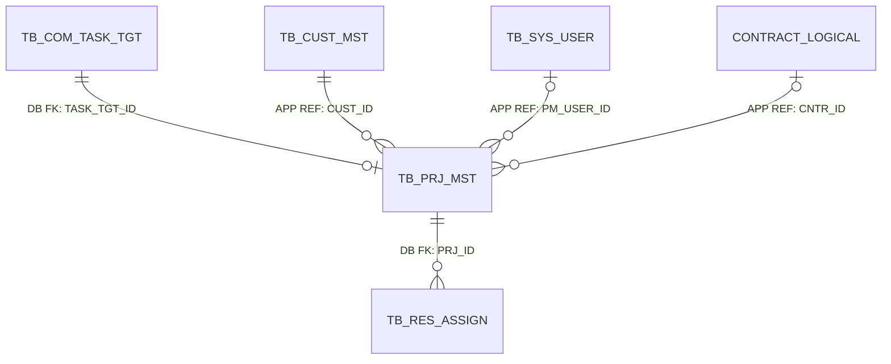
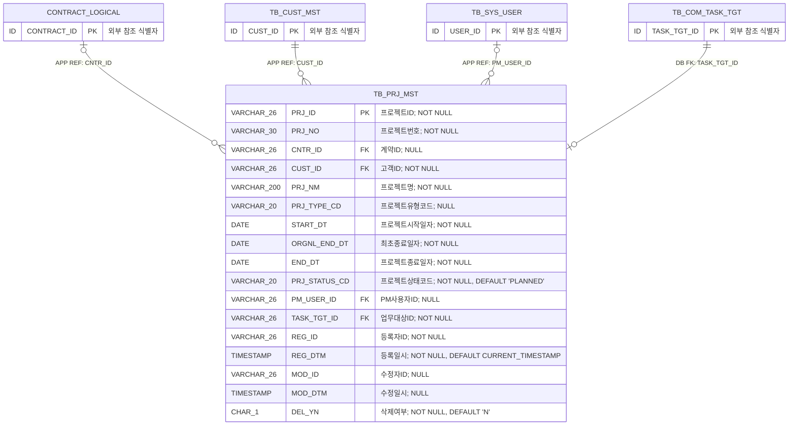

<!-- 이 파일은 python scripts/generate_erd.py --area project 명령으로 생성합니다. 직접 수정하지 마십시오. -->
# 프로젝트관리 상세 ERD

## 1. 문서 개요

인력투입에서 참조하는 v1.0 최소 프로젝트 기준정보의 PostgreSQL 물리 모델을 표현한다. 원본은 데이터 카탈로그 CSV이며 이 문서는 구현과 리뷰를 위한 파생 산출물이다.

- 기준 DBMS: PostgreSQL
- 범위: 프로젝트관리 1개 테이블
- 표기: `PK`는 기본키, `FK`는 논리 참조 컬럼, `DB FK`는 DB 제약 집행, `APP REF`는 애플리케이션 집행, `LOGICAL REF`는 상대 영역 물리화 전 논리 관계
- 타입 표기: Mermaid 호환을 위해 `VARCHAR(26)`은 `VARCHAR_26`, `CHAR(1)`은 `CHAR_1`처럼 괄호를 밑줄로 표시
- 카디널리티: `||` 필수 1, `o|` 선택 1, `o{` 0개 이상

### 1.1 원본 카탈로그

- 테이블: `03.physical-model/tables/table-project.csv`
- 컬럼: `03.physical-model/columns/column-project.csv`
- 제약조건: `03.physical-model/constraints/constraint-project.csv`
- 인덱스: `03.physical-model/indexes/index-project.csv`
- 타입 매핑: `01.standard/db-type-mapping.csv`

### 1.2 업무기능 추적성

| 기능 ID | 업무기능 | 주요 테이블 |
| --- | --- | --- |
| PB-005 | 인력투입용 최소 프로젝트 기준정보 | TB_PRJ_MST |

## 2. 전체 관계 개요



> `TB_COM_TASK_TGT`는 공통, `TB_CUST_MST`는 고객관리, `TB_SYS_USER`는 시스템관리, `TB_RES_ASSIGN`은 인력관리 영역의 물리 테이블이다. 계약은 v1.1 대상이므로 `CONTRACT_LOGICAL`로 표시했다.

## 3. 영역별 상세 ERD

### 3.1 프로젝트 기준정보

수동 등록 프로젝트의 업무번호, 고객사, 기본정보, 최초·현재 종료일과 상태를 관리하는 구조이다.



테이블 대응:
- `TB_PRJ_MST`: 프로젝트

## 4. 관계 구현 명세

| 관계명 | 자식 컬럼 | 부모 | 집행 | 생성 | 삭제/수정 | 설명 |
| --- | --- | --- | --- | --- | --- | --- |
| FK_TB_PRJ_MST_01 | TB_PRJ_MST.CNTR_ID | 계약(논리).계약ID | APPLICATION | N | RESTRICT/RESTRICT | v1.1 계약 물리 모델 확정 전 선택 계약 참조 |
| FK_TB_PRJ_MST_02 | TB_PRJ_MST.CUST_ID | TB_CUST_MST.CUST_ID | APPLICATION | N | RESTRICT/RESTRICT | 프로젝트 고객사의 애플리케이션 참조 |
| FK_TB_PRJ_MST_03 | TB_PRJ_MST.PM_USER_ID | TB_SYS_USER.USER_ID | APPLICATION | N | RESTRICT/RESTRICT | 프로젝트 PM 사용자의 애플리케이션 참조 |
| FK_TB_PRJ_MST_04 | TB_PRJ_MST.TASK_TGT_ID | TB_COM_TASK_TGT.TASK_TGT_ID | DATABASE | Y | RESTRICT/RESTRICT | 프로젝트 업무대상 참조 무결성 |

## 5. 업무 무결성 규칙

| 제약조건 | 테이블 | 대상 컬럼 | 검사식 | 설명 |
| --- | --- | --- | --- | --- |
| CK_TB_PRJ_MST_01 | TB_PRJ_MST | START_DT\|ORGNL_END_DT\|END_DT | `START_DT <= ORGNL_END_DT AND ORGNL_END_DT <= END_DT` | 시작일 최초종료일 현재종료일 순서 검사 |
| CK_TB_PRJ_MST_02 | TB_PRJ_MST | DEL_YN | `DEL_YN IN ('Y','N')` | 삭제여부 허용값 검사 |
| CK_TB_PRJ_MST_03 | TB_PRJ_MST | PRJ_STATUS_CD\|ORGNL_END_DT\|END_DT | `PRJ_STATUS_CD <> 'EXTENDED' OR END_DT > ORGNL_END_DT` | 연장 상태이면 현재 종료일이 최초 종료일보다 이후인지 검사 |

## 6. 조회 및 고유성 인덱스

| 인덱스 | 테이블 | 컬럼 | 고유 | 조건 | 목적 |
| --- | --- | --- | --- | --- | --- |
| UX_TB_PRJ_MST_01 | TB_PRJ_MST | PRJ_NO | Y | - | 삭제 여부와 관계없는 프로젝트번호 고유성 및 재사용 금지 |
| UX_TB_PRJ_MST_02 | TB_PRJ_MST | TASK_TGT_ID | Y | - | 하나의 업무대상에 프로젝트 한 건만 연결 |
| IX_TB_PRJ_MST_01 | TB_PRJ_MST | CUST_ID\|PRJ_STATUS_CD\|PRJ_NM | N | DEL_YN = 'N' | 고객사와 상태별 프로젝트 조회 |
| IX_TB_PRJ_MST_02 | TB_PRJ_MST | PRJ_STATUS_CD\|END_DT | N | DEL_YN = 'N' | 상태별 종료예정 프로젝트 조회 |
| IX_TB_PRJ_MST_03 | TB_PRJ_MST | PM_USER_ID\|PRJ_STATUS_CD | N | DEL_YN = 'N' AND PM_USER_ID IS NOT NULL | PM별 프로젝트 조회 |

## 7. 구현 주의사항

- 프로젝트 등록 시 업무대상과 프로젝트를 같은 트랜잭션에서 생성하고 `TASK_TGT_ID`를 필수·고유 참조한다.
- 프로젝트번호는 논리삭제 후에도 재사용하지 않으며 프로젝트명 중복은 허용한다.
- 등록 시 `ORGNL_END_DT`와 `END_DT`를 같게 저장하고 연장 시 최초종료일자는 유지한 채 현재 종료일자만 증가시킨다.
- 상태는 `PLANNED`, `IN_PROGRESS`, `EXTENDED`, `COMPLETED`, `CANCELED`를 사용한다.
- 완료·취소 프로젝트는 신규 인력투입에서 선택할 수 없고 인력투입이 참조 중인 프로젝트는 물리삭제하지 않는다.
- 다회 연장 이력은 v1.0에서 저장하지 않으며 필요 시 프로젝트 연장이력 하위 테이블을 추가한다.

## 8. 재생성

```powershell
python scripts/generate_erd.py --area project
```

생성 후 전체 데이터 카탈로그 검증을 수행한다.

```powershell
python scripts/validate_data_catalog.py --review-area project --report tmp/data-catalog-validation-project.csv
```
