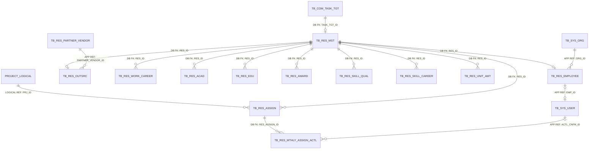
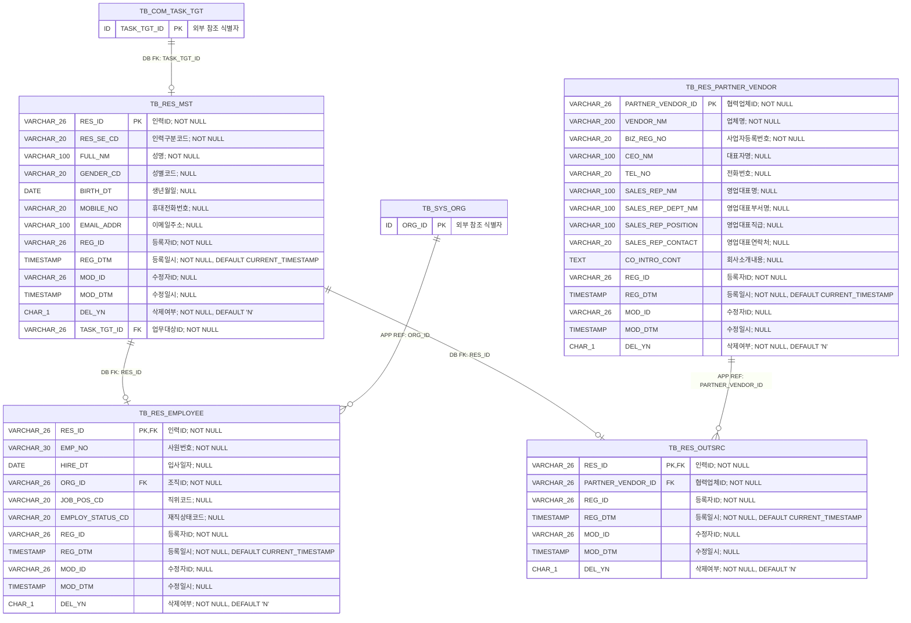
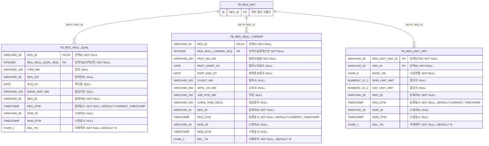
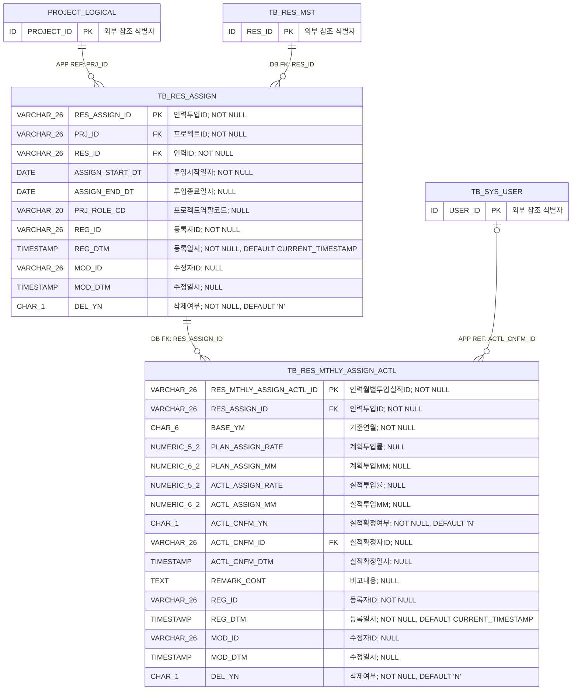

<!-- 이 파일은 python scripts/generate_erd.py --area employee 명령으로 생성합니다. 직접 수정하지 마십시오. -->
# 인력관리 상세 ERD

## 1. 문서 개요

직원과 외주인력의 공통 인력정보, 이력·역량·단가 및 프로젝트 투입계획·실적의 PostgreSQL 물리 모델을 표현한다. 원본은 데이터 카탈로그 CSV이며 이 문서는 구현과 리뷰를 위한 파생 산출물이다.

- 기준 DBMS: PostgreSQL
- 범위: 인력관리 13개 테이블
- 표기: `PK`는 기본키, `FK`는 논리 참조 컬럼, `DB FK`는 DB 제약 집행, `APP REF`는 애플리케이션 집행, `LOGICAL REF`는 상대 영역 물리화 전 논리 관계
- 타입 표기: Mermaid 호환을 위해 `VARCHAR(26)`은 `VARCHAR_26`, `CHAR(1)`은 `CHAR_1`처럼 괄호를 밑줄로 표시
- 카디널리티: `||` 필수 1, `o|` 선택 1, `o{` 0개 이상

### 1.1 원본 카탈로그

- 테이블: `03.physical-model/tables/table-employee.csv`
- 컬럼: `03.physical-model/columns/column-employee.csv`
- 제약조건: `03.physical-model/constraints/constraint-employee.csv`
- 인덱스: `03.physical-model/indexes/index-employee.csv`
- 타입 매핑: `01.standard/db-type-mapping.csv`

### 1.2 업무기능 추적성

| 기능 ID | 업무기능 | 주요 테이블 |
| --- | --- | --- |
| BFD-07-01 | 직원관리 | TB_RES_MST, TB_RES_EMPLOYEE, TB_RES_WORK_CAREER, TB_RES_ACAD, TB_RES_EDU, TB_RES_AWARD, TB_RES_SKILL_QUAL, TB_RES_SKILL_CAREER |
| BFD-07-03 | 단가관리 | TB_RES_UNIT_AMT |
| BFD-07-04 | 인력투입관리 | TB_RES_ASSIGN |
| BFD-07-05 | 투입률관리 | TB_RES_MTHLY_ASSIGN_ACTL |
| BFD-07-06 | 협력업체관리 | TB_RES_PARTNER_VENDOR |
| BFD-07-07 | 외주인력관리 | TB_RES_MST, TB_RES_OUTSRC |

## 2. 전체 관계 개요



> `TB_COM_TASK_TGT`는 공통, `TB_SYS_ORG`와 `TB_SYS_USER`는 시스템관리 영역의 물리 테이블이다. 프로젝트는 아직 물리 모델이 확정되지 않아 `PROJECT_LOGICAL`로 표시했다.

## 3. 영역별 상세 ERD

### 3.1 인력·직원·외주인력

인력 공통 마스터와 공유 PK 방식의 직원·외주인력 하위유형 및 협력업체를 관리하는 구조이다.



테이블 대응:
- `TB_RES_MST`: 인력
- `TB_RES_EMPLOYEE`: 직원
- `TB_RES_OUTSRC`: 외주인력
- `TB_RES_PARTNER_VENDOR`: 협력업체

### 3.2 경력·학력·교육·상훈

인력별 복합 PK 순번으로 과거 근무경력, 학력, 교육 및 상훈 이력을 관리하는 구조이다.

```mermaid
erDiagram
    TB_RES_WORK_CAREER {
        VARCHAR_26 RES_ID PK,FK "인력ID; NOT NULL"
        INTEGER RES_WORK_CAREER_SEQ PK "인력근무경력순번; NOT NULL"
        DATE WORK_START_DT "근무시작일자; NULL"
        DATE WORK_END_DT "근무종료일자; NULL"
        VARCHAR_200 CO_NM "회사명; NULL"
        VARCHAR_500 CHRG_TASK_DESC "담당업무; NULL"
        VARCHAR_100 DEPT_NM "부서; NULL"
        VARCHAR_100 JOB_POS_NM "직위; NULL"
        VARCHAR_26 REG_ID "등록자ID; NOT NULL"
        TIMESTAMP REG_DTM "등록일시; NOT NULL, DEFAULT CURRENT_TIMESTAMP"
        VARCHAR_26 MOD_ID "수정자ID; NULL"
        TIMESTAMP MOD_DTM "수정일시; NULL"
        CHAR_1 DEL_YN "삭제여부; NOT NULL, DEFAULT 'N'"
    }
    TB_RES_ACAD {
        VARCHAR_26 RES_ID PK,FK "인력ID; NOT NULL"
        INTEGER RES_ACAD_SEQ PK "인력학력순번; NOT NULL"
        VARCHAR_200 SCHOOL_NM "학교명; NOT NULL"
        VARCHAR_100 MAJOR_NM "학과; NULL"
        DATE STUDY_START_DT "수학시작일자; NULL"
        DATE STUDY_END_DT "수학종료일자; NULL"
        VARCHAR_100 DEGREE_NM "학위; NULL"
        VARCHAR_26 REG_ID "등록자ID; NOT NULL"
        TIMESTAMP REG_DTM "등록일시; NOT NULL, DEFAULT CURRENT_TIMESTAMP"
        VARCHAR_26 MOD_ID "수정자ID; NULL"
        TIMESTAMP MOD_DTM "수정일시; NULL"
        CHAR_1 DEL_YN "삭제여부; NOT NULL, DEFAULT 'N'"
    }
    TB_RES_EDU {
        VARCHAR_26 RES_ID PK,FK "인력ID; NOT NULL"
        INTEGER RES_EDU_SEQ PK "인력교육순번; NOT NULL"
        VARCHAR_200 EDU_CRS_NM "교육과정명; NOT NULL"
        VARCHAR_200 EDU_INST_NM "교육기관명; NULL"
        DATE EDU_START_DT "교육시작일자; NULL"
        DATE EDU_END_DT "교육종료일자; NULL"
        VARCHAR_30 CMPL_NO "수료번호; NULL"
        VARCHAR_26 REG_ID "등록자ID; NOT NULL"
        TIMESTAMP REG_DTM "등록일시; NOT NULL, DEFAULT CURRENT_TIMESTAMP"
        VARCHAR_26 MOD_ID "수정자ID; NULL"
        TIMESTAMP MOD_DTM "수정일시; NULL"
        CHAR_1 DEL_YN "삭제여부; NOT NULL, DEFAULT 'N'"
    }
    TB_RES_AWARD {
        VARCHAR_26 RES_ID PK,FK "인력ID; NOT NULL"
        INTEGER RES_AWD_SEQ PK "인력상훈순번; NOT NULL"
        VARCHAR_100 AWD_TYPE_NM "상훈종류; NULL"
        VARCHAR_200 AWD_INST_NM "상훈기관명; NULL"
        DATE CNFR_DT "수여일; NULL"
        TEXT BASIS_CONT "근거; NULL"
        VARCHAR_26 REG_ID "등록자ID; NOT NULL"
        TIMESTAMP REG_DTM "등록일시; NOT NULL, DEFAULT CURRENT_TIMESTAMP"
        VARCHAR_26 MOD_ID "수정자ID; NULL"
        TIMESTAMP MOD_DTM "수정일시; NULL"
        CHAR_1 DEL_YN "삭제여부; NOT NULL, DEFAULT 'N'"
    }
    TB_RES_MST {
        ID RES_ID PK "외부 참조 식별자"
    }
    TB_RES_MST ||--o{ TB_RES_WORK_CAREER : "DB FK: RES_ID"
    TB_RES_MST ||--o{ TB_RES_ACAD : "DB FK: RES_ID"
    TB_RES_MST ||--o{ TB_RES_EDU : "DB FK: RES_ID"
    TB_RES_MST ||--o{ TB_RES_AWARD : "DB FK: RES_ID"
```



테이블 대응:
- `TB_RES_WORK_CAREER`: 인력근무경력
- `TB_RES_ACAD`: 인력학력
- `TB_RES_EDU`: 인력교육
- `TB_RES_AWARD`: 인력상훈

### 3.3 기술·단가

인력의 기술자격·외부 사업 기술경력과 기준연월별 단가를 관리하는 구조이다.



테이블 대응:
- `TB_RES_SKILL_QUAL`: 인력기술자격
- `TB_RES_SKILL_CAREER`: 인력기술경력
- `TB_RES_UNIT_AMT`: 인력단가

### 3.4 프로젝트 투입·월별실적

프로젝트별 인력 투입기간과 월별 계획·실적 투입률 및 투입MM을 관리하는 구조이다.



테이블 대응:
- `TB_RES_ASSIGN`: 인력투입
- `TB_RES_MTHLY_ASSIGN_ACTL`: 인력월별투입실적

## 4. 관계 구현 명세

| 관계명 | 자식 컬럼 | 부모 | 집행 | 생성 | 삭제/수정 | 설명 |
| --- | --- | --- | --- | --- | --- | --- |
| FK_TB_RES_MST_01 | TB_RES_MST.TASK_TGT_ID | TB_COM_TASK_TGT.TASK_TGT_ID | DATABASE | Y | RESTRICT/RESTRICT | 인력의 업무대상 참조 무결성 |
| FK_TB_RES_EMPLOYEE_01 | TB_RES_EMPLOYEE.RES_ID | TB_RES_MST.RES_ID | DATABASE | Y | RESTRICT/RESTRICT | 직원의 인력 공유 PK 참조 무결성 |
| FK_TB_RES_EMPLOYEE_02 | TB_RES_EMPLOYEE.ORG_ID | TB_SYS_ORG.ORG_ID | APPLICATION | N | RESTRICT/RESTRICT | 직원 소속 조직 애플리케이션 참조 |
| FK_TB_RES_OUTSRC_01 | TB_RES_OUTSRC.RES_ID | TB_RES_MST.RES_ID | DATABASE | Y | RESTRICT/RESTRICT | 외주인력의 인력 공유 PK 참조 무결성 |
| FK_TB_RES_OUTSRC_02 | TB_RES_OUTSRC.PARTNER_VENDOR_ID | TB_RES_PARTNER_VENDOR.PARTNER_VENDOR_ID | APPLICATION | N | RESTRICT/RESTRICT | 외주인력 소속 협력업체 애플리케이션 참조 |
| FK_TB_RES_WORK_CAREER_01 | TB_RES_WORK_CAREER.RES_ID | TB_RES_MST.RES_ID | DATABASE | Y | RESTRICT/RESTRICT | 인력근무경력의 인력 참조 무결성 |
| FK_TB_RES_ACAD_01 | TB_RES_ACAD.RES_ID | TB_RES_MST.RES_ID | DATABASE | Y | RESTRICT/RESTRICT | 인력학력의 인력 참조 무결성 |
| FK_TB_RES_EDU_01 | TB_RES_EDU.RES_ID | TB_RES_MST.RES_ID | DATABASE | Y | RESTRICT/RESTRICT | 인력교육의 인력 참조 무결성 |
| FK_TB_RES_AWARD_01 | TB_RES_AWARD.RES_ID | TB_RES_MST.RES_ID | DATABASE | Y | RESTRICT/RESTRICT | 인력상훈의 인력 참조 무결성 |
| FK_TB_RES_SKILL_QUAL_01 | TB_RES_SKILL_QUAL.RES_ID | TB_RES_MST.RES_ID | DATABASE | Y | RESTRICT/RESTRICT | 인력기술자격의 인력 참조 무결성 |
| FK_TB_RES_SKILL_CAREER_01 | TB_RES_SKILL_CAREER.RES_ID | TB_RES_MST.RES_ID | DATABASE | Y | RESTRICT/RESTRICT | 인력기술경력의 인력 참조 무결성 |
| FK_TB_RES_UNIT_AMT_01 | TB_RES_UNIT_AMT.RES_ID | TB_RES_MST.RES_ID | DATABASE | Y | RESTRICT/RESTRICT | 인력단가의 인력 참조 무결성 |
| FK_TB_RES_ASSIGN_01 | TB_RES_ASSIGN.PRJ_ID | 프로젝트(논리).프로젝트ID | APPLICATION | N | RESTRICT/RESTRICT | 프로젝트 물리 모델 확정 전 인력투입의 프로젝트 참조 메타데이터이며 확정 후 DB FK로 전환 |
| FK_TB_RES_ASSIGN_02 | TB_RES_ASSIGN.RES_ID | TB_RES_MST.RES_ID | DATABASE | Y | RESTRICT/RESTRICT | 인력투입의 인력 참조 무결성 |
| FK_TB_RES_MTHLY_ASSIGN_ACTL_01 | TB_RES_MTHLY_ASSIGN_ACTL.RES_ASSIGN_ID | TB_RES_ASSIGN.RES_ASSIGN_ID | DATABASE | Y | RESTRICT/RESTRICT | 월별투입실적의 인력투입 참조 무결성 |
| FK_TB_RES_MTHLY_ASSIGN_ACTL_02 | TB_RES_MTHLY_ASSIGN_ACTL.ACTL_CNFM_ID | TB_SYS_USER.USER_ID | APPLICATION | N | RESTRICT/RESTRICT | 실적확정 사용자 애플리케이션 참조 |

## 5. 업무 무결성 규칙

| 제약조건 | 테이블 | 대상 컬럼 | 검사식 | 설명 |
| --- | --- | --- | --- | --- |
| CK_TB_RES_MST_01 | TB_RES_MST | DEL_YN | `DEL_YN IN ('Y','N')` | 삭제여부 허용값 검사 |
| CK_TB_RES_MST_02 | TB_RES_MST | RES_ID\|RES_SE_CD | `VALID_RESOURCE_SUBTYPE(RES_ID, RES_SE_CD)` | 인력구분에 맞는 직원 또는 외주인력 상세 한 건만 허용 |
| CK_TB_RES_EMPLOYEE_01 | TB_RES_EMPLOYEE | DEL_YN | `DEL_YN IN ('Y','N')` | 삭제여부 허용값 검사 |
| CK_TB_RES_OUTSRC_01 | TB_RES_OUTSRC | DEL_YN | `DEL_YN IN ('Y','N')` | 삭제여부 허용값 검사 |
| CK_TB_RES_PARTNER_VENDOR_01 | TB_RES_PARTNER_VENDOR | DEL_YN | `DEL_YN IN ('Y','N')` | 삭제여부 허용값 검사 |
| CK_TB_RES_WORK_CAREER_01 | TB_RES_WORK_CAREER | RES_WORK_CAREER_SEQ | `RES_WORK_CAREER_SEQ > 0` | 이력 순번 양수 검사 |
| CK_TB_RES_WORK_CAREER_02 | TB_RES_WORK_CAREER | WORK_START_DT\|WORK_END_DT | `WORK_END_DT IS NULL OR WORK_START_DT IS NULL OR WORK_END_DT >= WORK_START_DT` | 시작일자와 종료일자 순서 검사 |
| CK_TB_RES_WORK_CAREER_03 | TB_RES_WORK_CAREER | DEL_YN | `DEL_YN IN ('Y','N')` | 삭제여부 허용값 검사 |
| CK_TB_RES_ACAD_01 | TB_RES_ACAD | RES_ACAD_SEQ | `RES_ACAD_SEQ > 0` | 이력 순번 양수 검사 |
| CK_TB_RES_ACAD_02 | TB_RES_ACAD | STUDY_START_DT\|STUDY_END_DT | `STUDY_END_DT IS NULL OR STUDY_START_DT IS NULL OR STUDY_END_DT >= STUDY_START_DT` | 시작일자와 종료일자 순서 검사 |
| CK_TB_RES_ACAD_03 | TB_RES_ACAD | DEL_YN | `DEL_YN IN ('Y','N')` | 삭제여부 허용값 검사 |
| CK_TB_RES_EDU_01 | TB_RES_EDU | RES_EDU_SEQ | `RES_EDU_SEQ > 0` | 이력 순번 양수 검사 |
| CK_TB_RES_EDU_02 | TB_RES_EDU | EDU_START_DT\|EDU_END_DT | `EDU_END_DT IS NULL OR EDU_START_DT IS NULL OR EDU_END_DT >= EDU_START_DT` | 시작일자와 종료일자 순서 검사 |
| CK_TB_RES_EDU_03 | TB_RES_EDU | DEL_YN | `DEL_YN IN ('Y','N')` | 삭제여부 허용값 검사 |
| CK_TB_RES_SKILL_CAREER_01 | TB_RES_SKILL_CAREER | RES_SKILL_CAREER_SEQ | `RES_SKILL_CAREER_SEQ > 0` | 이력 순번 양수 검사 |
| CK_TB_RES_SKILL_CAREER_02 | TB_RES_SKILL_CAREER | PART_START_DT\|PART_END_DT | `PART_END_DT IS NULL OR PART_START_DT IS NULL OR PART_END_DT >= PART_START_DT` | 시작일자와 종료일자 순서 검사 |
| CK_TB_RES_SKILL_CAREER_03 | TB_RES_SKILL_CAREER | DEL_YN | `DEL_YN IN ('Y','N')` | 삭제여부 허용값 검사 |
| CK_TB_RES_AWARD_01 | TB_RES_AWARD | RES_AWD_SEQ | `RES_AWD_SEQ > 0` | 이력 순번 양수 검사 |
| CK_TB_RES_AWARD_02 | TB_RES_AWARD | DEL_YN | `DEL_YN IN ('Y','N')` | 삭제여부 허용값 검사 |
| CK_TB_RES_SKILL_QUAL_01 | TB_RES_SKILL_QUAL | RES_SKILL_QUAL_SEQ | `RES_SKILL_QUAL_SEQ > 0` | 이력 순번 양수 검사 |
| CK_TB_RES_SKILL_QUAL_02 | TB_RES_SKILL_QUAL | DEL_YN | `DEL_YN IN ('Y','N')` | 삭제여부 허용값 검사 |
| CK_TB_RES_UNIT_AMT_01 | TB_RES_UNIT_AMT | MON_UNIT_AMT\|DAY_UNIT_AMT | `(MON_UNIT_AMT IS NOT NULL OR DAY_UNIT_AMT IS NOT NULL) AND (MON_UNIT_AMT IS NULL OR MON_UNIT_AMT >= 0) AND (DAY_UNIT_AMT IS NULL OR DAY_UNIT_AMT >= 0)` | 월단가 또는 일단가 필수 및 음수 방지 |
| CK_TB_RES_UNIT_AMT_02 | TB_RES_UNIT_AMT | BASE_YM | `BASE_YM ~ '^[0-9]{4}(0[1-9]\|1[0-2])$'` | 기준연월 YYYYMM 형식 검사 |
| CK_TB_RES_UNIT_AMT_03 | TB_RES_UNIT_AMT | DEL_YN | `DEL_YN IN ('Y','N')` | 삭제여부 허용값 검사 |
| CK_TB_RES_ASSIGN_01 | TB_RES_ASSIGN | ASSIGN_START_DT\|ASSIGN_END_DT | `ASSIGN_END_DT IS NULL OR ASSIGN_END_DT >= ASSIGN_START_DT` | 투입 시작일자와 종료일자 순서 검사 |
| CK_TB_RES_ASSIGN_02 | TB_RES_ASSIGN | DEL_YN | `DEL_YN IN ('Y','N')` | 삭제여부 허용값 검사 |
| CK_TB_RES_ASSIGN_03 | TB_RES_ASSIGN | PRJ_ID\|RES_ID\|ASSIGN_START_DT\|ASSIGN_END_DT\|DEL_YN | `NO_OVERLAPPING_ACTIVE_ASSIGNMENT(PRJ_ID, RES_ID, ASSIGN_START_DT, ASSIGN_END_DT)` | 동일 프로젝트·인력의 활성 투입기간 중복 방지 |
| CK_TB_RES_MTHLY_ASSIGN_ACTL_01 | TB_RES_MTHLY_ASSIGN_ACTL | BASE_YM | `BASE_YM ~ '^[0-9]{4}(0[1-9]\|1[0-2])$'` | 기준연월 YYYYMM 형식 검사 |
| CK_TB_RES_MTHLY_ASSIGN_ACTL_02 | TB_RES_MTHLY_ASSIGN_ACTL | PLAN_ASSIGN_RATE\|ACTL_ASSIGN_RATE | `(PLAN_ASSIGN_RATE IS NULL OR PLAN_ASSIGN_RATE BETWEEN 0 AND 100) AND (ACTL_ASSIGN_RATE IS NULL OR ACTL_ASSIGN_RATE BETWEEN 0 AND 100)` | 계획 및 실적 투입률 범위 검사 |
| CK_TB_RES_MTHLY_ASSIGN_ACTL_03 | TB_RES_MTHLY_ASSIGN_ACTL | PLAN_ASSIGN_MM\|ACTL_ASSIGN_MM | `(PLAN_ASSIGN_MM IS NULL OR PLAN_ASSIGN_MM >= 0) AND (ACTL_ASSIGN_MM IS NULL OR ACTL_ASSIGN_MM >= 0)` | 계획 및 실적 투입MM 음수 방지 |
| CK_TB_RES_MTHLY_ASSIGN_ACTL_04 | TB_RES_MTHLY_ASSIGN_ACTL | ACTL_CNFM_YN | `ACTL_CNFM_YN IN ('Y','N')` | 실적확정여부 허용값 검사 |
| CK_TB_RES_MTHLY_ASSIGN_ACTL_05 | TB_RES_MTHLY_ASSIGN_ACTL | ACTL_CNFM_YN\|ACTL_CNFM_ID\|ACTL_CNFM_DTM | `(ACTL_CNFM_YN = 'Y' AND ACTL_CNFM_ID IS NOT NULL AND ACTL_CNFM_DTM IS NOT NULL) OR (ACTL_CNFM_YN = 'N' AND ACTL_CNFM_ID IS NULL AND ACTL_CNFM_DTM IS NULL)` | 실적확정여부와 확정자 및 확정일시 일관성 검사 |
| CK_TB_RES_MTHLY_ASSIGN_ACTL_06 | TB_RES_MTHLY_ASSIGN_ACTL | DEL_YN | `DEL_YN IN ('Y','N')` | 삭제여부 허용값 검사 |
| CK_TB_RES_MTHLY_ASSIGN_ACTL_07 | TB_RES_MTHLY_ASSIGN_ACTL | RES_ASSIGN_ID\|BASE_YM | `BASE_YM_WITHIN_ASSIGNMENT_PERIOD(RES_ASSIGN_ID, BASE_YM)` | 기준연월이 인력투입 기간 안에 포함되는지 검증 |
| CK_TB_RES_MTHLY_ASSIGN_ACTL_08 | TB_RES_MTHLY_ASSIGN_ACTL | RES_ASSIGN_ID\|BASE_YM\|PLAN_ASSIGN_RATE\|ACTL_ASSIGN_RATE | `RESOURCE_MONTHLY_TOTAL_RATE_WITHIN_LIMIT(RES_ASSIGN_ID, BASE_YM)` | 인력별 월간 계획 및 실적 총투입률 상한 검증 |
| CK_TB_RES_MTHLY_ASSIGN_ACTL_09 | TB_RES_MTHLY_ASSIGN_ACTL | ACTL_CNFM_YN | `CONFIRMED_ACTUAL_IMMUTABLE(ACTL_CNFM_YN)` | 확정된 월별 실적의 직접 수정 방지 |

## 6. 조회 및 고유성 인덱스

| 인덱스 | 테이블 | 컬럼 | 고유 | 조건 | 목적 |
| --- | --- | --- | --- | --- | --- |
| UX_TB_RES_MST_01 | TB_RES_MST | TASK_TGT_ID | Y | - | 하나의 업무대상에 최대 하나의 인력 연결 보장 |
| IX_TB_RES_MST_01 | TB_RES_MST | RES_SE_CD\|FULL_NM | N | DEL_YN = 'N' | 인력구분 및 성명 기준 활성 인력 조회 |
| IX_TB_RES_MST_02 | TB_RES_MST | MOBILE_NO | N | DEL_YN = 'N' AND MOBILE_NO IS NOT NULL | 휴대전화번호 기준 활성 인력 조회 |
| UX_TB_RES_EMPLOYEE_01 | TB_RES_EMPLOYEE | EMP_NO | Y | - | 삭제 여부와 관계없는 사원번호 고유성 보장 |
| IX_TB_RES_EMPLOYEE_01 | TB_RES_EMPLOYEE | ORG_ID\|EMPLOY_STATUS_CD | N | DEL_YN = 'N' | 조직 및 재직상태별 직원 조회 |
| IX_TB_RES_EMPLOYEE_02 | TB_RES_EMPLOYEE | HIRE_DT | N | DEL_YN = 'N' AND HIRE_DT IS NOT NULL | 입사일자별 직원 조회 |
| IX_TB_RES_OUTSRC_01 | TB_RES_OUTSRC | PARTNER_VENDOR_ID\|RES_ID | N | DEL_YN = 'N' | 협력업체별 외주인력 조회 |
| UX_TB_RES_PARTNER_VENDOR_01 | TB_RES_PARTNER_VENDOR | BIZ_REG_NO | Y | BIZ_REG_NO IS NOT NULL | 삭제 여부와 관계없는 사업자등록번호 고유성 보장 |
| IX_TB_RES_PARTNER_VENDOR_01 | TB_RES_PARTNER_VENDOR | VENDOR_NM | N | DEL_YN = 'N' | 협력업체명 검색 |
| IX_TB_RES_WORK_CAREER_01 | TB_RES_WORK_CAREER | RES_ID\|WORK_START_DT | N | DEL_YN = 'N' | 인력별 이력 일자순 조회 |
| IX_TB_RES_ACAD_01 | TB_RES_ACAD | RES_ID\|STUDY_START_DT | N | DEL_YN = 'N' | 인력별 이력 일자순 조회 |
| IX_TB_RES_EDU_01 | TB_RES_EDU | RES_ID\|EDU_START_DT | N | DEL_YN = 'N' | 인력별 이력 일자순 조회 |
| IX_TB_RES_AWARD_01 | TB_RES_AWARD | RES_ID\|CNFR_DT | N | DEL_YN = 'N' | 인력별 이력 일자순 조회 |
| IX_TB_RES_SKILL_QUAL_01 | TB_RES_SKILL_QUAL | RES_ID\|ACQ_DT | N | DEL_YN = 'N' | 인력별 이력 일자순 조회 |
| IX_TB_RES_SKILL_CAREER_01 | TB_RES_SKILL_CAREER | RES_ID\|PART_START_DT | N | DEL_YN = 'N' | 인력별 이력 일자순 조회 |
| UX_TB_RES_UNIT_AMT_01 | TB_RES_UNIT_AMT | RES_ID\|BASE_YM | Y | DEL_YN = 'N' | 인력별 기준연월 활성 단가 중복 방지 |
| IX_TB_RES_UNIT_AMT_01 | TB_RES_UNIT_AMT | BASE_YM\|RES_ID | N | DEL_YN = 'N' | 기준연월별 인력단가 조회 |
| IX_TB_RES_ASSIGN_01 | TB_RES_ASSIGN | PRJ_ID\|ASSIGN_START_DT\|ASSIGN_END_DT | N | DEL_YN = 'N' | 프로젝트별 활성 투입인력 조회 |
| IX_TB_RES_ASSIGN_02 | TB_RES_ASSIGN | RES_ID\|ASSIGN_START_DT\|ASSIGN_END_DT | N | DEL_YN = 'N' | 인력별 투입기간 및 가용현황 조회 |
| UX_TB_RES_MTHLY_ASSIGN_ACTL_01 | TB_RES_MTHLY_ASSIGN_ACTL | RES_ASSIGN_ID\|BASE_YM | Y | DEL_YN = 'N' | 인력투입별 기준연월 활성 계획·실적 중복 방지 |
| IX_TB_RES_MTHLY_ASSIGN_ACTL_01 | TB_RES_MTHLY_ASSIGN_ACTL | BASE_YM\|ACTL_CNFM_YN | N | DEL_YN = 'N' | 기준연월 및 확정여부별 투입실적 조회 |

## 7. 구현 주의사항

- 인력 등록 시 인력 업무대상과 인력 마스터를 동일 트랜잭션에서 생성하고 `TASK_TGT_ID`를 필수·고유 참조한다.
- 인력구분에 맞는 직원 또는 외주인력 상세 중 하나만 공유 PK로 생성하며 두 하위유형의 동시 존재를 차단한다.
- 사람 사용자 계정은 내부 직원만 선택적으로 연결하고 외주인력에는 사용자 계정을 생성하지 않는다.
- 사원번호와 값이 있는 협력업체 사업자등록번호는 삭제 여부와 관계없이 재사용하지 않는다.
- 같은 프로젝트·인력의 활성 투입기간 중복을 차단하고 서로 다른 프로젝트의 동시 투입은 월간 총투입률 상한으로 통제한다.
- 월별 계획·실적의 기준연월은 투입기간 안에 있어야 하며 인력별 월간 계획·실적 투입률 합계가 설정 상한을 초과할 수 없다.
- 확정된 월별 실적은 직접 수정하지 않고 권한이 있는 사용자의 확정취소 절차를 거친다.
- 생년월일·휴대전화번호·이메일주소 등 개인정보는 접근권한, 마스킹 및 보존기간 정책을 적용한다.

## 8. 재생성

```powershell
python scripts/generate_erd.py --area employee
```

생성 후 전체 데이터 카탈로그 검증을 수행한다.

```powershell
python scripts/validate_data_catalog.py --review-area employee --report tmp/data-catalog-validation-employee.csv
```
