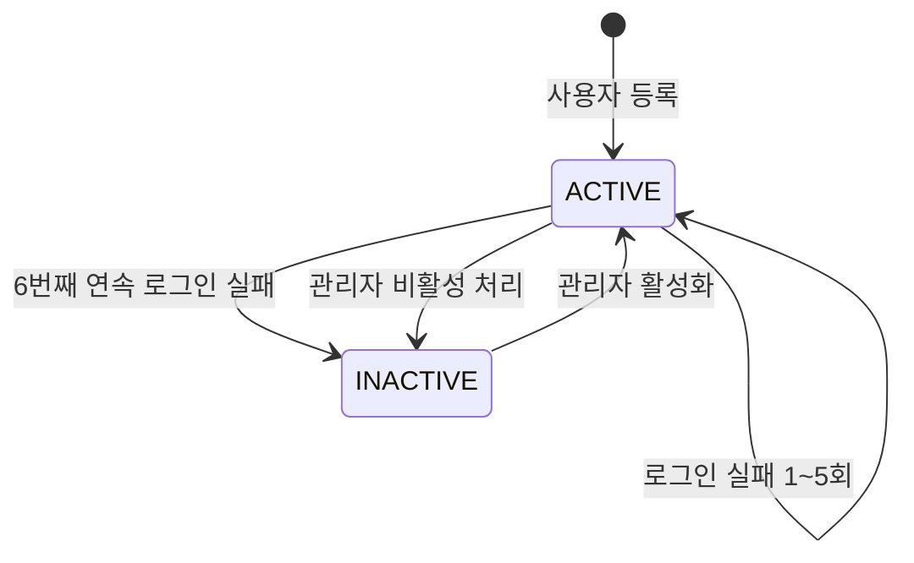
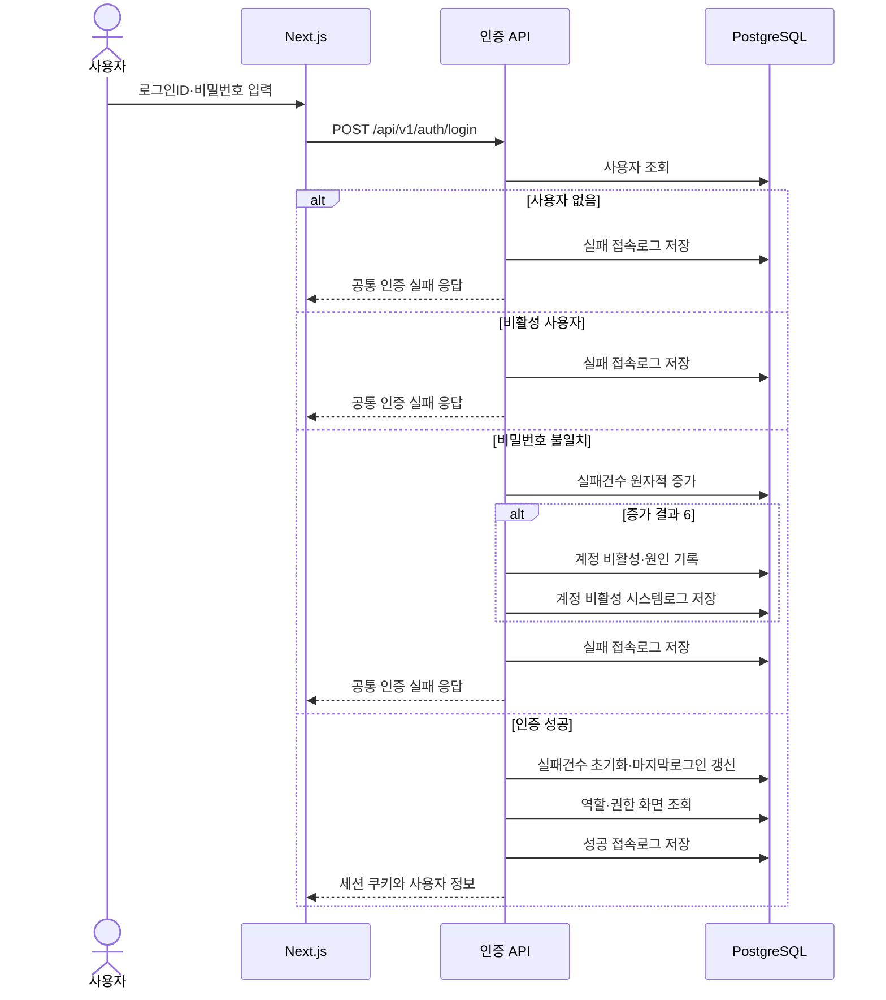
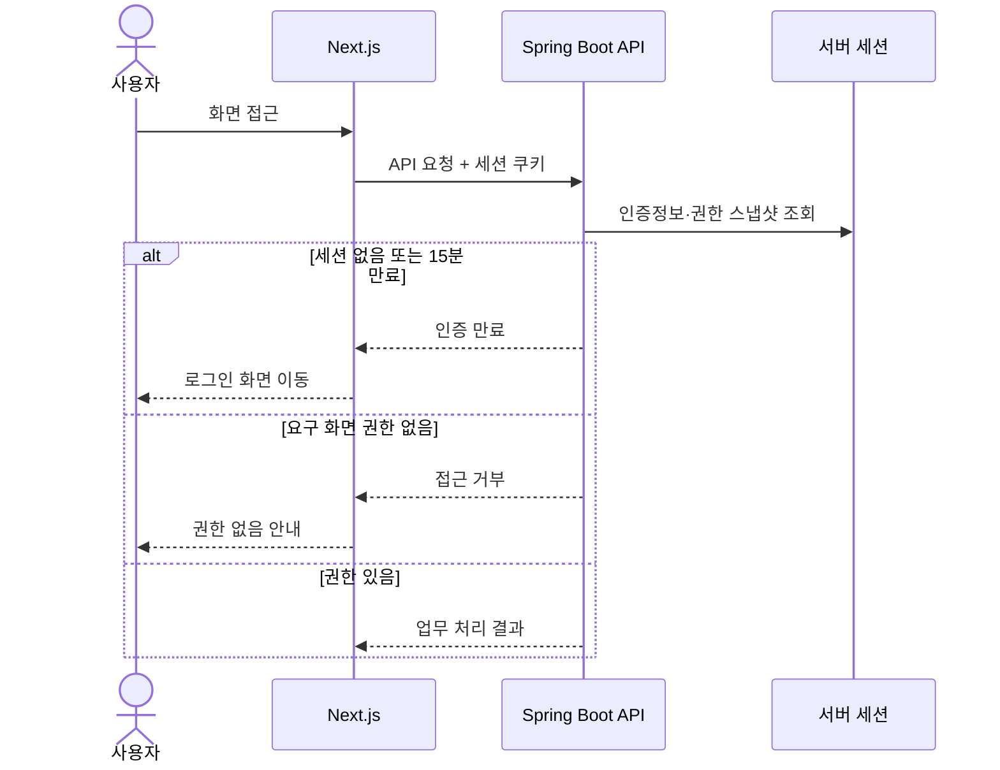

# 인증·권한 상세설계서

## 1. 문서 개요

### 1.1 목적

본 문서는 BMS의 ID·비밀번호 로그인, 서버 세션, 사용자 계정 비활성화, 역할별 화면 접근권한 및 관련 로그 처리 기준을 정의한다.

본 설계는 다음 기능의 화면·API·데이터 상세설계 기준으로 사용한다.

- COM-001 로그인
- SYS-001 사용자관리
- SYS-002 역할관리
- SYS-003 메뉴관리
- BFD-02-05 인증관리
- BFD-01-01 사용자관리
- BFD-01-02 역할관리
- BFD-01-03 메뉴관리
- BFD-01-07 로그관리

### 1.2 문서 상태

| 항목 | 내용 |
| --- | --- |
| 상태 | 초안 |
| 작성일 | 2026-07-16 |
| 상위 기준 | 애플리케이션 아키텍처 |
| 인증 방식 | ID·비밀번호, Spring Security 서버 세션 |

### 1.3 적용 원칙

- 본문에서 `확정`으로 표시한 정책은 사용자 제시 기준을 그대로 적용한다.
- 기존 분석 또는 데이터 모델과 다른 내용은 본 설계의 데이터 영향사항에서 식별한다.
- 비밀번호, 세션ID 및 인증 쿠키값은 화면, API 응답과 로그에 노출하지 않는다.

---

## 2. 확정 정책

| ID | 정책 | 설계 적용 내용 |
| --- | --- | --- |
| AUTH-POL-001 | 로그인 방식 | 로그인ID와 비밀번호를 입력하는 방식으로 인증한다. |
| AUTH-POL-002 | 자동 로그아웃 | 로그인 후 15분 동안 사용자 작업이 없으면 자동 로그아웃한다. |
| AUTH-POL-003 | 로그인 실패 | 5회까지 연속 실패를 허용하고 5회를 초과하는 6번째 실패에서 계정을 비활성화한다. |
| AUTH-POL-004 | 비활성 해제 | 비활성 계정은 관리자만 활성 상태로 복구한다. |
| AUTH-POL-005 | 메뉴 권한 | 사용자의 화면 접근권한은 사용자에게 부여된 역할들의 권한 화면을 합한 결과로 정의한다. |
| AUTH-POL-006 | 권한 변경 반영 | 권한 변경 시 로그인 중인 세션의 권한은 유지하고 다음 로그인부터 변경된 권한을 적용한다. |
| AUTH-POL-007 | 로그 생성 | 사용자 등록·수정·비활성·활성화, 역할 추가·변경·삭제, 로그인·로그아웃 및 자동 로그아웃을 기록한다. |

`AUTH-POL-003`은 “5회 초과”를 문자 그대로 해석한 기준이다. 따라서 로그인 실패건수 1~5에서는 계정을 유지하고 6번째 연속 실패 처리와 함께 비활성화한다.

---

## 3. 사용자 계정 상태

### 3.1 상태 정의

| 상태코드 | 상태명 | 로그인 | 설명 |
| --- | --- | :---: | --- |
| ACTIVE | 활성 | 가능 | 정상적으로 사용할 수 있는 계정 |
| INACTIVE | 비활성 | 불가 | 관리자 처리 또는 로그인 실패 초과로 사용이 중지된 계정 |

비활성 원인은 상태와 별도로 관리한다.

| 비활성원인코드 | 설명 |
| --- | --- |
| MANUAL | 관리자가 사용자관리 화면에서 비활성 처리 |
| LOGIN_FAILURE | 로그인 연속 실패 허용 횟수 초과 |

별도의 `LOCKED` 상태는 사용하지 않는다. 로그인 실패 허용 횟수를 초과한 계정은 `INACTIVE` 상태로 전환한다.

### 3.2 상태 전이



### 3.3 상태 변경 규칙

- 사용자 신규 등록 시 상태는 `ACTIVE`, 로그인실패건수는 `0`으로 시작한다.
- 로그인 성공 시 로그인실패건수를 `0`으로 초기화한다.
- 로그인 실패 시 등록된 로그인ID의 활성 계정에 대해 실패건수를 원자적으로 1 증가시킨다.
- 증가 결과가 `6`이면 동일 트랜잭션에서 계정을 `INACTIVE`로 변경하고 비활성 원인을 `LOGIN_FAILURE`로 기록한다.
- 계정이 `ACTIVE`이면 비활성원인코드와 비활성일시는 모두 `NULL`이고, `INACTIVE`이면 두 값은 모두 필수로 기록한다.
- 존재하지 않는 로그인ID에 대해서는 계정 상태를 변경하지 않지만 로그인 실패 접속로그는 생성한다.
- 관리자가 계정을 활성화하면 로그인실패건수를 `0`으로 초기화하고 비활성 원인과 비활성 일시를 해제한다.
- 관리자 비활성 처리와 활성화는 모두 시스템로그에 기록한다.
- 계정 비활성은 단순 권한 변경과 구분한다. 관리자가 계정을 비활성화하면 해당 사용자의 기존 세션을 모두 즉시 무효화한다.
- 로그인 실패로 비활성화된 계정에 기존 세션이 있으면 해당 세션도 즉시 무효화한다.

---

## 4. 로그인·로그아웃 설계

### 4.1 로그인 입력

| 항목 | 필수 | 처리 기준 |
| --- | :---: | --- |
| 로그인ID | Y | 앞뒤 공백을 제거하고 대소문자 구분 여부는 데이터 설계에서 통일한다. |
| 비밀번호 | Y | 원문을 저장하거나 로그에 기록하지 않는다. |

로그인 실패 응답은 로그인ID 존재 여부, 비밀번호 오류, 비활성 상태를 외부에 상세히 구분하지 않는 공통 메시지를 기본으로 한다.

### 4.2 로그인 성공 처리

로그인 성공 처리는 하나의 인증 유스케이스로 수행한다.

1. 로그인ID로 삭제되지 않은 사용자를 조회한다.
2. 계정 상태가 `ACTIVE`인지 확인한다.
3. 입력 비밀번호와 저장된 비밀번호 해시를 비교한다.
4. 로그인실패건수를 `0`으로 초기화하고 마지막로그인일시를 갱신한다.
5. 사용자의 삭제되지 않은 역할과 역할별 권한 화면을 조회한다.
6. 사용자 식별자, 역할 목록과 권한 화면 목록을 인증 권한 스냅샷으로 생성한다.
7. 기존 인증 세션 식별자를 교체하고 새 서버 세션을 발급한다.
8. 로그인 성공 접속로그를 생성하고 접속로그ID를 세션에 보관한다.
9. 세션 쿠키를 브라우저에 전달한다.

### 4.3 로그인 실패 처리



### 4.4 로그아웃

- 사용자가 로그아웃을 실행하면 현재 세션의 접속로그ID로 접속로그의 로그아웃일시와 로그아웃유형 `MANUAL`을 기록한다.
- 접속로그 갱신 후 서버 세션을 무효화하고 세션 쿠키를 만료시킨다.
- 이미 만료된 세션으로 로그아웃을 요청한 경우에도 클라이언트 쿠키는 제거하고 성공 응답을 반환할 수 있다.
- 로그아웃 처리는 여러 번 호출되어도 결과가 동일한 멱등 처리를 기본으로 한다.

### 4.5 자동 로그아웃

- 서버 세션 유휴시간은 15분으로 설정한다.
- 사용자 조작으로 발생한 인증 요청이 처리되면 마지막 활동시각을 갱신한다.
- 여러 브라우저 탭은 동일 세션을 사용하므로 어느 한 탭의 사용자 작업도 세션 활동으로 본다.
- 프론트엔드는 키보드 입력, 마우스 클릭, 스크롤과 화면 이동을 사용자 활동으로 감지한다.
- 화면 내 활동이 있었지만 업무 API 요청이 없었던 경우에는 최대 1분 단위로 활동 신호 API를 호출하여 서버의 마지막 활동시각을 갱신한다.
- 자동 갱신, 상태 확인용 폴링 등 사용자 작업이 아닌 백그라운드 요청은 활동 신호를 보내지 않으며 초기 구현에서는 세션을 연장하는 주기적 폴링을 사용하지 않는다.
- 프론트엔드는 마지막 사용자 활동부터 15분이 지나면 로그아웃 화면으로 이동한다.
- 서버에서 세션이 만료되면 접속로그에 로그아웃일시와 로그아웃유형 `TIMEOUT`을 기록한다.
- 만료된 세션의 API 요청에는 인증 만료 오류를 반환하고 프론트엔드는 로그인 화면으로 이동한다.

### 4.6 세션 쿠키

| 항목 | 기준 |
| --- | --- |
| 저장 위치 | 브라우저 쿠키 |
| JavaScript 접근 | 차단(`HttpOnly`) |
| HTTPS 전송 | 운영환경 필수(`Secure`) |
| SameSite | `Lax` 기본안 |
| 유효시간 | 서버 유휴시간 15분 |
| 세션 고정 공격 방지 | 로그인 성공 시 세션 식별자 교체 |
| 상태 변경 요청 | CSRF 토큰 검증 |

---

## 5. 역할과 화면 권한

### 5.1 권한 구성

```text
사용자 N : M 역할
역할 N : M 메뉴(화면)
사용자 권한 화면 = 부여된 미삭제 역할별 권한 화면의 합집합
```

- 역할에는 접근 가능한 화면을 지정한다.
- 하나의 화면에 하나 이상의 메뉴 경로가 있으면 권한 판정 기준 메뉴를 화면설계서에서 지정한다.
- 여러 역할 중 하나라도 화면 권한이 있으면 해당 화면에 접근할 수 있다.
- 삭제 처리된 역할과 메뉴는 신규 로그인 권한 스냅샷에서 제외한다.
- 화면 권한이 없는 메뉴는 내비게이션에 표시하지 않는다.
- URL 직접 접근과 API 직접 호출도 서버에서 동일한 화면 권한을 검사한다.

### 5.2 API 권한 매핑

각 보호 API는 자신을 사용하는 화면 ID 또는 메뉴 ID를 하나 이상 지정한다.

| API 유형 | 권한 기준 |
| --- | --- |
| 화면 전용 API | 해당 화면의 메뉴 권한 필요 |
| 여러 화면의 공통 조회 API | 호출 가능한 화면 중 하나 이상의 권한 필요 |
| 첨부파일·메모 API | 호출 화면 권한과 대상 업무 데이터 접근권한 필요 |
| 로그인·로그아웃 API | 메뉴 권한 없이 호출 가능 |
| 현재 사용자·메뉴 조회 API | 로그인 세션 필요 |

현재 정책에서 역할 권한 단위는 화면 접근이다. 화면 안의 조회·등록·수정·삭제 행위를 역할별로 추가 분리하지 않는다.

역할메뉴권한은 역할ID와 메뉴ID 관계의 존재 자체로 접근권한을 표현한다. 관계 행이 있으면 접근 가능하고 행이 없으면 접근할 수 없다. 별도의 접근권한여부 및 조회·등록·수정·삭제 권한여부 컬럼은 사용하지 않는다. 화면에서 호출하는 보호 API는 HTTP Method와 관계없이 해당 화면의 메뉴 권한을 동일하게 검사한다.

### 5.3 권한 스냅샷

로그인 성공 시점에 다음 정보를 세션의 권한 스냅샷으로 저장한다.

- 사용자ID
- 역할ID 목록
- 접근 가능한 메뉴ID 또는 화면ID 목록
- 사용자 표시명과 직원의 조직ID 등 화면 공통 표시정보
- 로그인 접속로그ID

권한 스냅샷은 세션이 유지되는 동안 데이터베이스에서 자동 갱신하지 않는다.



### 5.4 권한 변경 반영

- 사용자 역할 추가·회수, 역할의 권한 화면 변경, 역할 삭제는 현재 세션에 반영하지 않는다.
- 변경 전 로그인한 사용자는 로그아웃 또는 15분 유휴시간 만료 전까지 기존 권한을 유지한다.
- 다음 로그인에서는 변경된 활성 역할과 화면 권한으로 새 스냅샷을 생성한다.
- 관리자 화면에는 “권한 변경은 대상 사용자의 다음 로그인부터 적용”된다는 안내를 표시한다.
- 역할 삭제 시에도 기존 세션에 포함된 권한은 세션 종료 전까지 유효하다.

---

## 6. 사용자·역할 관리 처리

### 6.1 사용자 처리

| 처리 | 주요 규칙 | 시스템로그 이벤트 |
| --- | --- | --- |
| 등록 | 내부 직원만 연결, 로그인ID 중복 금지, 초기 상태 ACTIVE | USER_CREATED |
| 수정 | 사용자 기본정보 변경, 비밀번호 원문 기록 금지 | USER_UPDATED |
| 비활성 | 상태 INACTIVE, 원인 MANUAL | USER_DEACTIVATED |
| 로그인 실패 비활성 | 6번째 실패에서 상태 INACTIVE, 원인 LOGIN_FAILURE | USER_DEACTIVATED_LOGIN_FAILURE |
| 활성화 | 관리자만 처리, 실패건수 0 초기화 | USER_REACTIVATED |

### 6.2 역할 처리

| 처리 | 주요 규칙 | 시스템로그 이벤트 |
| --- | --- | --- |
| 추가 | 역할명 중복 금지, 권한 화면 지정 | ROLE_CREATED |
| 변경 | 역할명·설명·권한 화면 변경 | ROLE_UPDATED |
| 삭제처리 | 물리삭제하지 않고 삭제여부를 Y로 변경 | ROLE_DELETED |

- 역할 삭제처리 전 해당 역할을 보유한 사용자 수를 확인하고 관리자에게 안내한다.
- 역할 삭제처리를 하더라도 사용자역할과 역할메뉴권한 이력은 즉시 물리삭제하지 않는다.
- 삭제된 역할은 신규 부여 대상과 다음 로그인 권한 스냅샷에서 제외한다.
- 역할 변경 및 삭제는 기존 로그인 세션에 반영하지 않는다.

---

## 7. 로그 설계

### 7.1 로그 구분

| 로그 | 기록 대상 |
| --- | --- |
| 접속로그 | 로그인 성공·실패, 수동 로그아웃, 15분 유휴시간 자동 로그아웃 |
| 시스템로그 | 사용자와 역할의 등록·변경·비활성·활성화·삭제처리 |

### 7.2 접속로그

| 항목 | 설명 |
| --- | --- |
| 접속로그ID | 접속 시도 식별자 |
| 사용자ID | 등록된 사용자이면 기록, 존재하지 않는 로그인ID이면 NULL 가능 |
| 로그인ID 마스킹값 | 미등록 사용자 실패 추적이 필요할 때 원문 대신 마스킹 또는 해시값 기록 |
| 접속일시 | 로그인 시도 일시 |
| 로그인성공여부 | 성공 Y, 실패 N |
| 실패사유코드 | 사용자없음, 비밀번호불일치, 계정비활성 등 내부 조회용 코드 |
| 로그아웃일시 | 수동 또는 자동 로그아웃 일시 |
| 로그아웃유형코드 | MANUAL 또는 TIMEOUT |
| 접속IP주소 | 신뢰 가능한 프록시 기준 원본 IP |
| 사용자에이전트 | 브라우저·클라이언트 식별정보 |
| 요청추적ID | 서버 로그와 연결하는 추적 식별자 |

실패사유는 관리자 로그 조회에서만 사용하며 로그인 응답에는 상세 사유를 노출하지 않는다.

- 실패사유코드는 로그인 성공 시 `NULL`이며 실패 시 `USER_NOT_FOUND`, `PASSWORD_MISMATCH`, `ACCOUNT_INACTIVE` 중 하나를 기록한다.
- 로그아웃일시와 로그아웃유형코드는 성공한 로그인 세션이 종료될 때 함께 기록하며, 로그인 실패 또는 접속 중인 세션은 모두 `NULL`이다.
- 요청추적ID는 접속로그를 생성한 로그인 요청의 식별자를 기록한다. 수동 로그아웃 요청까지 별도로 추적해야 하는 경우에는 로그아웃요청추적ID를 별도 속성으로 확장하며, HTTP 요청 없이 발생하는 `TIMEOUT`에는 로그아웃 요청 식별자가 없다.
- 미등록 로그인ID 추적값은 원문이나 단순 마스킹값 대신 서버 비밀키를 사용하는 단방향 해시값으로 저장한다.

### 7.3 시스템로그

| 항목 | 설명 |
| --- | --- |
| 로그ID | 시스템로그 식별자 |
| 이벤트유형코드 | USER_CREATED 등 업무 사건 코드 |
| 처리사용자ID | 작업을 수행한 관리자 |
| 대상유형코드 | USER 또는 ROLE |
| 대상ID | 변경된 사용자ID 또는 역할ID |
| 발생일시 | 업무 처리 일시 |
| 처리결과코드 | SUCCESS 또는 FAILURE |
| 변경요약 | 개인정보와 비밀번호를 제외한 변경 항목 요약 |
| 요청추적ID | API 요청과 로그 연결 식별자 |
| 접속IP주소 | 관리자 요청 IP |

### 7.4 로그 보안

- 비밀번호 원문·해시값, 세션ID, 쿠키값과 CSRF 토큰을 기록하지 않는다.
- 개인정보는 업무상 필요한 최소 범위만 기록하며 이메일과 전화번호의 변경 전후 값을 남기지 않는다.
- 로그 생성 실패가 사용자·역할 변경 이력을 누락시키지 않도록 업무 변경과 시스템로그는 같은 트랜잭션에서 저장한다.
- 로그인 성공·실패 로그는 인증 결과와 함께 반드시 저장한다.
- 성공 시스템로그는 업무 변경과 같은 트랜잭션에서 저장한다. 실패 시스템로그가 반드시 필요한 경우 업무 트랜잭션 롤백에 함께 사라지지 않도록 별도 트랜잭션이나 애플리케이션 진단로그로 기록한다.

---

## 8. API 후보

| API | Method | 기능 | 인증·권한 |
| --- | --- | --- | --- |
| `/api/v1/auth/login` | POST | 로그인 및 세션 생성 | 불필요 |
| `/api/v1/auth/logout` | POST | 수동 로그아웃 및 세션 무효화 | 로그인 세션 |
| `/api/v1/auth/me` | GET | 현재 사용자와 권한 화면 조회 | 로그인 세션 |
| `/api/v1/auth/activity` | POST | 사용자 활동시각 갱신 | 로그인 세션 |
| `/api/v1/users` | POST | 사용자 등록 | SYS-001 |
| `/api/v1/users/{userId}` | PATCH | 사용자 수정 | SYS-001 |
| `/api/v1/users/{userId}/deactivate` | POST | 사용자 비활성 | SYS-001 |
| `/api/v1/users/{userId}/reactivate` | POST | 사용자 활성화 및 실패건수 초기화 | SYS-001 |
| `/api/v1/roles` | POST | 역할 추가 | SYS-002 |
| `/api/v1/roles/{roleId}` | PATCH | 역할과 권한 화면 변경 | SYS-002 |
| `/api/v1/roles/{roleId}` | DELETE | 역할 논리 삭제처리 | SYS-002 |

상세 요청·응답 DTO, 오류코드와 목록 조회 API는 API 명세 작성 시 확정한다.

---

## 9. 데이터 모델 영향사항

### 9.1 사용자

사용자 상태는 `계정상태코드`를 단일 기준으로 관리한다. `사용여부`는 제거하고, 별도 `LOCKED` 상태를 사용하지 않으므로 `잠금일시`를 `비활성일시`로 변경한다.

| 항목 | 적용 | 설계 기준 |
| --- | :---: | --- |
| 계정상태코드 | 유지 | `ACTIVE`, `INACTIVE` 상태의 단일 기준 |
| 로그인실패건수 | 유지 | 연속 실패건수, 성공 또는 관리자 활성화 시 0 |
| 비활성원인코드 | 추가 | `MANUAL`, `LOGIN_FAILURE` |
| 비활성일시 | 명칭 변경 | 기존 잠금일시를 변경하며 비활성 전환 시각 기록 |
| 사용여부 | 제거 | 계정상태코드와 의미 중복 |
| 조직ID | 물리모델에서 제거 | 직원의 조직ID를 조회하며 사용자에 중복 저장하지 않음 |

사용자가 `ACTIVE`이면 비활성원인코드와 비활성일시는 모두 `NULL`이어야 하고, `INACTIVE`이면 두 값은 모두 필수다. 관리자 활성화 시 두 값을 `NULL`로 초기화한다. 사용자의 조직정보는 `사용자 → 직원 → 조직` 관계로 조회하고 로그인 세션에는 조회 시점의 조직정보를 화면 표시용 스냅샷으로 저장한다.

### 9.2 역할과 역할메뉴권한

역할은 추가·변경·논리 삭제만 사용한다. `사용여부`를 제거하고 `삭제여부`를 역할 상태의 단일 기준으로 사용한다.

역할메뉴권한은 역할별 화면 접근권한만 표현한다. 역할ID와 메뉴ID의 관계 행이 있으면 해당 화면에 접근할 수 있고, 관계 행이 없으면 접근할 수 없다. 조회·등록·수정·삭제 권한여부 4개 컬럼과 접근권한여부 컬럼은 두지 않는다.

화면 내 행위별 권한이 향후 필요해지면 CRUD 여부 컬럼을 복원하지 않고 `권한코드`와 `역할권한` 관계로 별도 모델링한다.

### 9.3 접속로그

접속로그에 다음 속성을 추가한다.

- 실패사유코드
- 로그아웃유형코드
- 사용자에이전트
- 요청추적ID
- 미등록 로그인ID 추적용 해시값

요청추적ID는 로그인 시도 요청을 기준으로 기록한다. 성공여부와 실패사유, 로그아웃일시와 로그아웃유형은 각각 함께 유효하도록 데이터 제약조건을 적용한다.

### 9.4 시스템로그

기존 로그유형, 발생일시와 로그내용 외에 다음 구조화 속성을 추가한다. 기존 사용자ID는 행위자와 대상자의 혼동을 방지하기 위해 처리사용자ID로 명칭을 변경한다.

- 이벤트유형코드
- 대상유형코드와 대상ID
- 처리결과코드
- 요청추적ID
- 접속IP주소

로그유형코드는 업무·보안·오류 등 상위 분류에 사용하고, 이벤트유형코드는 `USER_CREATED`, `USER_UPDATED`, `USER_DEACTIVATED`, `USER_REACTIVATED`, `ROLE_CREATED`, `ROLE_UPDATED`, `ROLE_DELETED` 등 구체적인 사건을 기록한다. 대상ID는 사용자ID 또는 역할ID 등 대상의 식별자이므로 대상유형코드와 함께 사용한다. 처리결과코드는 `SUCCESS` 또는 `FAILURE`를 사용한다.

---

## 10. 예외처리

| 상황 | 처리 기준 |
| --- | --- |
| 로그인 정보 불일치 | 공통 인증 실패 메시지 반환, 실패 접속로그 생성 |
| 6번째 연속 실패 | 계정 비활성 처리 후 공통 인증 실패 메시지 반환 |
| 비활성 계정 로그인 | 로그인 차단, 실패 접속로그 생성 |
| 15분 무활동 | 세션 무효화, TIMEOUT 로그 기록, 로그인 화면 이동 |
| 권한 없는 화면·API | HTTP 접근 거부 응답, 권한 없음 화면 또는 메시지 제공 |
| 삭제된 역할로 신규 로그인 | 해당 역할을 제외하고 권한 스냅샷 생성 |
| 마지막 관리자 권한 제거 | 전체 관리 불능 방지 정책 확정 전까지 처리 차단 권장 |
| 자기 계정 비활성 | 관리자 접근 불능 방지 정책 확정 전까지 처리 차단 권장 |

---

## 11. 검증 시나리오

| ID | 시나리오 | 예상 결과 |
| --- | --- | --- |
| AUTH-TC-001 | 올바른 ID·비밀번호로 로그인 | 세션과 권한 스냅샷 생성, 실패건수 0, 성공로그 생성 |
| AUTH-TC-002 | 비밀번호 5회 연속 실패 | 실패건수 5, 계정 ACTIVE 유지 |
| AUTH-TC-003 | 비밀번호 6회 연속 실패 | 실패건수 6, 계정 INACTIVE·LOGIN_FAILURE, 로그 생성 |
| AUTH-TC-004 | 실패 후 로그인 성공 | 로그인 성공, 실패건수 0 초기화 |
| AUTH-TC-005 | 비활성 계정 로그인 | 로그인 차단, 실패로그 생성 |
| AUTH-TC-006 | 관리자가 비활성 계정 활성화 | ACTIVE 전환, 실패건수 0, 시스템로그 생성 |
| AUTH-TC-007 | 15분 동안 사용자 작업 없음 | 세션 만료, TIMEOUT 로그, 로그인 화면 이동 |
| AUTH-TC-008 | 권한 없는 화면 URL 직접 접근 | 화면과 API 접근 거부 |
| AUTH-TC-009 | 복수 역할 사용자 로그인 | 역할별 권한 화면의 합집합으로 스냅샷 생성 |
| AUTH-TC-010 | 로그인 중 역할 권한 변경 | 현재 세션은 기존 권한 유지 |
| AUTH-TC-011 | 권한 변경 후 재로그인 | 변경된 권한으로 새 스냅샷 생성 |
| AUTH-TC-012 | 사용자·역할 변경 | 대상·행위·처리자 시스템로그 생성 |

---

## 12. 추가 결정 필요사항

| ID | 항목 | 현재 기본안 | 필요한 결정 |
| --- | --- | --- | --- |
| AUTH-DEC-001 | 로그인 실패 임계값 | 5회까지 허용, 6번째 실패에서 비활성 | “5회 초과” 해석 확인 |
| AUTH-DEC-002 | 계정 비활성의 기존 세션 | 안전한 기본안으로 해당 사용자의 모든 세션 즉시 종료 | 권한 변경과 다른 보안 예외 적용 확인 |
| AUTH-DEC-003 | 동시 로그인 | 제한하지 않음 | 사용자별 허용 세션 수와 중복 로그인 처리 |
| AUTH-DEC-004 | 비밀번호 정책 | 단방향 해시만 확정 | 최소 길이, 복잡도, 초기 비밀번호, 변경주기 |
| AUTH-DEC-005 | 로그인ID 대소문자 | 미확정 | 대소문자 구분 여부 |
| AUTH-DEC-006 | 역할별 행위 권한 | 화면 접근권한만 사용 | 기존 CRUD 권한 컬럼과 메뉴구조도의 제한적 권한(△) 정리 |
| AUTH-DEC-007 | 최고관리자 보호 | 자기 비활성·마지막 관리자 권한 제거 차단 권장 | 차단 규칙 확정 |
| AUTH-DEC-008 | 백그라운드 요청 | 세션 유휴시간을 연장하지 않음 | 알림 폴링 등 구현 방식 확정 |
| AUTH-DEC-009 | 로그 보존기간 | 미확정 | 접속로그·시스템로그 보존 및 파기 기간 |

---

## 13. 변경 이력

| 버전 | 일자 | 변경 내용 |
| --- | --- | --- |
| 0.1 | 2026-07-16 | ID·비밀번호 로그인, 15분 자동 로그아웃, 로그인 실패 비활성, 역할별 화면 권한, 세션 권한 스냅샷 및 로그 정책 초안 작성 |
