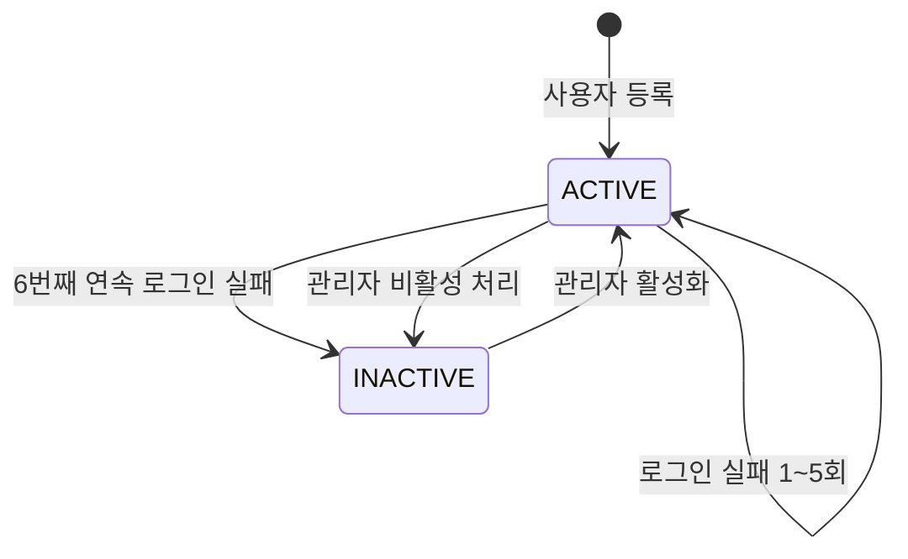
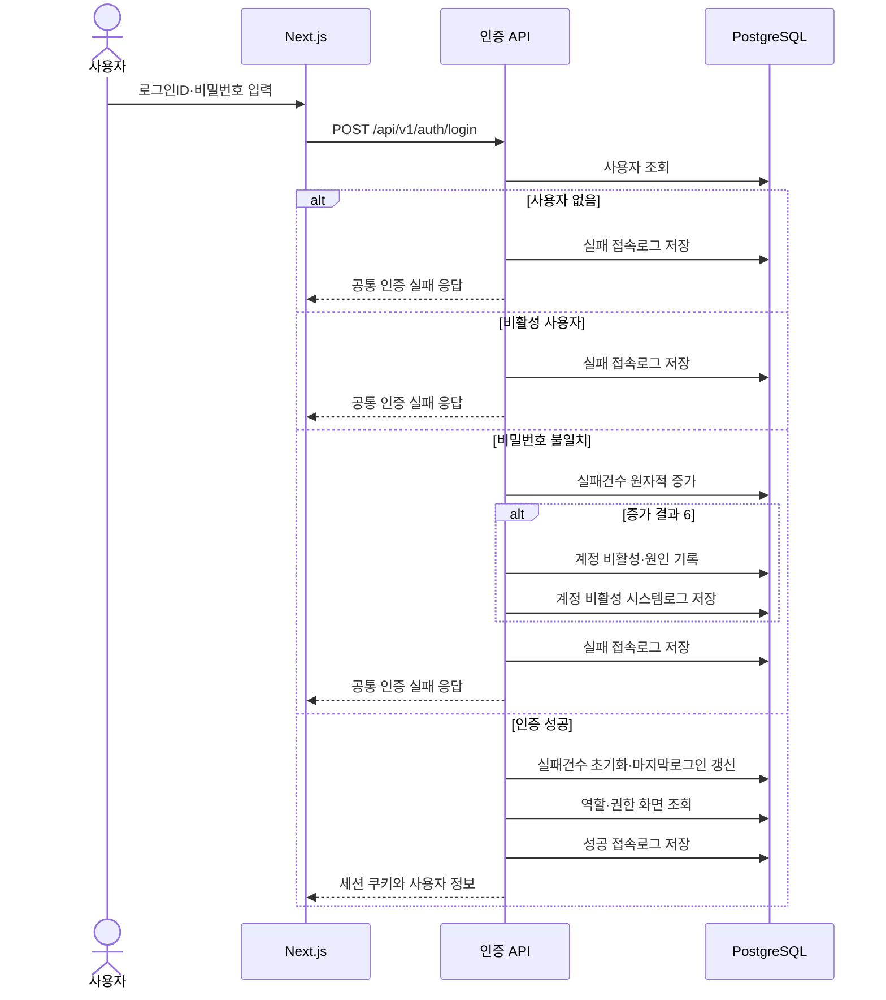
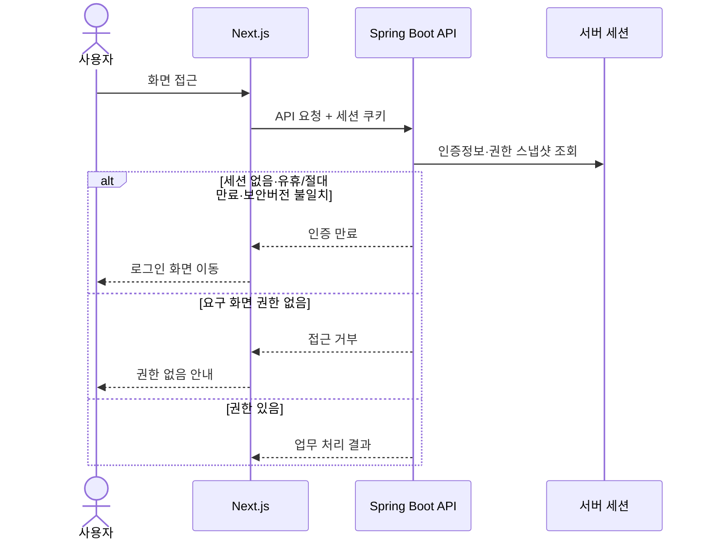

# 인증·권한 상세설계서

## 1. 문서 개요

### 1.1 목적

본 문서는 BMS의 ID·비밀번호 로그인, 서버 세션, 사용자 계정 비활성화, 역할별 화면 접근권한 및 관련 로그 처리 기준을 정의한다.

본 설계는 다음 기능의 화면·API·데이터 상세설계 기준으로 사용한다.

- COM-001 로그인
- SYS-001 사용자관리
- SYS-002 역할관리
- SYS-003 메뉴관리
- BFD-02-05 인증관리
- BFD-01-01 사용자관리
- BFD-01-02 역할관리
- BFD-01-03 메뉴관리
- BFD-01-07 로그관리

### 1.2 문서 상태

| 항목 | 내용 |
| --- | --- |
| 상태 | 확정 |
| 작성일 | 2026-07-16 |
| 상위 기준 | 애플리케이션 아키텍처 |
| 인증 방식 | ID·비밀번호, Spring Security 서버 세션 |

### 1.3 적용 원칙

- 본문에서 `확정`으로 표시한 정책은 사용자 제시 기준을 그대로 적용한다.
- 기존 분석 또는 데이터 모델과 다른 내용은 본 설계의 데이터 영향사항에서 식별한다.
- 비밀번호, 세션ID 및 인증 쿠키값은 화면, API 응답과 로그에 노출하지 않는다.

---

## 2. 확정 정책

| ID | 정책 | 설계 적용 내용 |
| --- | --- | --- |
| AUTH-POL-001 | 로그인 방식 | 로그인ID와 비밀번호를 입력하는 방식으로 인증한다. |
| AUTH-POL-002 | 자동 로그아웃 | 로그인 후 15분 동안 사용자 작업이 없으면 자동 로그아웃한다. |
| AUTH-POL-003 | 로그인 실패 | 5회까지 연속 실패를 허용하고 5회를 초과하는 6번째 실패에서 계정을 비활성화한다. |
| AUTH-POL-004 | 비활성 해제 | 비활성 계정은 관리자만 활성 상태로 복구한다. |
| AUTH-POL-005 | 메뉴 권한 | 사용자의 화면 접근권한은 사용자에게 부여된 역할들의 권한 화면을 합한 결과로 정의한다. |
| AUTH-POL-006 | 권한 변경 반영 | 권한 변경 시 대상 사용자의 보안버전을 증가시키고 기존 세션을 다음 보호 API 요청에서 종료한다. |
| AUTH-POL-007 | 로그 생성 | 사용자 등록·수정·비활성·활성화, 역할 추가·변경·삭제, 로그인·로그아웃 및 자동 로그아웃을 기록한다. |
| AUTH-POL-008 | 로그인ID | 앞뒤 공백을 제거하고 영문자를 소문자로 변환한 정규화 값만 저장·조회하며, 정규화된 로그인ID로 유일성을 검사한다. |
| AUTH-POL-009 | 비밀번호 길이 | 12자 이상 64자 이하를 허용하며 영문 대문자·소문자·숫자·특수문자 중 3종 이상을 사용한다. |
| AUTH-POL-010 | 비밀번호 금지 | 로그인ID·성명 포함, 공백만 사용, 유출·사전·연속·반복 비밀번호 및 최근 5개 재사용을 금지한다. |
| AUTH-POL-011 | 비밀번호 변경 | 정기 강제 변경은 하지 않고 초기화·유출 의심·관리자 조치 시 즉시 변경을 요구한다. |
| AUTH-POL-012 | 초기 비밀번호 | 관리자도 재조회할 수 없는 최초 등록 전용 임시 비밀번호를 발급하고 24시간 안에 변경하게 한다. 등록 완료 전에는 유효기간 안에서 제한 세션 재로그인을 허용하며 완료 또는 재발급 즉시 폐기한다. |
| AUTH-POL-013 | 비밀번호 저장 | Argon2id를 메모리 19 MiB·반복 2회·병렬도 1 이상의 파라미터로 사용하며 평문·복호화 키를 저장하지 않는다. |
| AUTH-POL-014 | 관리자 보호 | 자기 계정 비활성화와 마지막 활성 시스템관리자의 역할 회수·비활성화를 차단한다. |
| AUTH-POL-015 | 일반 세션 절대 만료 | 사용자 활동과 관계없이 로그인 성공 후 8시간에 일반 세션을 만료한다. |
| AUTH-POL-016 | 중요 작업 재인증 | 시스템관리자 권한 변경, 비밀번호 초기화 등 중요 작업은 로그인 또는 최근 비밀번호 재인증 후 10분 안에서만 허용한다. |
| AUTH-POL-017 | 시스템관리자 MFA | v1.0에서는 제외하고 외부 IdP·WebAuthn·TOTP 중 방식을 승인한 뒤 후속 우선 보안과제로 구현한다. |

`AUTH-POL-003`은 “5회 초과”를 문자 그대로 해석한 기준이다. 따라서 로그인 실패건수 1~5에서는 계정을 유지하고 6번째 연속 실패 처리와 함께 비활성화한다.

---

## 3. 사용자 계정 상태

### 3.1 상태 정의

| 상태코드 | 상태명 | 로그인 | 설명 |
| --- | --- | :---: | --- |
| ACTIVE | 활성 | 가능 | 정상적으로 사용할 수 있는 계정 |
| INACTIVE | 비활성 | 불가 | 관리자 처리 또는 로그인 실패 초과로 사용이 중지된 계정 |

비활성 원인은 상태와 별도로 관리한다.

| 비활성원인코드 | 설명 |
| --- | --- |
| MANUAL | 관리자가 사용자관리 화면에서 비활성 처리 |
| LOGIN_FAILURE | 로그인 연속 실패 허용 횟수 초과 |

별도의 `LOCKED` 상태는 사용하지 않는다. 로그인 실패 허용 횟수를 초과한 계정은 `INACTIVE` 상태로 전환한다.

### 3.2 상태 전이



### 3.3 상태 변경 규칙

- 사용자 신규 등록 시 상태는 `ACTIVE`, 로그인실패건수는 `0`으로 시작한다.
- 로그인 성공 시 로그인실패건수를 `0`으로 초기화한다.
- 로그인 실패 시 등록된 로그인ID의 활성 계정에 대해 실패건수를 원자적으로 1 증가시킨다.
- 증가 결과가 `6`이면 동일 트랜잭션에서 계정을 `INACTIVE`로 변경하고 비활성 원인을 `LOGIN_FAILURE`로 기록하며 `SEC_VER`를 1 증가시킨다.
- 계정이 `ACTIVE`이면 비활성원인코드와 비활성일시는 모두 `NULL`이고, `INACTIVE`이면 두 값은 모두 필수로 기록한다.
- 존재하지 않는 로그인ID에 대해서는 계정 상태를 변경하지 않지만 로그인 실패 접속로그는 생성한다.
- 관리자가 계정을 활성화하면 로그인실패건수를 `0`으로 초기화하고 비활성 원인과 비활성 일시를 해제하며 `SEC_VER`를 1 증가시킨다.
- 관리자 비활성 처리와 활성화는 모두 시스템로그에 기록한다.
- 계정 비활성은 단순 권한 변경과 구분한다. 사용자별 세션 목록을 관리하여 즉시 종료하지 않고, 모든 보호 API 요청에서 계정의 활성·삭제 상태를 다시 확인한다.
- 관리자 처리 또는 로그인 실패로 계정이 비활성화된 뒤 기존 세션으로 요청하면 다음 보호 API 요청에서 차단한다. 추가 요청이 없으면 마지막 사용자 활동부터 최대 15분 안에 세션이 만료된다.

---

## 4. 로그인·로그아웃 설계

### 4.1 로그인 입력

| 항목 | 필수 | 처리 기준 |
| --- | :---: | --- |
| 로그인ID | Y | 앞뒤 공백을 제거하고 영문자를 소문자로 변환한다. 등록·부트스트랩·로그인·검색은 같은 정규화 함수를 사용하며 DB에는 소문자 정규화 값만 저장한다. |
| 비밀번호 | Y | 12~64자와 비밀번호 정책을 검증하며 원문을 저장하거나 로그에 기록하지 않는다. |

로그인 실패 응답은 로그인ID 존재 여부, 비밀번호 오류, 비활성 상태를 외부에 상세히 구분하지 않는 공통 메시지를 기본으로 한다.

비밀번호는 공백 제거·대소문자 변환·유니코드 정규화 없이 입력 그대로 Argon2id 해시와 비교한다. 존재하지 않는 로그인ID도 고정된 더미 Argon2id 해시를 검증하여 응답시간 차이를 줄인다. 세부 파라미터와 금지사항은 `09.security-implementation-contract.md`를 따른다.

### 4.2 로그인 성공 처리

로그인 성공 처리는 하나의 인증 유스케이스로 수행한다.

1. 로그인ID의 앞뒤 공백을 제거하고 영문자를 소문자로 변환한 뒤, 정규화 로그인ID로 삭제되지 않은 사용자를 조회한다.
2. 계정 상태가 `ACTIVE`인지 확인한다.
3. 입력 비밀번호와 저장된 비밀번호 해시를 비교한다.
4. 로그인실패건수를 `0`으로 초기화하고 마지막로그인일시를 갱신한다.
5. 사용자의 삭제되지 않은 역할과 역할별 권한 화면을 조회한다.
6. 사용자 식별자, 역할 목록과 권한 화면 목록을 인증 권한 스냅샷으로 생성한다.
7. 기존 인증 세션 식별자를 교체하고 새 서버 세션을 발급한다.
8. 로그인 성공 접속로그를 생성하고 접속로그ID를 세션에 보관한다.
9. 세션 쿠키를 브라우저에 전달한다.

### 4.3 로그인 실패 처리



### 4.4 로그아웃

- 사용자가 로그아웃을 실행하면 현재 세션의 접속로그ID로 접속로그의 로그아웃일시와 로그아웃유형 `MANUAL`을 기록한다.
- 접속로그 갱신 후 서버 세션을 무효화하고 세션 쿠키를 만료시킨다.
- 이미 만료된 세션으로 로그아웃을 요청한 경우에도 클라이언트 쿠키는 제거하고 성공 응답을 반환할 수 있다.
- 로그아웃 처리는 여러 번 호출되어도 결과가 동일한 멱등 처리를 기본으로 한다.

### 4.5 자동 로그아웃

- 서버 세션에 별도 `lastUserActivityAt`을 저장하고 이를 기준으로 일반 세션의 15분 유휴시간을 판정한다.
- 일반 세션에는 로그인 성공시각부터 8시간의 `absoluteExpiresAt`을 저장하며 사용자 활동으로 연장하지 않는다.
- 로그인 성공 시 `lastUserActivityAt`을 로그인 성공시각으로 초기화하고, 유효한 `POST /api/v1/auth/activity`만 이 값을 갱신한다.
- 업무 API, 현재 사용자 조회, CSRF 조회, 자동 갱신과 폴링 등 다른 요청은 `HttpSession` 컨테이너의 접근시각이 바뀌더라도 `lastUserActivityAt`을 갱신하지 않는다.
- 여러 브라우저 탭은 동일 세션을 사용하므로 어느 한 탭의 사용자 작업도 세션 활동으로 본다.
- 프론트엔드는 키보드 입력, 마우스 클릭, 스크롤과 화면 이동을 사용자 활동으로 감지한다.
- 화면 내 활동이 있었지만 업무 API 요청이 없었던 경우에는 최대 1분 단위로 활동 신호 API를 호출하여 서버의 마지막 활동시각을 갱신한다.
- 자동 갱신, 상태 확인용 폴링 등 사용자 작업이 아닌 백그라운드 요청은 활동 신호를 보내지 않으며 초기 구현에서는 세션을 연장하는 주기적 폴링을 사용하지 않는다.
- 프론트엔드는 마지막 사용자 활동부터 15분이 지나면 로그아웃 화면으로 이동한다.
- 서버에서 세션이 만료되면 접속로그에 로그아웃일시와 로그아웃유형 `TIMEOUT`을 기록한다.
- 만료된 세션의 API 요청에는 인증 만료 오류를 반환하고 프론트엔드는 로그인 화면으로 이동한다.

### 4.6 세션 쿠키

| 항목 | 기준 |
| --- | --- |
| 저장 위치 | 브라우저 쿠키 |
| 쿠키명 | `BMSSESSION` |
| JavaScript 접근 | 차단(`HttpOnly`) |
| HTTPS 전송 | 운영환경 필수(`Secure`) |
| SameSite | `Lax` 기본안 |
| Path·Domain | `Path=/`, Domain 미지정 |
| 브라우저 보존 | `Max-Age`·`Expires` 없는 세션 쿠키 |
| 서버 유효시간 | 유휴 15분·절대 8시간 |
| 세션 고정 공격 방지 | 로그인 성공 시 세션 식별자 교체 |
| 상태 변경 요청 | CSRF 토큰 검증 |

### 4.7 로그인 요청 속도 제한

- 정규화 로그인ID와 접속 IP 조합은 1분에 5회, 접속 IP 전체는 1분에 30회까지 허용한다.
- 제한을 초과하면 60초 동안 `429 AUTH_TOO_MANY_ATTEMPTS`와 `Retry-After: 60`을 반환한다.
- 속도 제한으로 거절한 요청은 비밀번호를 검증하지 않고 계정의 로그인실패건수를 증가시키지 않는다.
- 로그인 성공 시 해당 로그인ID·IP 조합의 제한 카운터를 초기화한다.
- 접속 IP 전체 제한은 여러 사용자가 같은 사내 IP를 공유할 수 있음을 고려하여 계정 조합 제한보다 넉넉하게 둔다.
- v1.0은 단일 인스턴스 메모리 구현을 사용하되 `LoginAttemptLimiter` 인터페이스 뒤에 두어 저장 방식이 인증 유스케이스로 전파되지 않게 한다.

### 4.8 세션 저장과 최초 등록 경로

- v1.0은 단일 백엔드 인스턴스와 서블릿 컨테이너 기본 `HttpSession`을 사용한다.
- 서버 재시작·재배포 시 기존 세션 소멸과 사용자 재로그인을 허용한다.
- 세션에는 사용자ID, 로그인ID, 표시명, 역할ID·역할명 목록, 메뉴ID·상위메뉴ID·메뉴명·메뉴URL·표시순서 목록, 접속로그ID, 비밀번호변경필요여부, `securityVersion`, `lastUserActivityAt`, `absoluteExpiresAt`과 `reauthenticatedAt`을 불변 DTO로 저장한다. JPA 엔터티와 인증비밀은 저장하지 않는다.
- 세션 접근은 `AuthSessionService` 경계에 모아 저장 구현과 인증 유스케이스를 분리한다.
- 모든 보호 API는 세션 스냅샷과 별도로 현재 사용자의 활성·삭제 상태와 `SEC_VER`를 조회한다. 비활성·삭제 상태 또는 세션 `securityVersion` 불일치이면 요청을 차단하고 현재 세션을 만료 처리한다.
- 초기 비밀번호 사용자는 제한 세션으로 `/account/initial-registration`에 이동한다.
- 제한 세션은 10분 유휴시간과 로그인 성공부터 30분의 절대 유효시간을 함께 적용한다. 초기 비밀번호 만료일시가 더 빠르면 그 시각에 만료한다.
- 제한 세션에는 `lastUserActivityAt`, `absoluteExpiresAt`과 로그인 당시 `PWD_CHG_DTM`을 자격 증명 기준시각으로 저장한다.
- 제한 세션에서는 `GET /auth/csrf`, `GET /auth/me`, `POST /auth/activity`, `POST /users/me/initial-registration`, `POST /auth/logout`만 허용한다.
- 제한 세션의 활동 API는 실제 사용자 활동이 있을 때만 `lastUserActivityAt`을 갱신하고 30분 절대 유효시간은 연장하지 않는다.
- 허용목록 밖의 API 요청은 `403 AUTH_PASSWORD_CHANGE_REQUIRED`로 차단한다.
- 제한 세션의 모든 허용 요청은 계정의 활성·삭제 상태, `PWD_INIT_REQ_YN='Y'`, 임시 비밀번호 만료 전 여부와 현재 `PWD_CHG_DTM`이 로그인 시점 기준시각과 같은지 확인한다. 하나라도 맞지 않으면 세션을 만료한다.
- 최초 등록 완료는 새 비밀번호 정책, 현재 임시 비밀번호와의 불일치 및 선택 개인정보를 검증한 뒤 새 비밀번호 해시를 저장하고 `PWD_INIT_REQ_YN='N'`, `TEMP_PWD_EXPIRE_DTM=NULL`, `SEC_VER=SEC_VER+1`로 변경하는 하나의 트랜잭션으로 처리한다.
- 최초 등록 완료 후 세션 식별자를 다시 교체하고 역할·메뉴 표시정보와 변경된 보안버전을 재조회하여 제한 세션을 일반 세션으로 승격한다. `lastUserActivityAt`과 `reauthenticatedAt`은 완료시각, `absoluteExpiresAt`은 완료시각+8시간으로 초기화한다.
- 임시 비밀번호 재발급은 `PWD_CHG_DTM`과 `TEMP_PWD_EXPIRE_DTM`을 갱신한다. 기존 제한 세션은 다음 요청에서 자격 증명 기준시각 불일치로 만료된다.
- 초기 비밀번호는 등록 완료 전 24시간 안에서 제한 세션에 다시 로그인할 수 있다. 브라우저 종료나 네트워크 장애만으로 관리자 재발급을 요구하지 않는다.
- 정상 만료는 세션 만료 리스너가 접속로그를 `TIMEOUT` 처리하고, 단일 인스턴스 기동 시 이전 실행의 미종료 성공 접속로그를 기동시각 기준 `TIMEOUT`으로 보정한다.
- 다중 인스턴스, 무중단 배포 또는 재시작 후 세션 유지가 필요해질 때 공유 세션 저장소 도입을 별도 ADR로 검토한다.

---

## 5. 역할과 화면 권한

### 5.1 권한 구성

```text
사용자 N : M 역할
역할 N : M 메뉴(화면)
사용자 권한 화면 = 부여된 미삭제 역할별 권한 화면의 합집합
```

- 역할에는 접근 가능한 화면을 지정한다.
- 하나의 화면에 하나 이상의 메뉴 경로가 있으면 권한 판정 기준 메뉴를 화면설계서에서 지정한다.
- 여러 역할 중 하나라도 화면 권한이 있으면 해당 화면에 접근할 수 있다.
- 삭제 처리된 역할과 메뉴는 신규 로그인 권한 스냅샷에서 제외한다.
- 화면 권한이 없는 메뉴는 내비게이션에 표시하지 않는다.
- URL 직접 접근과 API 직접 호출도 서버에서 동일한 화면 권한을 검사한다.

### 5.2 API 권한 매핑

각 보호 API는 자신을 사용하는 화면 ID 또는 메뉴 ID를 하나 이상 지정한다.

| API 유형 | 권한 기준 |
| --- | --- |
| 화면 전용 API | 해당 화면의 메뉴 권한 필요 |
| 여러 화면의 공통 조회 API | 호출 가능한 화면 중 하나 이상의 권한 필요 |
| 첨부파일·메모 API | 호출 화면 권한과 대상 업무 데이터 접근권한 필요 |
| 로그인·로그아웃 API | 메뉴 권한 없이 호출 가능 |
| 현재 사용자·메뉴 조회 API | 로그인 세션 필요 |

현재 정책에서 역할 권한 단위는 화면 접근이다. 화면 안의 조회·등록·수정·삭제 행위를 역할별로 추가 분리하지 않는다.

역할메뉴권한은 역할ID와 메뉴ID 관계의 존재 자체로 접근권한을 표현한다. 관계 행이 있으면 접근 가능하고 행이 없으면 접근할 수 없다. 별도의 접근권한여부 및 조회·등록·수정·삭제 권한여부 컬럼은 사용하지 않는다. 화면에서 호출하는 보호 API는 HTTP Method와 관계없이 해당 화면의 메뉴 권한을 동일하게 검사한다.

### 5.3 권한 스냅샷

로그인 성공 시점에 다음 정보를 세션의 권한 스냅샷으로 저장한다.

- 사용자ID
- 로그인ID와 사용자 표시명
- 역할ID와 역할명 목록
- 접근 가능한 메뉴의 메뉴ID, 상위메뉴ID, 메뉴명, 메뉴URL과 표시순서
- 로그인 접속로그ID
- 비밀번호변경필요여부, `securityVersion`, `lastUserActivityAt`, `absoluteExpiresAt`과 `reauthenticatedAt`

권한 스냅샷은 세션이 유지되는 동안 데이터베이스에서 자동 갱신하지 않는다.
계정의 활성·삭제 상태와 보안버전 확인은 권한 스냅샷 갱신이 아니라 세션 사용 가능 여부 판정이므로 모든 보호 API 요청에서 별도로 수행한다.



### 5.4 권한 변경 반영

- 사용자 역할 추가·회수는 대상 사용자의 `SEC_VER`를 같은 트랜잭션에서 1 증가시킨다.
- 역할의 권한 화면 변경과 역할 삭제는 해당 역할을 가진 모든 사용자의 `SEC_VER`를 같은 트랜잭션에서 1 증가시킨다.
- 기존 세션의 `securityVersion`과 현재 `SEC_VER`가 달라지면 다음 보호 API 요청에서 세션을 만료하고 재로그인을 요구한다.
- 계정 비활성·삭제는 권한 변경과 달리 다음 보호 API 요청에서 즉시 차단하며, 요청이 없으면 마지막 사용자 활동부터 최대 15분 안에 세션이 만료된다.
- 다음 로그인에서는 변경된 활성 역할과 화면 권한으로 새 스냅샷을 생성한다.
- 관리자 화면에는 “권한 변경 후 대상 사용자는 다음 요청에서 로그아웃된다”는 안내를 표시한다.
- 권한 변경 트랜잭션이 보안버전 증가에 실패하면 권한 변경도 롤백한다.

---

## 6. 사용자·역할 관리 처리

### 6.1 사용자 처리

| 처리 | 주요 규칙 | 시스템로그 이벤트 |
| --- | --- | --- |
| 등록 | 내부 직원만 연결, 로그인ID 중복 금지, 초기 상태 ACTIVE | USER_CREATED |
| 수정 | 사용자 기본정보 변경, 비밀번호 원문 기록 금지 | USER_UPDATED |
| 비활성 | 상태 INACTIVE, 원인 MANUAL, 보안버전 증가 | USER_DEACTIVATED |
| 로그인 실패 비활성 | 6번째 실패에서 상태 INACTIVE, 원인 LOGIN_FAILURE, 보안버전 증가 | USER_DEACTIVATED_LOGIN_FAILURE |
| 활성화 | 관리자만 처리, 실패건수 0 초기화, 보안버전 증가 | USER_REACTIVATED |

### 6.2 역할 처리

| 처리 | 주요 규칙 | 시스템로그 이벤트 |
| --- | --- | --- |
| 추가 | 역할명 중복 금지, 권한 화면 지정 | ROLE_CREATED |
| 변경 | 역할명·설명·권한 화면 변경 | ROLE_UPDATED |
| 삭제처리 | 물리삭제하지 않고 삭제여부를 Y로 변경 | ROLE_DELETED |

- 역할 삭제처리 전 해당 역할을 보유한 사용자 수를 확인하고 관리자에게 안내한다.
- 역할 삭제처리를 하더라도 사용자역할과 역할메뉴권한 이력은 즉시 물리삭제하지 않는다.
- 삭제된 역할은 신규 부여 대상과 다음 로그인 권한 스냅샷에서 제외한다.
- 역할 변경 및 삭제는 해당 역할 사용자의 보안버전을 증가시켜 기존 세션을 다음 요청에서 종료한다.

### 6.3 중요 작업 재인증

- 로그인 성공 시 `reauthenticatedAt`을 로그인 성공시각으로 초기화한다.
- `POST /api/v1/auth/reauthenticate`는 현재 비밀번호와 CSRF 토큰을 검증하고 성공 시 `reauthenticatedAt`을 갱신한다.
- 시스템관리자 역할 부여·회수, 역할 메뉴권한 변경·삭제, 다른 사용자 비밀번호 초기화, 관리자의 사용자 활성·비활성, 보안 설정과 감사로그 내보내기는 `reauthenticatedAt`부터 10분 안에서만 허용한다.
- 재인증 실패는 로그인실패건수에 포함하지 않고 세션별 분당 5회로 제한하며 보안로그를 생성한다.
- 재인증이 없거나 10분이 지나면 `403 AUTH_REAUTHENTICATION_REQUIRED`를 반환하고 업무 트랜잭션을 시작하지 않는다.

### 6.4 최초 관리자와 사용자 등록

#### 최초 시스템관리자 부트스트랩

- 빈 시스템에서는 일반 사용자 API와 분리된 1회성 부트스트랩 절차로 기본 조직, 관리자 직원정보, 시스템관리자 계정과 역할 관계를 하나의 트랜잭션에서 생성한다.
- 부트스트랩은 사용자 계정이 한 건도 없을 때만 실행할 수 있으며 성공 후 다시 실행할 수 없다.
- 초기 관리자 로그인ID, 사원번호, 성명과 기본 조직명은 배포 작업자가 직접 입력한다.
- 초기 비밀번호는 배포환경의 일회성 비밀값으로 전달하며 마이그레이션, 소스코드, 설정 파일과 로그에 기록하지 않는다. 생성 후 비밀값을 제거한다.
- 초기 관리자도 `PWD_INIT_REQ_YN=Y`, `TEMP_PWD_EXPIRE_DTM=발급시각+24시간`으로 생성하고 24시간 안에 비밀번호를 변경해야 일반 업무 화면을 사용할 수 있다.
- 역할·메뉴 기준 데이터는 Flyway로 생성할 수 있지만 사람 사용자와 비밀번호 해시는 Flyway 기준 데이터에 포함하지 않는다.

#### 관리자 사용자 등록

1. 관리자가 `/system/users`에서 사원번호, 성명, 조직과 계정 초기값을 직접 입력한다.
2. 인력관리 모듈의 공개 등록 인터페이스가 업무대상, 인력 공통정보와 직원정보를 생성한다.
3. 시스템관리 모듈이 생성된 직원ID에 사용자 계정을 연결하고 초기 역할을 부여한다.
4. 직원·사용자·역할 관계와 시스템로그는 하나의 트랜잭션에서 처리하며 어느 한 단계라도 실패하면 모두 롤백한다.
5. 최초 등록 전용 임시 비밀번호 원문을 한 번만 전달하고 계정은 `PWD_INIT_REQ_YN=Y`, `TEMP_PWD_EXPIRE_DTM=발급시각+24시간`으로 생성한다.

관리자가 입력하는 최소 직원정보는 사원번호, 성명과 조직이다. 로그인ID와 초기 역할은 계정 필수값이며 이메일주소와 휴대전화번호는 선택값으로 시작한다. 사원번호 자동 생성은 사용하지 않는다.

#### 사용자 최초 로그인 완성

- 공개 회원가입 API는 제공하지 않는다. 관리자에 의해 생성된 계정만 최초 등록 완성 절차에 진입할 수 있다.
- 초기 비밀번호로 인증한 사용자는 제한 세션을 발급받고 비밀번호 변경과 필수 동의 항목만 처리할 수 있다.
- 사용자는 새 비밀번호를 설정하고 이메일주소·휴대전화번호 등 선택 개인정보를 확인하거나 입력한다.
- 완료 시 `PWD_INIT_REQ_YN=N`으로 변경하고 일반 세션을 새로 발급한다.
- 24시간이 지난 임시 비밀번호는 사용할 수 없으며 관리자가 다시 초기화해야 한다.

직원 엑셀 일괄등록은 v1.0 범위에서 제외한다. 사용자 수가 증가하여 반복 입력 비용이 확인되면 별도 백로그로 추가하고 중복 사원번호, 행별 오류와 부분실패 정책을 먼저 설계한다.

---

## 7. 로그 설계

### 7.1 로그 구분

| 로그 | 기록 대상 |
| --- | --- |
| 접속로그 | 로그인 성공·실패, 수동 로그아웃, 유휴·절대 세션 만료 |
| 시스템로그 | 사용자와 역할의 등록·변경·비활성·활성화·삭제처리, 재인증과 권한 변경 |

### 7.2 접속로그

| 항목 | 설명 |
| --- | --- |
| 접속로그ID | 접속 시도 식별자 |
| 사용자ID | 등록된 사용자이면 기록, 존재하지 않는 로그인ID이면 NULL 가능 |
| 로그인ID 마스킹값 | 미등록 사용자 실패 추적이 필요할 때 원문 대신 마스킹 또는 해시값 기록 |
| 접속일시 | 로그인 시도 일시 |
| 로그인성공여부 | 성공 Y, 실패 N |
| 실패사유코드 | 사용자없음, 비밀번호불일치, 계정비활성 등 내부 조회용 코드 |
| 로그아웃일시 | 수동 또는 자동 로그아웃 일시 |
| 로그아웃유형코드 | MANUAL 또는 TIMEOUT |
| 접속IP주소 | 신뢰 가능한 프록시 기준 원본 IP |
| 사용자에이전트 | 브라우저·클라이언트 식별정보 |
| 요청추적ID | 서버 로그와 연결하는 추적 식별자 |

실패사유는 관리자 로그 조회에서만 사용하며 로그인 응답에는 상세 사유를 노출하지 않는다.

- 실패사유코드는 로그인 성공 시 `NULL`이며 실패 시 `USER_NOT_FOUND`, `BAD_CREDENTIALS`, `ACCOUNT_INACTIVE`, `TEMP_PWD_EXPIRED` 중 하나를 기록한다.
- 로그아웃일시와 로그아웃유형코드는 성공한 로그인 세션이 종료될 때 함께 기록하며, 로그인 실패 또는 접속 중인 세션은 모두 `NULL`이다.
- 요청추적ID는 접속로그를 생성한 로그인 요청의 식별자를 기록한다. 수동 로그아웃 요청까지 별도로 추적해야 하는 경우에는 로그아웃요청추적ID를 별도 속성으로 확장하며, HTTP 요청 없이 발생하는 `TIMEOUT`에는 로그아웃 요청 식별자가 없다.
- 미등록 로그인ID 추적값은 원문이나 단순 마스킹값 대신 서버 비밀키를 사용하는 단방향 해시값으로 저장한다.

### 7.3 시스템로그

| 항목 | 설명 |
| --- | --- |
| 로그ID | 시스템로그 식별자 |
| 이벤트유형코드 | USER_CREATED 등 업무 사건 코드 |
| 처리사용자ID | 작업을 수행한 관리자 |
| 대상유형코드 | USER 또는 ROLE |
| 대상ID | 변경된 사용자ID 또는 역할ID |
| 발생일시 | 업무 처리 일시 |
| 처리결과코드 | SUCCESS 또는 FAILURE |
| 변경요약 | 개인정보와 비밀번호를 제외한 변경 항목 요약 |
| 요청추적ID | API 요청과 로그 연결 식별자 |
| 접속IP주소 | 관리자 요청 IP |

### 7.4 로그 보안

- 비밀번호 원문·해시값, 세션ID, 쿠키값과 CSRF 토큰을 기록하지 않는다.
- 개인정보는 업무상 필요한 최소 범위만 기록하며 이메일과 전화번호의 변경 전후 값을 남기지 않는다.
- 로그 생성 실패가 사용자·역할 변경 이력을 누락시키지 않도록 업무 변경과 시스템로그는 같은 트랜잭션에서 저장한다.
- 로그인 성공·실패 로그는 인증 결과와 함께 반드시 저장한다.
- 성공 시스템로그는 업무 변경과 같은 트랜잭션에서 저장한다. 실패 시스템로그가 반드시 필요한 경우 업무 트랜잭션 롤백에 함께 사라지지 않도록 별도 트랜잭션이나 애플리케이션 진단로그로 기록한다.

---

## 8. API 후보

| API | Method | 기능 | 인증·권한 |
| --- | --- | --- | --- |
| `/api/v1/auth/login` | POST | 로그인 및 세션 생성 | 비인증·CSRF |
| `/api/v1/auth/logout` | POST | 수동 로그아웃 및 세션 무효화 | 로그인 세션 |
| `/api/v1/auth/me` | GET | 현재 사용자와 권한 화면 조회 | 로그인 세션 |
| `/api/v1/auth/activity` | POST | 사용자 활동시각 갱신 | 로그인 세션 |
| `/api/v1/auth/reauthenticate` | POST | 중요 작업용 현재 비밀번호 재인증 | 로그인 세션·CSRF |
| `/api/v1/users` | POST | 사용자 등록 | SYS-001 |
| `/api/v1/users/me/initial-registration` | POST | 최초 비밀번호 변경과 사용자정보 완성 | 초기 비밀번호 인증 제한 세션 |
| `/api/v1/users/{userId}` | PATCH | 사용자 수정 | SYS-001 |
| `/api/v1/users/{userId}/deactivate` | POST | 사용자 비활성 | SYS-001 |
| `/api/v1/users/{userId}/reactivate` | POST | 사용자 활성화 및 실패건수 초기화 | SYS-001 |
| `/api/v1/roles` | POST | 역할 추가 | SYS-002 |
| `/api/v1/roles/{roleId}` | PATCH | 역할과 권한 화면 변경 | SYS-002 |
| `/api/v1/roles/{roleId}` | DELETE | 역할 논리 삭제처리 | SYS-002 |

상세 요청·응답 DTO, 오류코드와 목록 조회 API는 API 명세 작성 시 확정한다.

---

## 9. 데이터 모델 영향사항

### 9.1 사용자

사용자 상태는 `계정상태코드`를 단일 기준으로 관리한다. `사용여부`는 제거하고, 별도 `LOCKED` 상태를 사용하지 않으므로 `잠금일시`를 `비활성일시`로 변경한다.

| 항목 | 적용 | 설계 기준 |
| --- | :---: | --- |
| 계정상태코드 | 유지 | `ACTIVE`, `INACTIVE` 상태의 단일 기준 |
| 로그인실패건수 | 유지 | 연속 실패건수, 성공 또는 관리자 활성화 시 0 |
| 비활성원인코드 | 추가 | `MANUAL`, `LOGIN_FAILURE` |
| 비활성일시 | 명칭 변경 | 기존 잠금일시를 변경하며 비활성 전환 시각 기록 |
| 보안버전 | 추가 | 역할·권한·비밀번호 변경 시 증가하고 세션 버전과 비교 |
| 사용여부 | 제거 | 계정상태코드와 의미 중복 |
| 조직ID | 물리모델에서 제거 | 직원의 조직ID를 조회하며 사용자에 중복 저장하지 않음 |

사용자가 `ACTIVE`이면 비활성원인코드와 비활성일시는 모두 `NULL`이어야 하고, `INACTIVE`이면 두 값은 모두 필수다. 관리자 활성화 시 두 값을 `NULL`로 초기화한다. `SEC_VER`는 1 이상이며 계정 활성·비활성·삭제, 사용자 역할, 해당 역할의 메뉴권한, 비밀번호 또는 세션 폐기가 필요한 보안속성을 변경할 때 원자적으로 증가시킨다. 사용자의 조직정보는 `사용자 → 직원 → 조직` 관계로 조회하고 로그인 세션에는 조회 시점의 조직정보를 화면 표시용 스냅샷으로 저장한다.

### 9.2 역할과 역할메뉴권한

역할은 추가·변경·논리 삭제만 사용한다. `사용여부`를 제거하고 `삭제여부`를 역할 상태의 단일 기준으로 사용한다.

역할메뉴권한은 역할별 화면 접근권한만 표현한다. 역할ID와 메뉴ID의 관계 행이 있으면 해당 화면에 접근할 수 있고, 관계 행이 없으면 접근할 수 없다. 조회·등록·수정·삭제 권한여부 4개 컬럼과 접근권한여부 컬럼은 두지 않는다.

화면 내 행위별 권한이 향후 필요해지면 CRUD 여부 컬럼을 복원하지 않고 `권한코드`와 `역할권한` 관계로 별도 모델링한다.

### 9.3 접속로그

접속로그에 다음 속성을 추가한다.

- 실패사유코드
- 로그아웃유형코드
- 사용자에이전트
- 요청추적ID
- 미등록 로그인ID 추적용 해시값

요청추적ID는 로그인 시도 요청을 기준으로 기록한다. 성공여부와 실패사유, 로그아웃일시와 로그아웃유형은 각각 함께 유효하도록 데이터 제약조건을 적용한다.

### 9.4 시스템로그

기존 로그유형, 발생일시와 로그내용 외에 다음 구조화 속성을 추가한다. 기존 사용자ID는 행위자와 대상자의 혼동을 방지하기 위해 처리사용자ID로 명칭을 변경한다.

- 이벤트유형코드
- 대상유형코드와 대상ID
- 처리결과코드
- 요청추적ID
- 접속IP주소

로그유형코드는 업무·보안·오류 등 상위 분류에 사용하고, 이벤트유형코드는 `USER_CREATED`, `USER_UPDATED`, `USER_DEACTIVATED`, `USER_REACTIVATED`, `ROLE_CREATED`, `ROLE_UPDATED`, `ROLE_DELETED` 등 구체적인 사건을 기록한다. 대상ID는 사용자ID 또는 역할ID 등 대상의 식별자이므로 대상유형코드와 함께 사용한다. 처리결과코드는 `SUCCESS` 또는 `FAILURE`를 사용한다.

---

## 10. 예외처리

| 상황 | 처리 기준 |
| --- | --- |
| 로그인 정보 불일치 | 공통 인증 실패 메시지 반환, 실패 접속로그 생성 |
| 6번째 연속 실패 | 계정 비활성 처리 후 공통 인증 실패 메시지 반환 |
| 비활성 계정 로그인 | 로그인 차단, 실패 접속로그 생성 |
| 15분 무활동 | 세션 무효화, TIMEOUT 로그 기록, 로그인 화면 이동 |
| 권한 없는 화면·API | HTTP 접근 거부 응답, 권한 없음 화면 또는 메시지 제공 |
| 삭제된 역할로 신규 로그인 | 해당 역할을 제외하고 권한 스냅샷 생성 |
| 마지막 관리자 권한 제거 | 전체 관리 불능 방지 정책 확정 전까지 처리 차단 권장 |
| 자기 계정 비활성 | 관리자 접근 불능 방지 정책 확정 전까지 처리 차단 권장 |
| 사용자 등록 중 직원 생성 실패 | 사용자 계정과 역할 관계를 생성하지 않고 전체 롤백 |
| 24시간이 지난 임시 비밀번호 | 최초 등록 차단, 관리자가 비밀번호를 다시 초기화 |
| 최초 관리자 부트스트랩 재실행 | 사용자 존재 여부를 확인하고 실행 거부 |

---

## 11. 검증 시나리오

| ID | 시나리오 | 예상 결과 |
| --- | --- | --- |
| AUTH-TC-001 | 올바른 ID·비밀번호로 로그인 | 세션과 권한 스냅샷 생성, 실패건수 0, 성공로그 생성 |
| AUTH-TC-002 | 비밀번호 5회 연속 실패 | 실패건수 5, 계정 ACTIVE 유지 |
| AUTH-TC-003 | 비밀번호 6회 연속 실패 | 실패건수 6, 계정 INACTIVE·LOGIN_FAILURE, 로그 생성 |
| AUTH-TC-004 | 실패 후 로그인 성공 | 로그인 성공, 실패건수 0 초기화 |
| AUTH-TC-005 | 비활성 계정 로그인 | 로그인 차단, 실패로그 생성 |
| AUTH-TC-006 | 관리자가 비활성 계정 활성화 | ACTIVE 전환, 실패건수 0, 시스템로그 생성 |
| AUTH-TC-007 | 15분 동안 사용자 작업 없음 | 세션 만료, TIMEOUT 로그, 로그인 화면 이동 |
| AUTH-TC-008 | 권한 없는 화면 URL 직접 접근 | 화면과 API 접근 거부 |
| AUTH-TC-009 | 복수 역할 사용자 로그인 | 역할별 권한 화면의 합집합으로 스냅샷 생성 |
| AUTH-TC-010 | 로그인 중 역할 권한 변경 | 대상 사용자 보안버전 증가 |
| AUTH-TC-011 | 권한 변경 후 기존 세션 요청 | 보안버전 불일치로 세션 만료 후 재로그인 요구 |
| AUTH-TC-012 | 사용자·역할 변경 | 대상·행위·처리자 시스템로그 생성 |
| AUTH-TC-013 | 빈 시스템에 최초 관리자 생성 | 기본 조직·직원·관리자 계정·시스템관리자 역할이 함께 생성됨 |
| AUTH-TC-014 | 관리자가 직원·사용자 초기값 등록 | 직원·사용자·초기 역할이 한 트랜잭션에서 생성됨 |
| AUTH-TC-015 | 직원 생성 후 사용자 생성 실패 | 직원과 업무대상을 포함한 전체 등록 롤백 |
| AUTH-TC-016 | 초기 사용자의 최초 로그인 완성 | 비밀번호 변경 후 초기화필요 해제, 일반 세션 재발급 |
| AUTH-TC-017 | 미등록 사용자의 공개 가입 시도 | 사용자 생성 없이 접근 거부 |
| AUTH-TC-018 | 제한 세션 10분 무활동 | 제한 세션 만료, 재로그인 요구 |
| AUTH-TC-019 | 제한 세션 30분 절대 만료 | 활동 여부와 관계없이 제한 세션 만료 |
| AUTH-TC-020 | 제한 세션 업무 API 호출 | `403 AUTH_PASSWORD_CHANGE_REQUIRED`, 업무 처리 없음 |
| AUTH-TC-021 | 임시 비밀번호 재발급 후 기존 제한 세션 요청 | 자격 증명 기준시각 불일치로 기존 세션 만료 |
| AUTH-TC-022 | 여러 제한 세션 중 한 세션에서 최초 등록 완료 | 완료 세션은 일반 세션으로 승격, 다른 제한 세션은 다음 요청에서 만료 |
| AUTH-TC-023 | 일반 세션에서 8시간 동안 계속 활동 | 활동 여부와 관계없이 절대 만료 |
| AUTH-TC-024 | 중요 관리자 작업을 재인증 없이 요청 | `403 AUTH_REAUTHENTICATION_REQUIRED`, 업무 미처리 |
| AUTH-TC-025 | 비밀번호 재인증 후 10분 안에 중요 작업 | 작업 허용과 보안로그 생성 |
| AUTH-TC-026 | 재인증을 분당 6회 요청 | 6번째 요청 속도 제한, 계정 실패건수 미증가 |
| AUTH-TC-027 | CSRF 토큰 없이 로그인·재인증·상태 변경 요청 | `403 AUTH_CSRF_INVALID`, 업무 미처리 |

---

## 12. 결정 기록

| ID | 항목 | 결정 |
| --- | --- | --- |
| AUTH-DEC-001 | 로그인 실패 임계값 | 5회까지 허용하고 6번째 연속 실패에서 비활성화한다. |
| AUTH-DEC-002 | 계정 비활성의 기존 세션 | 사용자별 세션 즉시 종료는 구현하지 않는다. 기존 세션은 다음 보호 API 요청에서 계정 상태를 확인하여 차단하고, 요청이 없으면 마지막 사용자 활동부터 최대 15분 안에 만료한다. |
| AUTH-DEC-003 | 동시 로그인 | v1.0에서는 제한하지 않는다. 보안 요구가 생기면 사용자별 세션 목록과 강제 종료를 확장한다. |
| AUTH-DEC-004 | 비밀번호 정책 | 12~64자, 문자종류 3종 이상, 취약·최근 5개 재사용 금지, 정기 강제 변경 없음, 24시간 유효한 최초 등록 전용 임시 비밀번호를 적용한다. |
| AUTH-DEC-005 | 로그인ID 정규화 | 앞뒤 공백을 제거하고 영문자를 소문자로 변환하여 소문자 정규화 값만 DB에 저장·조회한다. |
| AUTH-DEC-006 | 역할별 행위 권한 | v1.0은 화면 접근권한을 사용한다. 행위·행 단위 권한이 필요한 기능은 기능 설계에서 별도 정책을 추가한다. |
| AUTH-DEC-007 | 최고관리자 보호 | 자기 비활성화와 마지막 활성 시스템관리자의 역할 회수·비활성화를 차단한다. |
| AUTH-DEC-008 | 세션 활동시각 | 세션의 별도 `lastUserActivityAt`은 유효한 활동 API만 갱신한다. 업무 API와 폴링·자동 갱신은 `HttpSession` 접근시각과 관계없이 세션 유휴시간을 연장하지 않는다. |
| AUTH-DEC-009 | 로그 보존기간 | 접속기록 1년(법정 조건 해당 시 2년), 업무 감사로그 3년, 시스템 진단로그 90일을 기본으로 한다. |
| AUTH-DEC-010 | 사용자 등록 | 관리자가 직원 최소정보와 계정 초기값을 직접 입력하고, 사용자가 최초 로그인에서 등록을 완성한다. 공개 회원가입은 제공하지 않는다. |
| AUTH-DEC-011 | 최초 관리자 | 빈 시스템에서만 실행 가능한 1회성 부트스트랩으로 기본 조직·직원·관리자 계정·역할을 함께 생성한다. |
| AUTH-DEC-012 | 엑셀 등록 | v1.0에서는 제외하고 실제 반복 입력 비용이 확인되면 별도 백로그로 검토한다. |
| AUTH-DEC-013 | 로그인 속도 제한 | 로그인ID·IP 5회/분, IP 전체 30회/분으로 제한하고 초과 요청은 60초 동안 429로 거절한다. |
| AUTH-DEC-014 | 최초 등록 URL | 제한 세션 사용자의 비밀번호 변경과 선택정보 완성 화면은 `/account/initial-registration`을 사용한다. |
| AUTH-DEC-015 | 세션 저장소 | v1.0은 단일 인스턴스 기본 `HttpSession`을 사용하고 서버 재시작 시 세션 소멸을 허용한다. |
| AUTH-DEC-016 | 초기 비밀번호 제한 세션 | 유휴 10분·절대 30분을 적용하고 실제 활동 API만 유휴시간을 연장한다. 허용 API를 서버에서 제한하며 완료 시 세션ID 교체 후 일반 세션으로 승격한다. |
| AUTH-DEC-017 | 임시 비밀번호 재로그인 | 발급 후 24시간 안에는 최초 등록 완료 전까지 제한 세션 재로그인을 허용하고, 완료 또는 재발급 시 이전 임시 비밀번호와 제한 세션을 무효화한다. |
| AUTH-DEC-018 | 일반 세션 절대 만료 | 사용자 활동과 관계없이 로그인 또는 제한 세션 승격 후 8시간에 만료한다. |
| AUTH-DEC-019 | 권한 변경 세션 처리 | 사용자·역할·메뉴권한 변경 시 대상 사용자의 `SEC_VER`를 증가시키고 기존 세션을 다음 보호 요청에서 만료한다. |
| AUTH-DEC-020 | 중요 작업 재인증 | 중요 관리자 작업은 로그인 또는 현재 비밀번호 재인증 후 10분 안에서만 허용하고 재인증은 세션별 분당 5회로 제한한다. |
| AUTH-DEC-021 | 시스템관리자 MFA | v1.0에서는 제외하고 외부 IdP·WebAuthn·TOTP 중 방식을 별도 ADR로 승인한 뒤 우선 보안과제로 구현한다. |
| AUTH-DEC-022 | 보안 구현 계약 | Argon2id, HTTPS·쿠키·CSRF·기본거부·보안헤더·로그 비밀정보 제외 기준은 `09.security-implementation-contract.md`를 따른다. |

---

## 13. 변경 이력

| 버전 | 일자 | 변경 내용 |
| --- | --- | --- |
| 0.7 | 2026-07-23 | 보안 구현 계약, 일반 세션 절대 8시간, 보안버전 기반 권한 변경 세션 종료, 중요 작업 10분 재인증과 MFA 후속 결정 반영 |
| 0.6 | 2026-07-23 | 초기 비밀번호 24시간, 제한 세션 유휴 10분·절대 30분, API 허용목록과 일반 세션 승격 정책 확정 |
| 0.5 | 2026-07-23 | 별도 사용자 활동시각, 다음 요청 계정상태 확인, 로그인ID 소문자 저장과 메뉴 표시정보 세션 스냅샷 결정 반영 |
| 0.4 | 2026-07-22 | 로그인 요청 속도 제한, 최초 등록 URL과 단일 인스턴스 기본 HttpSession 사용 결정 반영 |
| 0.3 | 2026-07-22 | 최초 관리자 부트스트랩, 관리자 직접입력 기반 직원·사용자 동시 등록, 사용자 최초 로그인 완성과 엑셀 등록 제외 결정 반영 |
| 0.2 | 2026-07-21 | 일반 비밀번호·로그인ID·최고관리자 보호 정책과 로그 보존기간 확정 |
| 0.1 | 2026-07-16 | ID·비밀번호 로그인, 15분 자동 로그아웃, 로그인 실패 비활성, 역할별 화면 권한, 세션 권한 스냅샷 및 로그 정책 초안 작성 |
